# Assignment 3 — Production Maintenance Drill (OPS Checklist)

Part of the DevOps Micro Internship (DMI) Cohort 3 with Agentic AI

---

## Purpose

In this assignment, you will treat your already deployed React application (on Ubuntu VM with Nginx) as a live production system. You will perform structured operational checks covering network validation, service health, log analysis, resource monitoring, configuration verification, and incident simulation with recovery — mirroring real on-call DevOps responsibilities.

---

# Task 1 — Server Access & Networking Validation

## Goal

Verify that the deployed React application is reachable from the browser and confirm basic network connectivity of the Ubuntu VM.

### Evidence

#### Screenshot 1 — Browser showing the React app with your Full Name visible on the UI

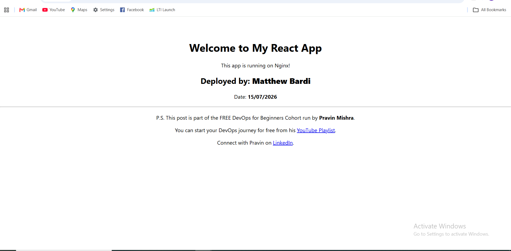

---

#### Screenshot 2 — Output of `ip a`

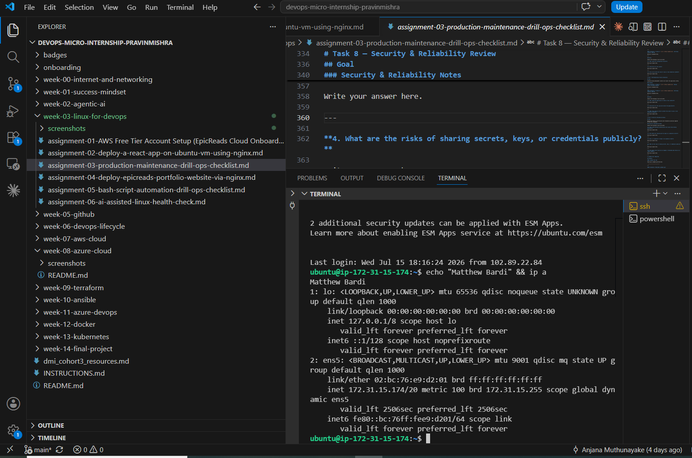

---

#### Screenshot 3 — Output of `sudo ss -tulpen`

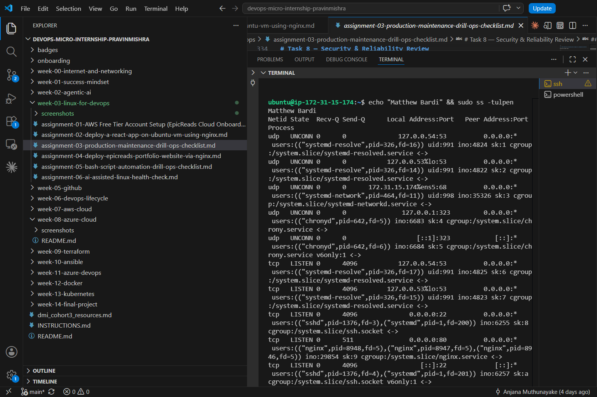

---

#### Screenshot 4 — Output of `sudo ufw status`

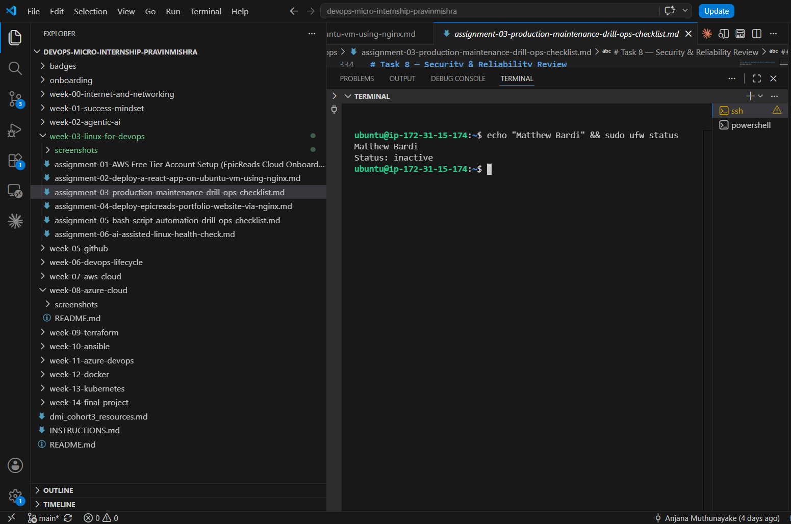

---

### Notes

Answer the following in your own words:

**1. What proves Nginx is listening on 0.0.0.0:80?**

The sudo ss -tulpen output shows Nginx in the LISTEN state on 0.0.0.0:80. This means Nginx is accepting HTTP connections on port 80 through all IPv4 network interfaces on the server.

---

**2. What proves SSH is active on port 22?**

The sudo ss -tulpen output shows sshd in the LISTEN state on 0.0.0.0:22 and [::]:22. This confirms that the SSH service is active and accepting connections on port 22 for both IPv4 and IPv6.

---

**3. Did you find any unexpected open ports? Explain briefly.**

I did not find any unexpected externally exposed application ports. Ports 80 and 22 are expected for HTTP and SSH. The other ports shown, such as 53, 68, and 323, are used internally by system services for DNS resolution, DHCP networking, and time synchronization.

---

# Task 2 — Service Health & Systemd Validation (Nginx)

## Goal

Verify that Nginx is properly installed, running, enabled at boot, and safely configured.

### Evidence

#### Screenshot 1 — Output of `systemctl status nginx --no-pager`

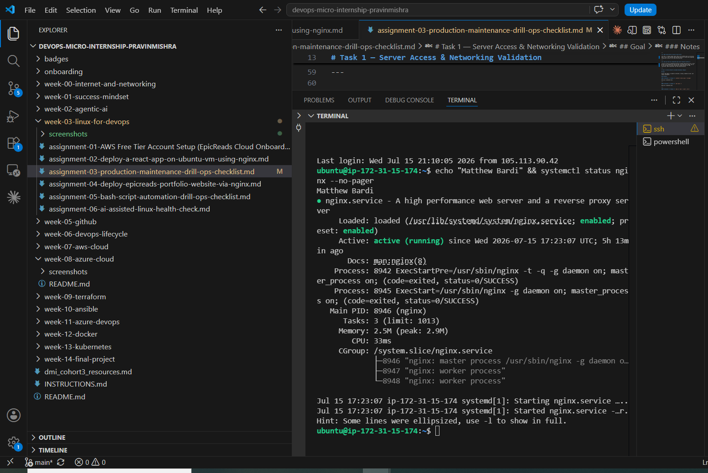

---

#### Screenshot 2 — Output of `sudo nginx -t`

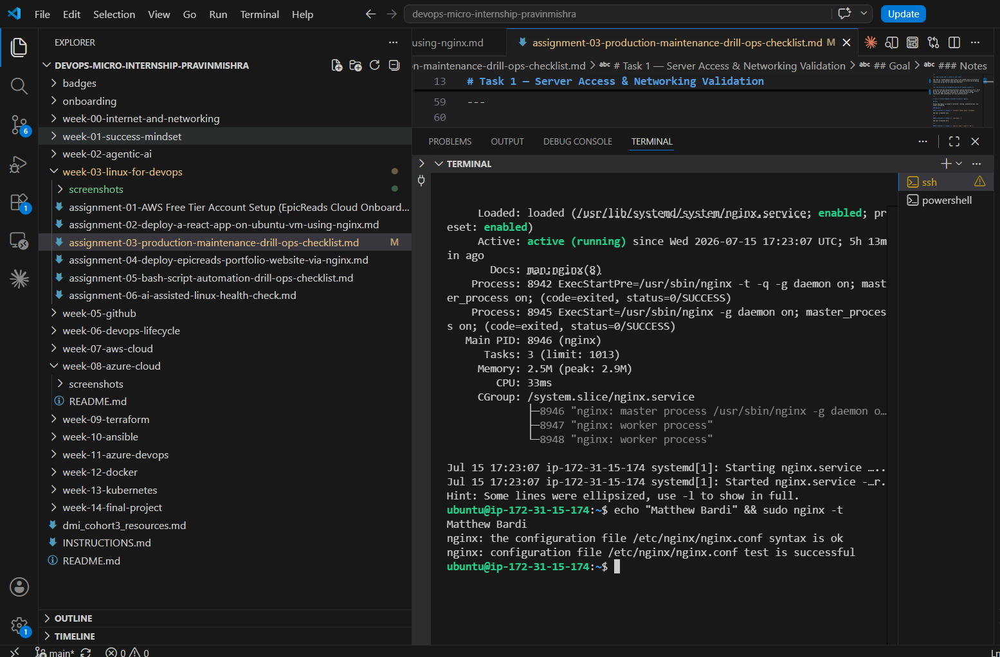

---

#### Screenshot 3 — Output of `sudo ss -lptn '( sport = :80 )'`

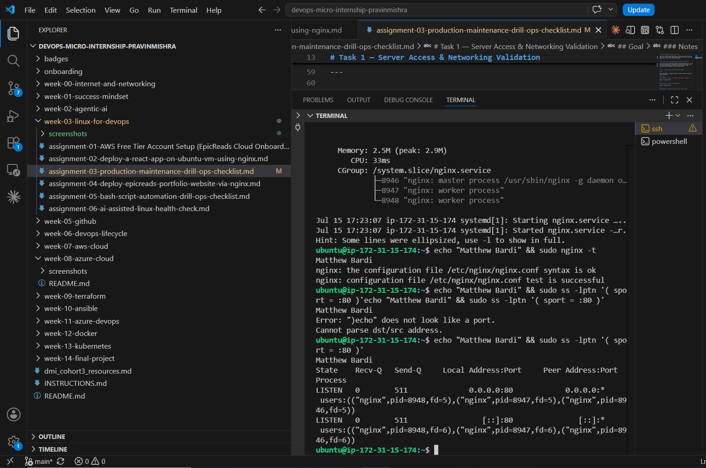

---

### Notes

Answer the following in your own words:

**1. What happens if Nginx fails to restart in production?**

If Nginx fails to restart in production, the website may become unavailable because Nginx will no longer serve incoming HTTP requests. Users could see connection errors or downtime until the configuration problem is fixed and the service is started again.

---

**2. What's your basic rollback plan?**

My basic rollback plan is to restore the last known working Nginx configuration or application build, test the configuration with sudo nginx -t, restart Nginx, and confirm the website returns a successful response before closing the incident.

---

# Task 3 — Logs & Request Trace

## Goal

Verify real traffic flow and analyze logs to understand system behavior and errors.

### Evidence

#### Screenshot 1 — Output of `sudo tail -n 30 /var/log/nginx/access.log`

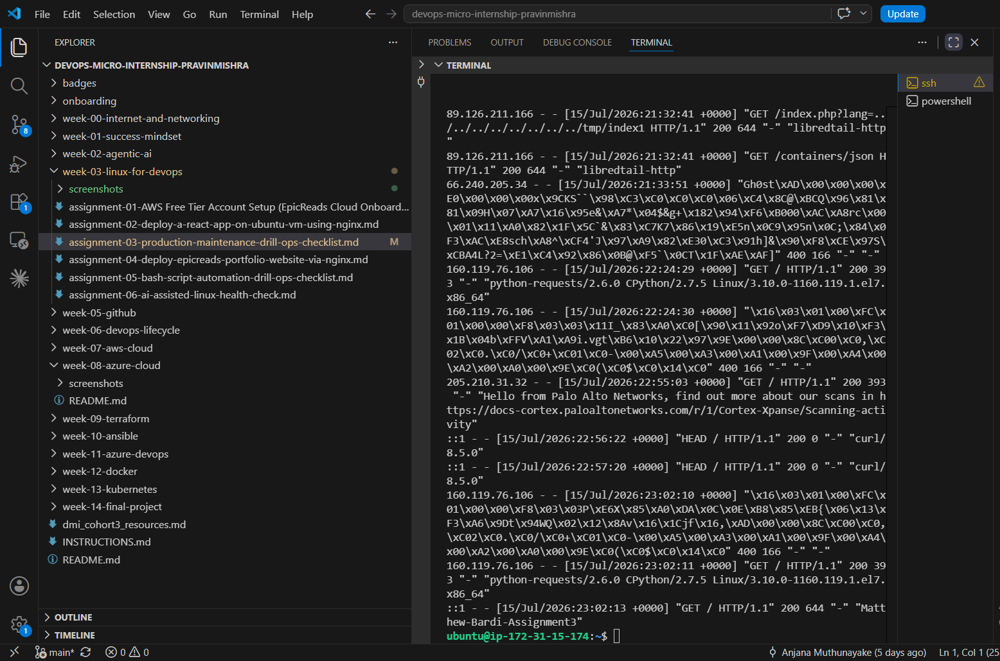

---

#### Screenshot 2 — Output of `sudo tail -n 30 /var/log/nginx/error.log`

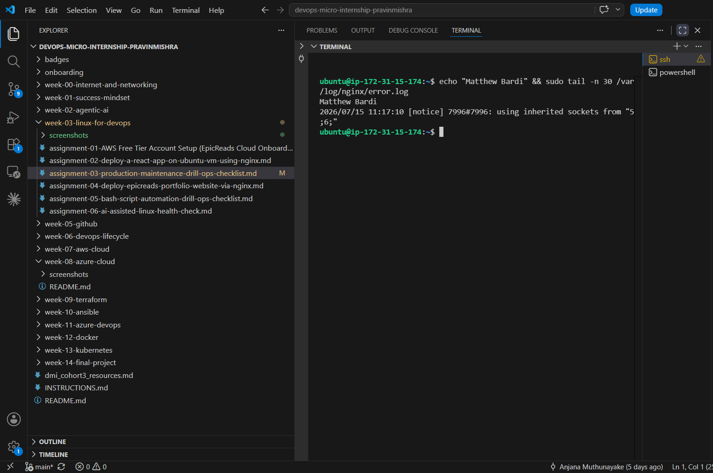

---

#### Screenshot 3 — Output of `sudo journalctl -u nginx --no-pager -n 50`

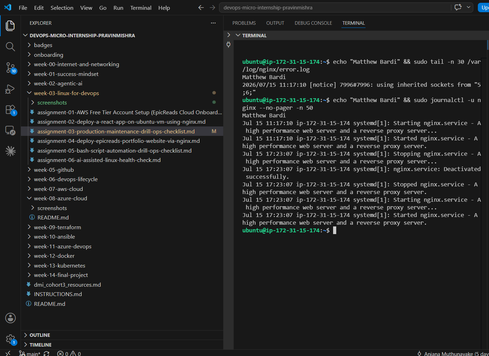

---

### Notes

Answer the following in your own words:

**1. Were there any errors in the logs?**

- If yes, mention 1–2 example error lines from the logs and explain what each one means in simple terms.
- If no, explain what it means if the error log is empty or shows no recent errors during your check.

I did not find any actual Nginx errors during this check. The error log only contained a normal notice about inherited sockets, which is informational and does not indicate a failure. The journal also showed that Nginx stopped and restarted successfully without error messages.

---

**2. If there were no errors, what does that indicate about the system?**

The absence of recent errors indicates that Nginx is operating normally and serving requests without configuration or runtime failures. It suggests the web service was healthy during the period I checked.

---

**3. Based on the access logs, were your curl requests visible in the log entries? What does that prove about traffic flow?**

Yes, my curl request was visible in the access log with the user agent Matthew-Bardi-Assignment3 and a 200 status code. This proves the request reached Nginx, Nginx processed it successfully, and the response was returned through the expected traffic path.

---

# Task 4 — System Resource Health Check (Capacity Red Flags)

## Goal

Assess server capacity and detect potential performance or failure risks.

### Evidence

#### Screenshot 1 — Output of `uptime`

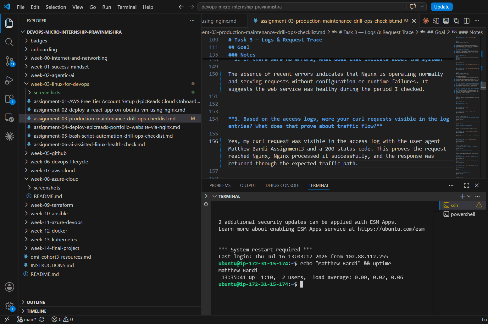

---

#### Screenshot 2 — Output of `free -h`

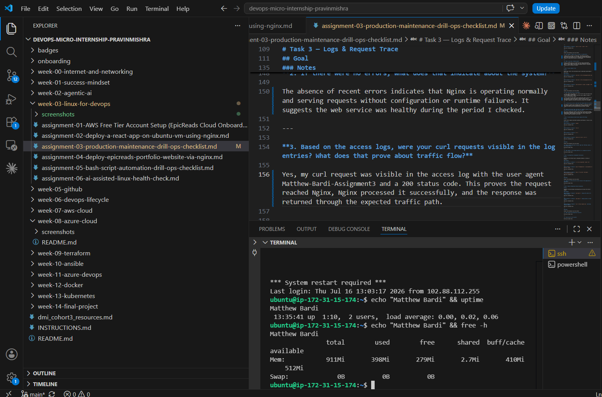

---

#### Screenshot 3 — Output of `df -h`

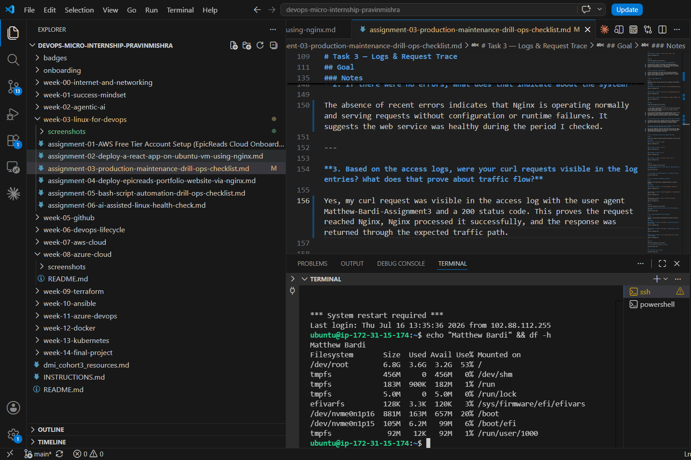

---

#### Screenshot 4 — Output of `sudo du -sh /var/* | sort -h`

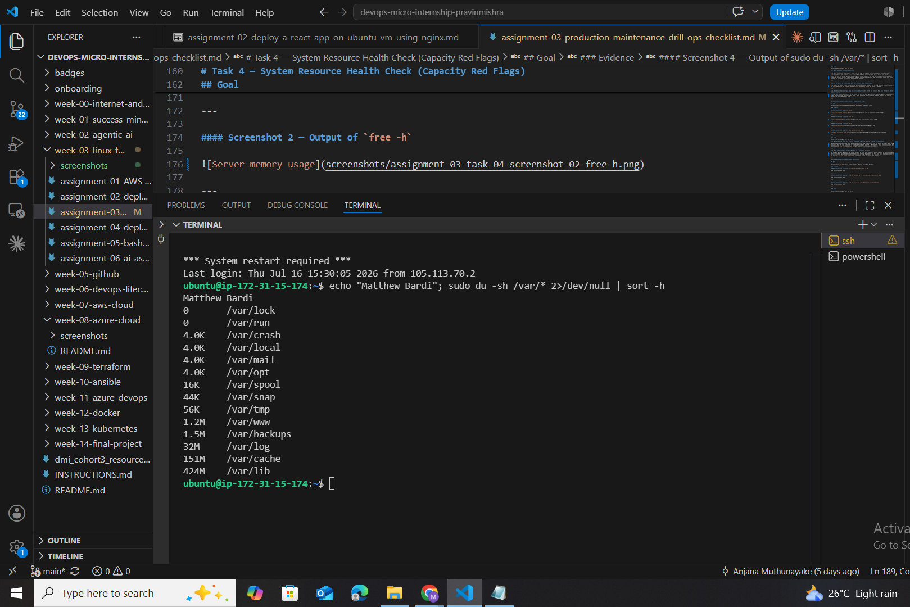

---

### Notes

Answer the following in your own words:

**1. Which resource looks most critical right now? (CPU/load, memory, or disk) Explain why.**

Disk space is the resource I would monitor most closely. CPU load is very low, and memory still has about 512 MiB available, but the root filesystem is already 53% used with about 3.2 GB remaining. It is not critical yet, but disk usage can grow over time because of logs, package files, and application data.

---

**2. What happens if disk becomes 100% full in a production server?**

If the disk becomes 100% full, the server may fail to write logs, temporary files, updates, or application data. Services such as Nginx may become unstable or stop working, deployments may fail, and users may experience errors or downtime. The disk should be monitored and cleaned before it reaches full capacity.

---

# Task 5 — Configuration & Deployment Verification

## Goal

Ensure the correct React build is deployed and Nginx is serving it properly.

### Evidence

#### Screenshot 1 — Output of `ls -lah /var/www/html | head -n 20`

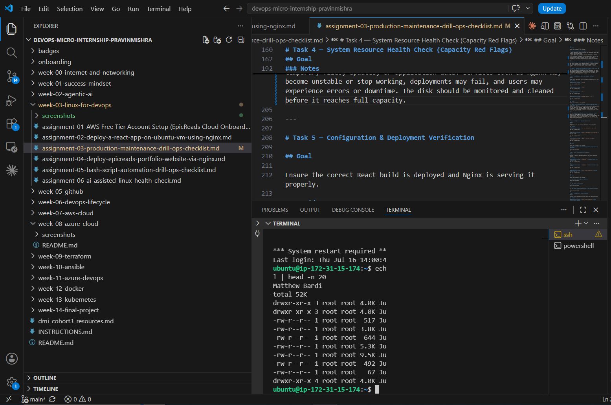

---

#### Screenshot 2 — Output of `grep -R "Deployed by" -n /var/www/html 2>/dev/null | head`

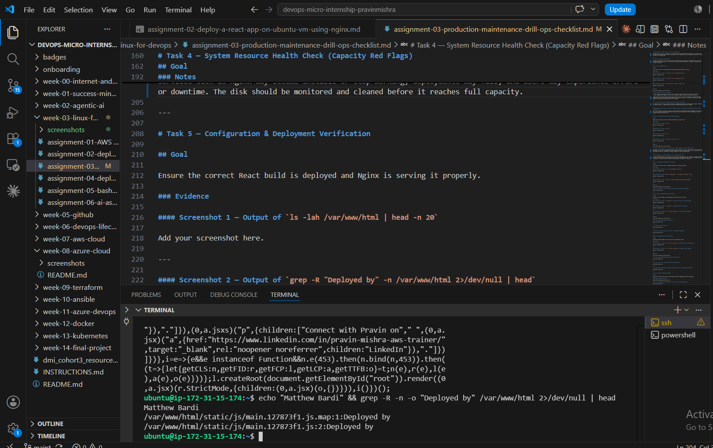

---

#### Screenshot 3 — Output of `grep -n "try_files" /etc/nginx/sites-available/default`

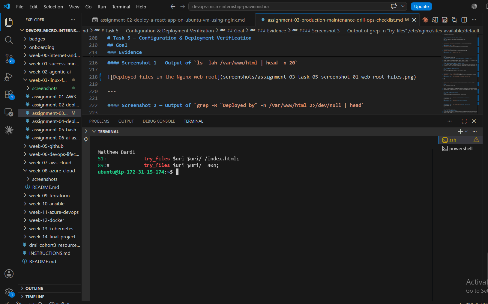

---

### Notes

Answer the following in your own words:

**1. How do you confirm that the correct version of the application is deployed?**

I confirm the correct application version by checking that the expected build files are present in /var/www/html, searching the deployed files for the text Deployed by, and opening the application in a browser to verify that my name and deployment date appear correctly. I also confirm that Nginx is using the correct try_files rule to serve the React application.

---

# Task 6 — Nginx Configuration Failure Simulation

## Goal

Simulate a real-world Nginx misconfiguration and recover the service safely.

### Evidence

#### Screenshot 1 — Output of `sudo nginx -t` showing the syntax error (broken config)

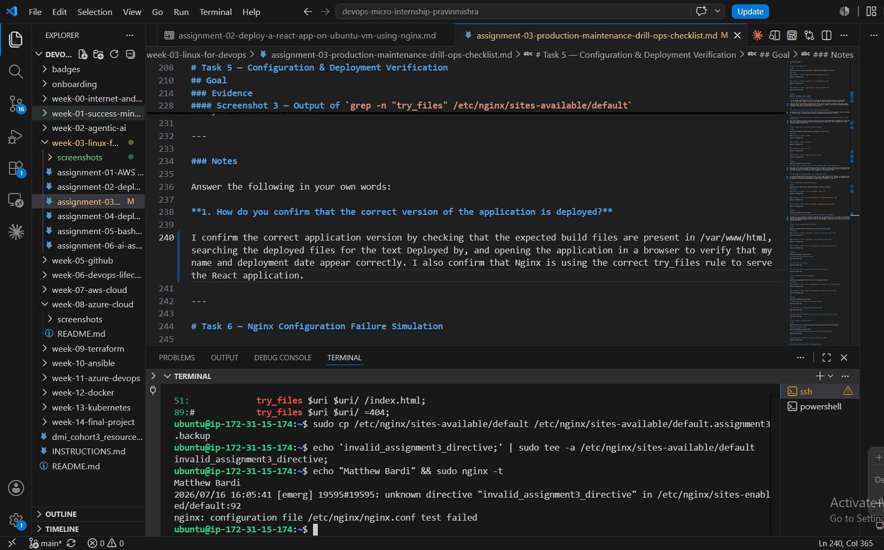

---

#### Screenshot 2 — Output of `sudo nginx -t` showing syntax ok (fixed config)

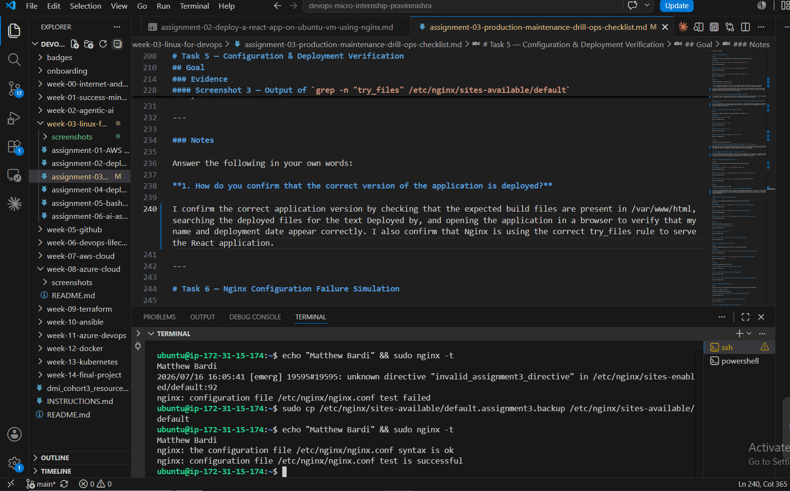

---

#### Screenshot 3 — Output of `curl -I http://<public-ip>` confirming recovery (200 OK)

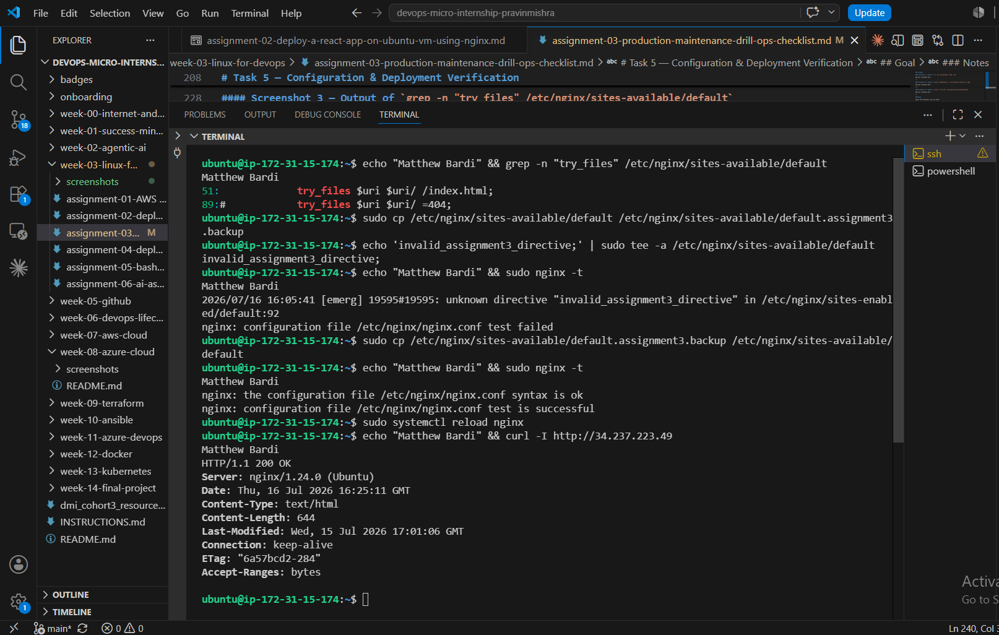

---

### Notes

Answer the following in your own words:

**1. What caused the configuration failure?**

The failure was caused by adding the invalid directive invalid_assignment3_directive; to the Nginx configuration file. Because Nginx did not recognize that directive, the configuration test failed and the updated configuration could not be safely applied.

---

**2. How did you fix the issue?**

I fixed the issue by restoring the backup of the last known working Nginx configuration. I then ran sudo nginx -t to confirm that the syntax was valid, reloaded Nginx, and verified recovery with a 200 OK response.

---

**3. How can you avoid this kind of issue in real production systems?**

I can avoid this kind of issue by keeping version-controlled backups, reviewing configuration changes, testing every change with sudo nginx -t before reloading or restarting Nginx, and using automated deployment checks so invalid configurations are blocked before they reach production.

---

# Task 7 — Web Application Failure Simulation

## Goal

Simulate missing deployment content and recover the application safely.

### Evidence

#### Screenshot 1 — Output of `curl -I http://<public-ip>` showing failure (non-200 response)

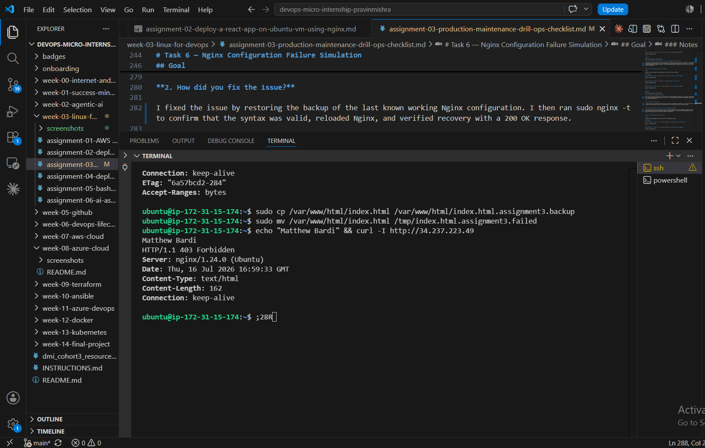

---

#### Screenshot 2 — Output of `curl -I http://<public-ip>` confirming recovery (200 OK)

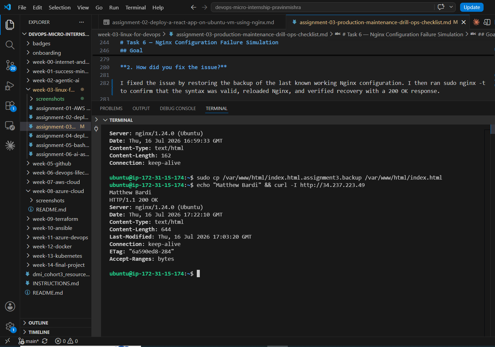

---

### Notes

Answer the following in your own words:

**1. What caused the application to break in this scenario?**

The application broke because the main index.html file was removed from the Nginx web root. Nginx was still running, but it could not find the homepage file needed to serve the React application, so it returned a 403 Forbidden response.

---

**2. How did you fix the issue and restore the application?**

I restored the application by copying the backup of index.html back into /var/www/html. I then ran curl -I against the public IP and confirmed that Nginx returned HTTP/1.1 200 OK.

---

**3. What steps would you take to prevent this kind of issue in real production systems?**

I would prevent this by keeping versioned backups of each deployment, validating that required files exist before release, using automated deployment checks, and keeping a rollback copy ready. I would also monitor the website with health checks so missing content is detected quickly.

---

# Task 8 — Security & Reliability Review

## Goal

Review and reflect on the security and reliability practices applied during this assignment.

### Security & Reliability Notes

Answer the following in your own words:

**1. Why is SSH key-based authentication more secure than sharing passwords?**

SSH key-based authentication is more secure because access requires possession of the private key, which is difficult to guess or brute-force. The private key remains on the authorized user’s computer and does not need to be shared or transmitted like a password.

---

**2. Why should only required ports be open on a production server?**

Only required ports should be open because every open port creates another possible entry point for attackers. Limiting access to essential services reduces the attack surface and lowers the risk of unauthorized access or exploitation.

---

**3. Why is it important for Nginx to be enabled on boot?**

Enabling Nginx on boot ensures the web service starts automatically whenever the server restarts. This reduces downtime and avoids requiring an administrator to start Nginx manually after every reboot.

---

**4. What are the risks of sharing secrets, keys, or credentials publicly?**

Sharing secrets, private keys, or credentials publicly can allow unauthorized users to access systems, steal data, create resources, or cause financial loss. Exposed credentials should be revoked immediately and replaced with new ones.

---

**5. Why should cloud resources be stopped or terminated when they are no longer needed?**

Cloud resources should be stopped or terminated when they are no longer needed to prevent unnecessary charges and reduce security risks. Unused resources can still consume storage, public IPs, and compute capacity, and may remain exposed if they are not properly managed.

---

# LinkedIn Post (Required)

## Evidence

#### LinkedIn Post URL

Paste your LinkedIn post URL here:

https://www.linkedin.com/posts/matthew-bardi_dmibypravinmishra-devops-agenticai-share-7483588689353142272-Uf79/?utm_source=share&utm_medium=member_desktop&rcm=ACoAABp_eQgBPlJcA09mSDh9Dmz_Fnr6k9cADN8

---

#### Screenshot — Published LinkedIn post

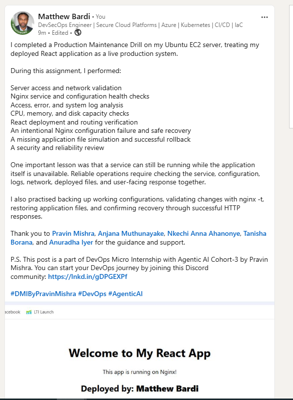

---

# Submission Instructions

- Add all required screenshots in your submission
- Full name must be visible in required screenshots
- Do not expose sensitive information (keys, passwords, account IDs)

---

# Completion Checklist

- [x] Task 1: Screenshots (browser, ip a, ss -tulpen, ufw status) + Notes answered
- [x] Task 2: Screenshots (nginx status, nginx -t, ss port 80) + Notes answered
- [x] Task 3: Screenshots (access log, error log, journalctl) + Notes answered
- [x] Task 4: Screenshots (uptime, free -h, df -h, du -sh) + Notes answered
- [x] Task 5: Screenshots (ls html, grep deployed by, grep try_files) + Notes answered
- [x] Task 6: Screenshots (nginx -t fail, nginx -t pass, curl recovery) + Notes answered
- [x] Task 7: Screenshots (curl failure, curl recovery) + Notes answered
- [x] Task 8: Security & Reliability Notes answered
- [x] LinkedIn post published and URL submitted
- [x] Full Name visible in all required screenshots
- [x] No sensitive data exposed

---

## 📌 About DMI & CloudAdvisory

DevOps Micro Internship (DMI) is a project-based DevOps program run by Pravin Mishra (The CloudAdvisory) focused on real-world execution, systems thinking, and career readiness.

It helps learners build strong DevOps foundations with hands-on experience.

---

## 📌 Resources

- 🌐 DMI Official Website: https://pravinmishra.com/dmi  
- 🎓 DevOps for Beginners (Udemy): https://www.udemy.com/course/devops-for-beginners-docker-k8s-cloud-cicd-4-projects/  
- 🎓 Agentic AI DevOps with Claude Code: https://www.udemy.com/course/ultimate-agentic-ai-devops-with-claude-code/  
- 🎓 DevOps with Claude Code: Terraform, EKS, ArgoCD & Helm: https://www.udemy.com/course/devops-with-claude-code-terraform-eks-argocd-helm/  
- ▶️ YouTube Playlist: https://www.youtube.com/playlist?list=PLFeSNDtI4Cho  
- 🔗 Pravin Mishra (LinkedIn): https://www.linkedin.com/in/pravin-mishra-aws-trainer/  
- 🏢 CloudAdvisory (LinkedIn): https://www.linkedin.com/company/thecloudadvisory/

---

*This submission is part of DevOps Micro Internship (DMI) Cohort 3 — Agentic AI Track.*