# Assignment 5 — Bash Script Automation Drill (OPS Checklist)

Part of the DevOps Micro Internship (DMI) Cohort 3 with Agentic AI

---

## Purpose

In this assignment, you will practice Bash scripting by building a series of small automation scripts covering environment setup, variables, arrays, loops, file conditionals, if-else logic, and functions. These scripts form the foundation of real-world Linux automation used in DevOps, cloud, and production support environments.

---

# Task 1 — Bash Environment & Workspace Setup

## Goal

Verify that Bash is available on your system and create a clean workspace for this assignment.

### Evidence

#### Screenshot 1 — Output of `echo $SHELL` and `bash --version`

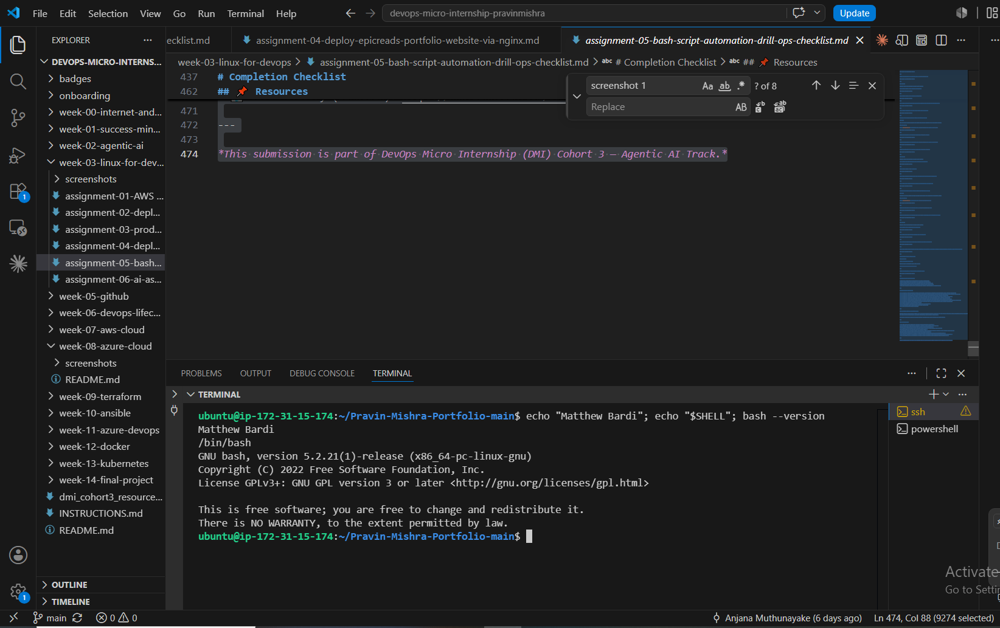

---

#### Screenshot 2 — Output of `pwd` and `ls -lah` showing the scripts directory

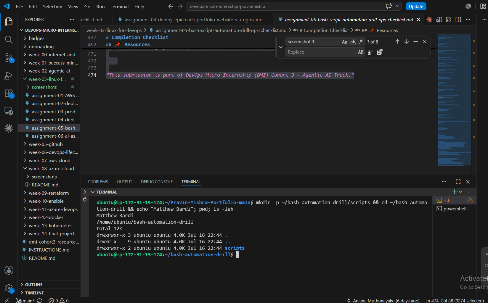

---

### Notes

Answer the following in your own words:

**1. What is Bash?**

Bash is a command-line shell and scripting language used to interact with Linux systems. It allows me to run commands manually and automate repeated tasks by placing commands inside script files.

---

**2. What is the difference between shell and Bash?**

A shell is any command-line program that lets a user interact with the operating system. Bash is one specific type of shell, with its own commands and scripting features.

---

**3. Why is it important to confirm the Bash version before writing scripts?**

Confirming the Bash version helps me know which features and syntax are supported. This prevents compatibility problems when a script uses commands or options that are not available in an older version.

---

# Task 2 — Your First Bash Script

## Goal

Create your first Bash script, make it executable, and run it from the terminal.

### Evidence

#### Screenshot 1 — Content of `first-script.sh`

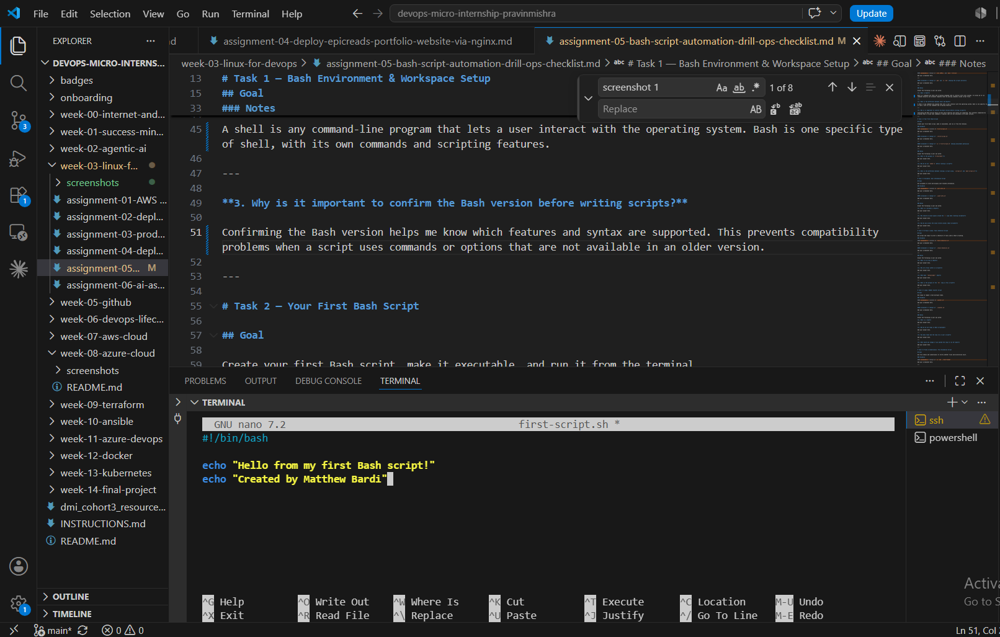

---

#### Screenshot 2 — Output of `./first-script.sh`

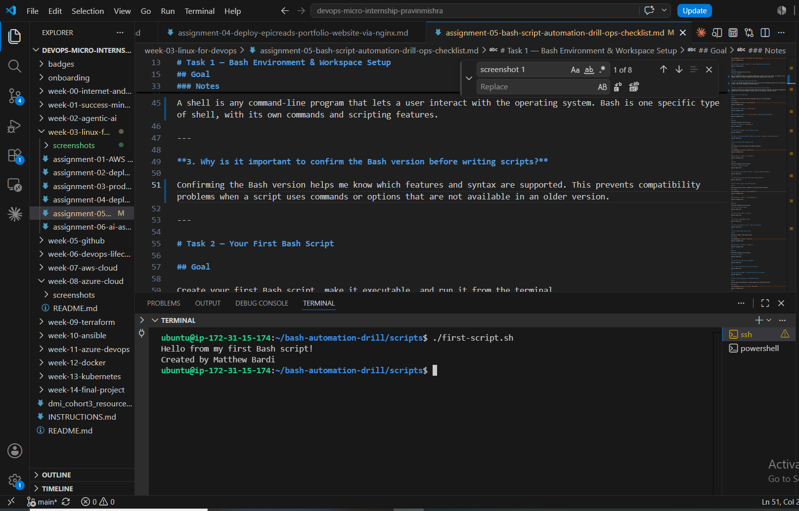

---

#### Screenshot 3 — Output of `ls -l first-script.sh` showing executable permission

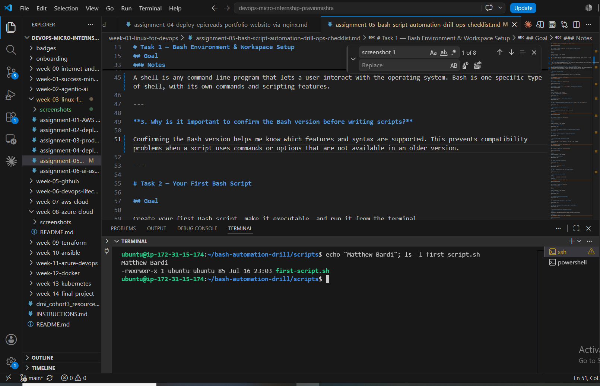

---

### Notes

Answer the following in your own words:

**1. What is the purpose of `#!/bin/bash`?**

#!/bin/bash tells the operating system to run the script using the Bash interpreter. It ensures the commands in the file are processed by Bash when the script is executed directly.

---

**2. Why do we use `chmod +x` before running a script?**

chmod +x adds executable permission to the script. This allows the operating system to run the file directly using ./script.sh.

---

**3. What is the difference between running a script using `./script.sh` and `bash script.sh`?**

./script.sh runs the file directly, so the script must have executable permission and normally uses the interpreter defined in its shebang. bash script.sh starts Bash explicitly and passes the script to it, so executable permission is not required.

---

# Task 3 — Variables: User Information Script

## Goal

Use variables to store and display user-related information.

### Evidence

#### Screenshot 1 — Content of `user-info.sh`

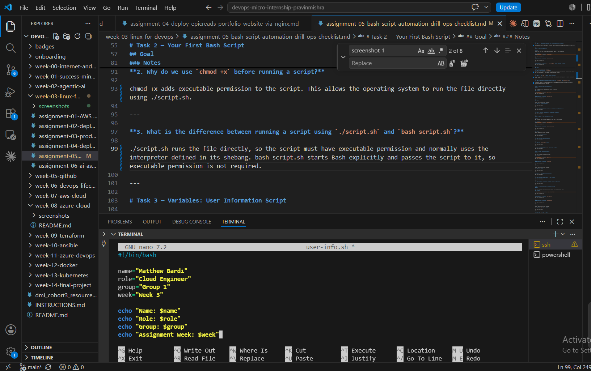

---

#### Screenshot 2 — Output of `./user-info.sh`

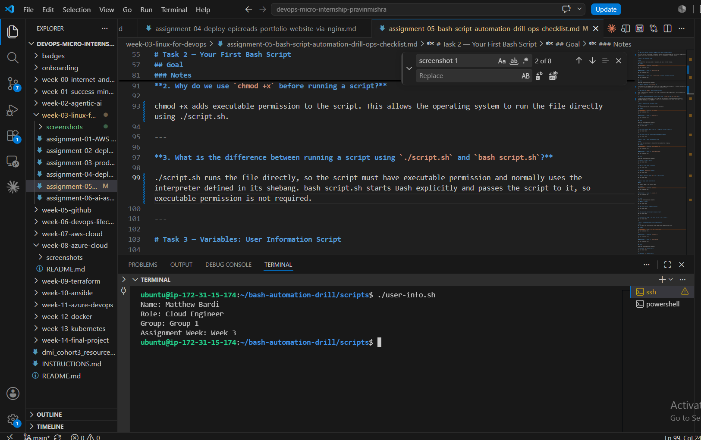

---

### Notes

Answer the following in your own words:

**1. What is a variable in Bash?**

A variable in Bash is a named place used to store information such as text, numbers, paths, or command output so the value can be reused later in the script.

---

**2. Why should we avoid spaces around the `=` sign when creating variables?**

Bash requires variable assignments to use the format name=value without spaces. Spaces would cause Bash to interpret the variable name and value as separate commands or arguments, which can produce an error.

---

**3. How do you access the value stored inside a Bash variable?**

I access a Bash variable’s value by placing a dollar sign before its name, such as $name. I can also use ${name}, especially when the variable is next to other text.

---

# Task 4 — Arrays & Loops: Tools Checklist Script

## Goal

Use arrays and loops to print a checklist of tools used in Bash scripting.

### Evidence

#### Screenshot 1 — Content of `tools-checklist.sh`

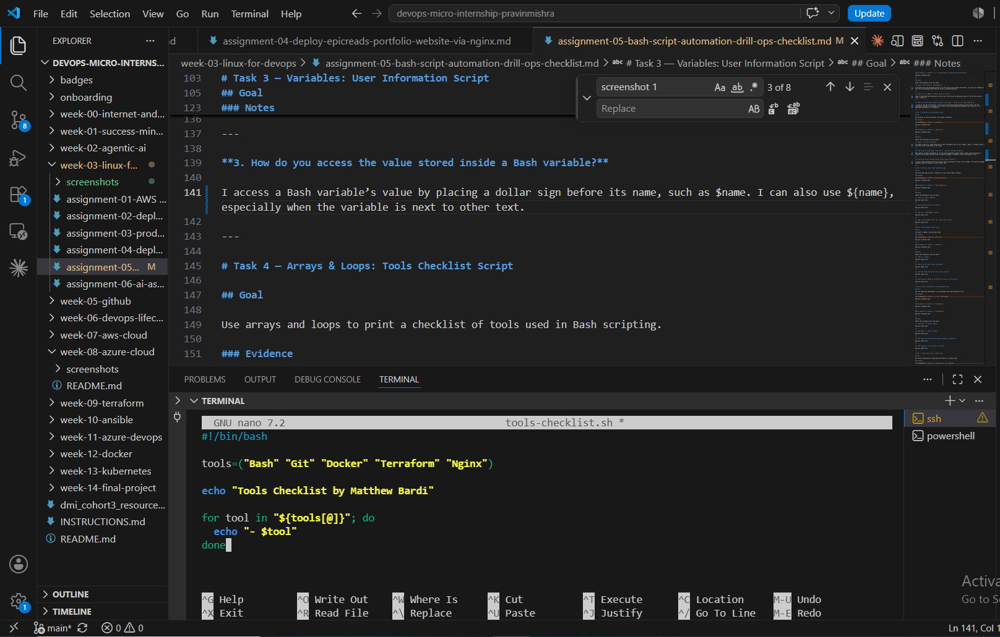

---

#### Screenshot 2 — Output of `./tools-checklist.sh`

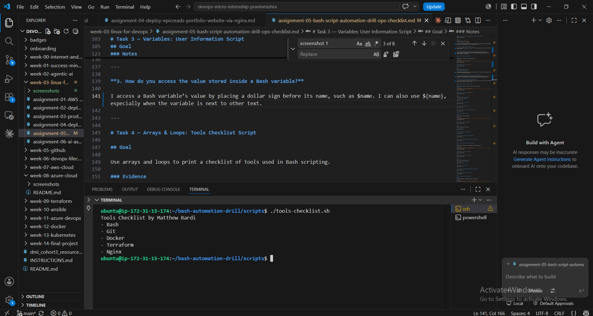

---

### Notes

Answer the following in your own words:

**1. What is an array in Bash?**

An array in Bash is a variable that can store multiple related values under one name. Each value can be accessed individually using its position in the array.

---

**2. Why are arrays useful in scripts?**

Arrays are useful because they let me manage several related values together. I can process all the values with a loop instead of creating a separate variable and command for each item.

---

**3. What does `"${tools[@]}"` mean?**

"${tools[@]}" expands the array so that every item is returned as a separate value. The quotation marks help preserve each item correctly, including values that may contain spaces.

---

**4. What is the purpose of the `for` loop in this script?**

The for loop goes through each item in the tools array one at a time and prints it as part of the checklist. This avoids repeating the same echo command manually for every tool.

---

# Task 5 — Loops: Number Counter Script

## Goal

Use loops to repeat a task multiple times.

### Evidence

#### Screenshot 1 — Content of `counter.sh`

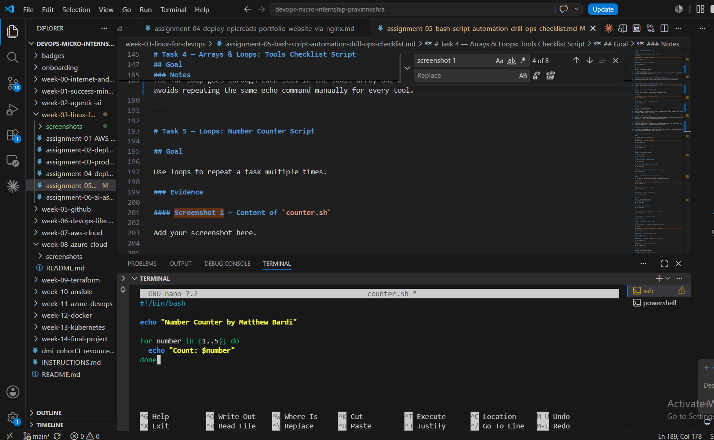

---

#### Screenshot 2 — Output of `./counter.sh`

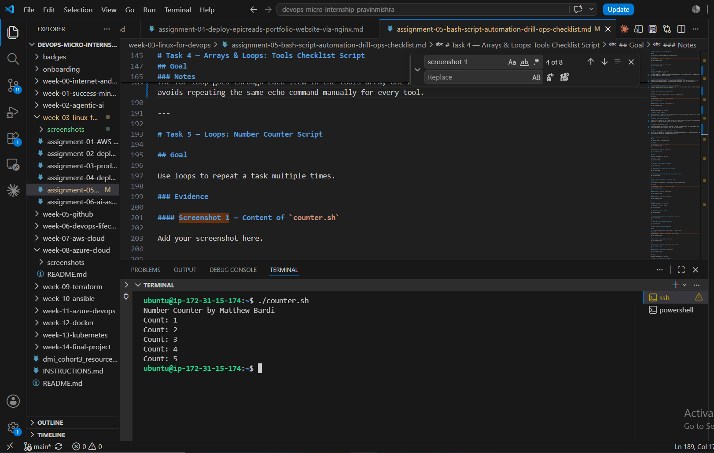

---

### Notes

Answer the following in your own words:

**1. What is a loop?**

A loop is a programming structure that repeats a block of commands multiple times. It helps automate repeated work without writing the same command again and again.

---

**2. Why do we use loops in Bash scripting?**

We use loops to automate repetitive tasks, process multiple items, and reduce duplicated commands. This makes scripts shorter, easier to maintain, and less likely to contain manual errors.

---

**3. How many times did the loop run in your script?**

The loop ran five times because it counted from 1 through 5.

---

**4. What would you change if you wanted the loop to run 10 times?**

I would change the range from {1..5} to {1..10} so the loop counts from 1 through 10.

---

# Task 6 — Files & Conditionals: File Validation Script

## Goal

Use file checks and conditionals to verify whether files and directories exist.

### Evidence

#### Screenshot 1 — Output of `ls -lah ../test-folder`

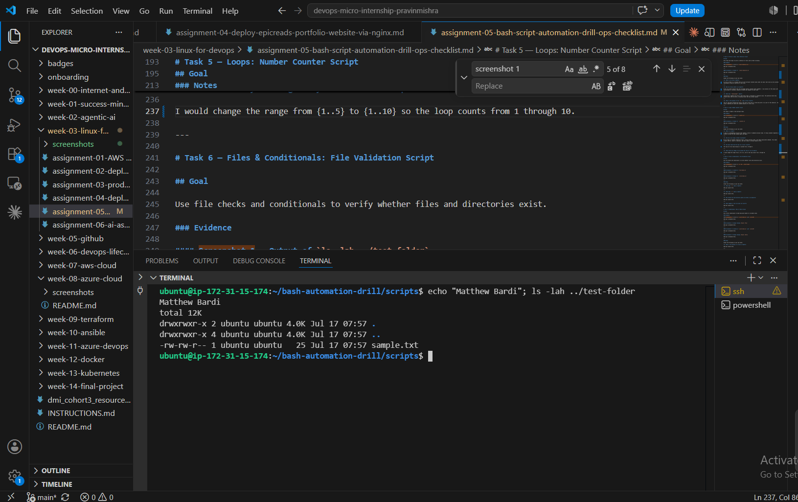

---

#### Screenshot 2 — Content of `file-check.sh`

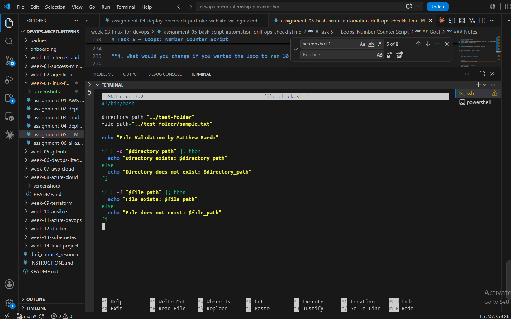

---

#### Screenshot 3 — Output of `./file-check.sh`

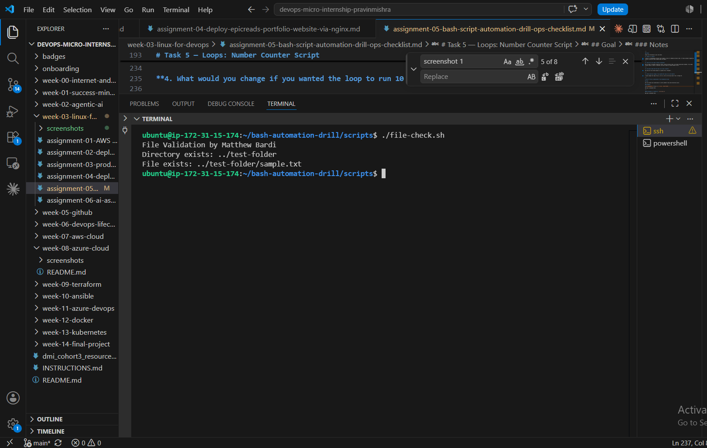

---

### Notes

Answer the following in your own words:

**1. What does `-d` check in Bash?**

-d checks whether a specified path exists and is a directory.

---

**2. What does `-f` check in Bash?**

-f checks whether a specified path exists and is a regular file.

---

**3. Why should file and directory paths be stored in variables?**

Storing file and directory paths in variables makes the script easier to read, update, and reuse. I only need to change the path in one place instead of editing it in several commands.

---

**4. What happens if the file does not exist?**

If the file does not exist, the -f condition returns false and the else block runs. In this script, it prints a message stating that the file does not exist.

---

# Task 7 — Conditionals: Pass or Retry Script

## Goal

Use if-else conditionals to make decisions based on a variable value.

### Evidence

#### Screenshot 1 — Content of `score-check.sh` with `score=85`

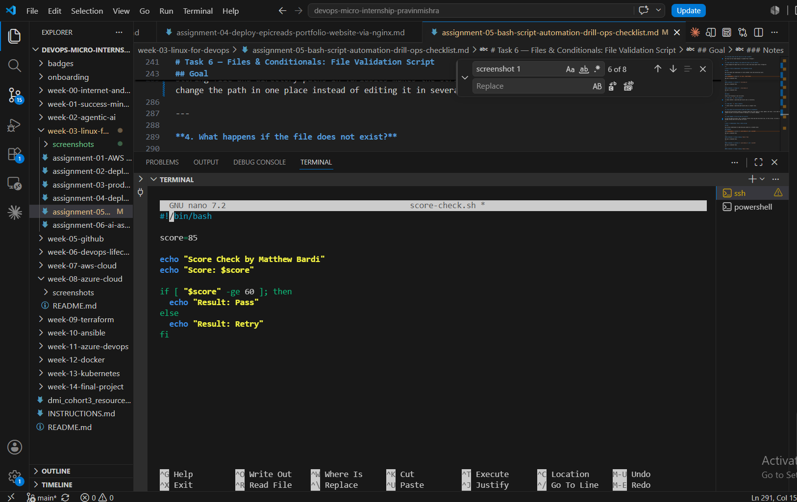

---

#### Screenshot 2 — Output showing `Result: Pass`

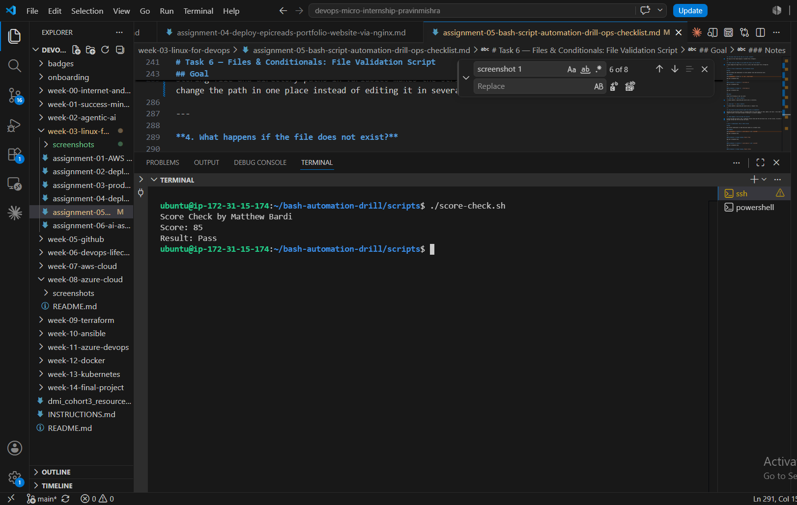

---

#### Screenshot 3 — Content of `score-check.sh` with `score=55`

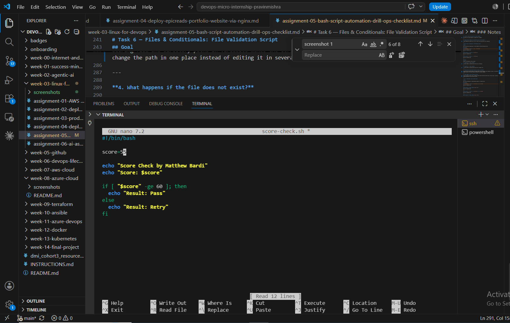

---

#### Screenshot 4 — Output showing `Result: Retry`

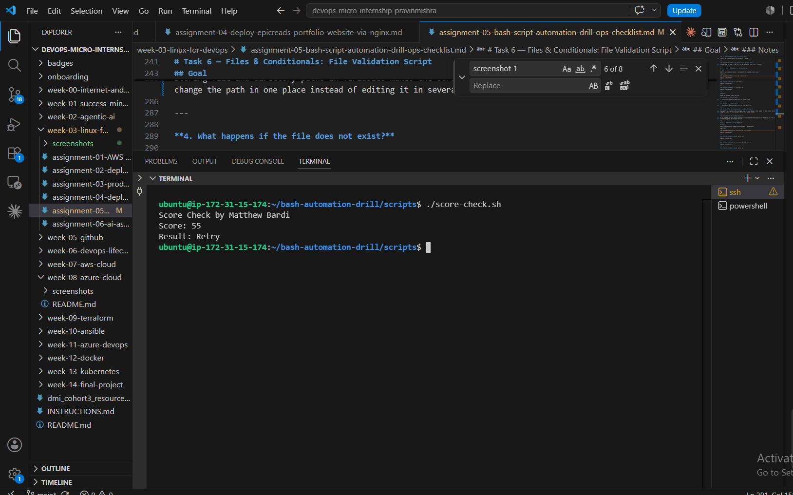

---

### Notes

Answer the following in your own words:

**1. What is the purpose of if-else in Bash?**

If-else allows a Bash script to make a decision. It checks whether a condition is true and runs one block of commands if it is true, or a different block if it is false.

---

**2. What does `-ge` mean?**

-ge means greater than or equal to. It is used to compare integer values in a Bash condition.

---

**3. Why should conditions be tested with different values?**

Testing conditions with different values confirms that every possible branch works correctly. It helps reveal logic errors before the script is used in a real automation task.

---

**4. How can conditionals help in automation scripts?**

Conditionals help automation scripts respond to different situations, such as checking whether a service is running, a file exists, or a command succeeded. The script can then take the correct action automatically.

---

# Task 8 — Functions: Final Bash Automation Script

## Goal

Create a final Bash script using functions to organize reusable code.

### Evidence

#### Screenshot 1 — Content of `final-automation.sh`

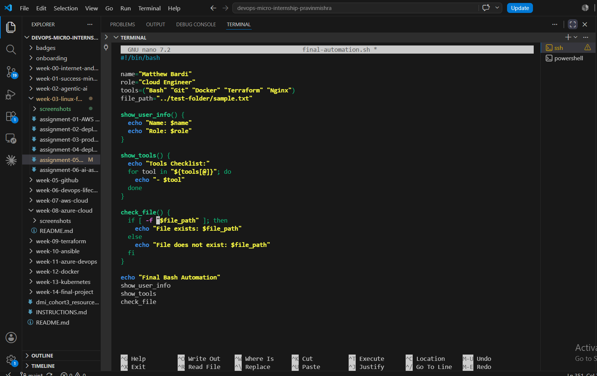

---

#### Screenshot 2 — Output of `./final-automation.sh`

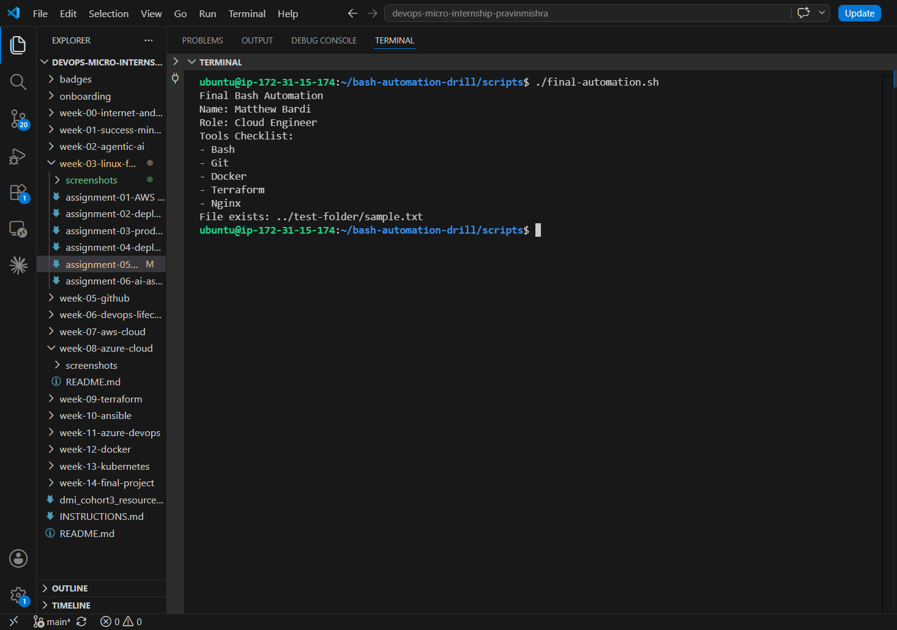

---

#### Screenshot 3 — Output of `ls -lah` showing all created scripts

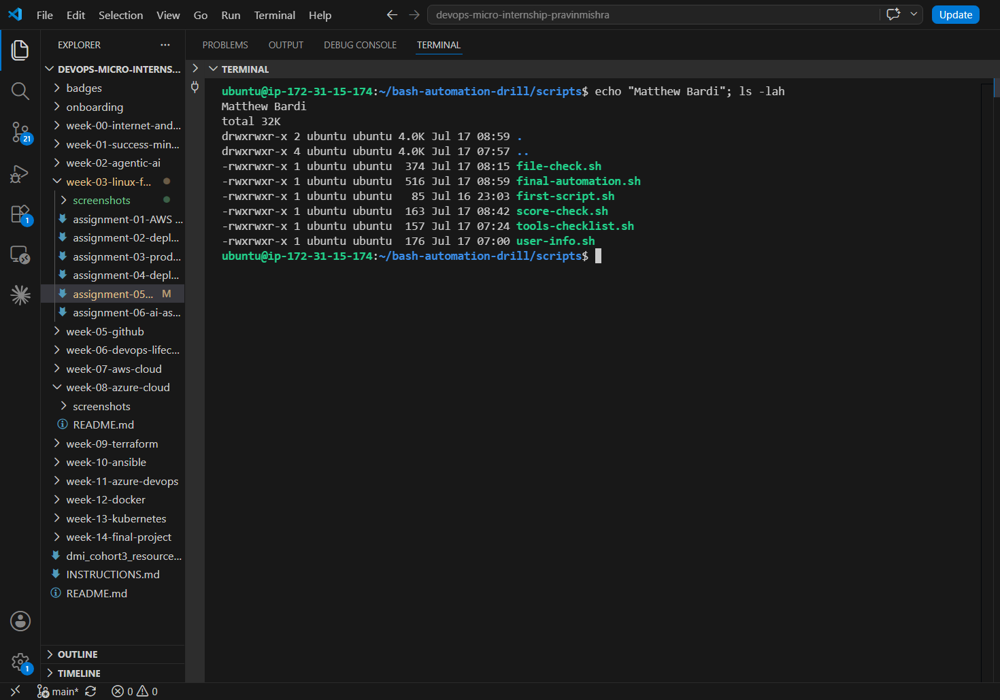

---

### Notes

Answer the following in your own words:

**1. What is a function in Bash?**

A function in Bash is a named block of commands that performs a specific task. It can be called whenever needed without rewriting the same commands.

---

**2. Why are functions useful in scripts?**

Functions make scripts easier to organize, reuse, test, and maintain. They reduce duplicated code by allowing the same group of commands to be called whenever it is needed.

---

**3. Which functions did you create in this script?**

I created three functions: show_user_info to display my name and role, show_tools to loop through and print the tools array, and check_file to verify whether the sample file exists.

---

**4. How does this final script combine variables, arrays, loops, conditionals, files, and functions?**

The script uses variables to store my name, role, and file path; an array to store the tools; a loop to print each tool; a conditional to check whether the sample file exists; and functions to organize each task into reusable sections.

---

# LinkedIn Post (Required)

## Evidence

#### LinkedIn Post URL

Paste your LinkedIn post URL here:

(https://www.linkedin.com/posts/matthew-bardi_dmibypravinmishra-devops-agenticai-share-7483812816253288448-y78j/?utm_source=share&utm_medium=member_desktop&rcm=ACoAABp_eQgBPlJcA09mSDh9Dmz_Fnr6k9cADN8)

---

#### Screenshot — Published LinkedIn post

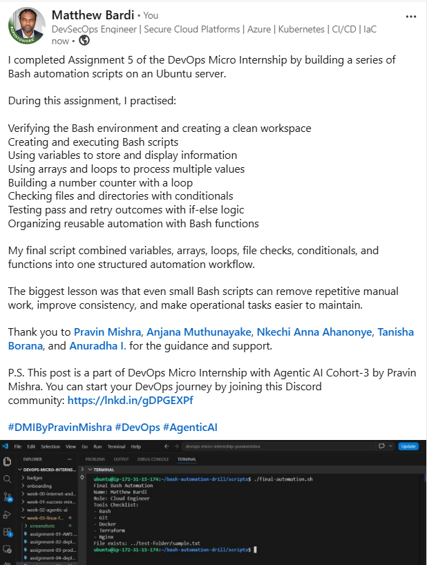

---

# Submission Instructions

- Add all required screenshots in your submission
- Full name must be visible in required screenshots
- All script files must be created and run successfully
- Required notes must be answered clearly for every task
- Do not expose sensitive information (keys, passwords, credentials)

---

# Completion Checklist

- [x] Task 1: Environment setup verified, workspace created (Screenshots 1–2, Notes answered)
- [x] Task 2: First script created, executed, permissions verified (Screenshots 1–3, Notes answered)
- [x] Task 3: Variables script created and run (Screenshots 1–2, Notes answered)
- [x] Task 4: Arrays and loops script created and run (Screenshots 1–2, Notes answered)
- [x] Task 5: Counter loop script created and run (Screenshots 1–2, Notes answered)
- [x] Task 6: File validation script created and run (Screenshots 1–3, Notes answered)
- [x] Task 7: Pass/Retry conditional script tested with both values (Screenshots 1–4, Notes answered)
- [x] Task 8: Final automation script created and run (Screenshots 1–3, Notes answered)
- [x] All scripts run without errors
- [x] Full Name visible in all required screenshots
- [x] LinkedIn post published and URL submitted
- [x] No sensitive data exposed

---

## 📌 About DMI & CloudAdvisory

DevOps Micro Internship (DMI) is a project-based DevOps program run by Pravin Mishra (The CloudAdvisory) focused on real-world execution, systems thinking, and career readiness.

It helps learners build strong DevOps foundations with hands-on experience.

---

## 📌 Resources

- 🌐 DMI Official Website: https://dmi.pravinmishra.com?utm_source=github&utm_medium=readme  
- 🎓 University: https://university.pravinmishra.com?utm_source=github&utm_medium=readme  
- 💬 Discord Community: https://discord.pravinmishra.com?utm_source=github&utm_medium=readme  
- 📝 Blog: https://dmi.pravinmishra.com/blog?utm_source=github&utm_medium=readme  
- ▶️ YouTube Playlist: https://www.youtube.com/playlist?list=PLFeSNDtI4Cho  
- 🔗 Pravin Mishra (LinkedIn): https://www.linkedin.com/in/pravin-mishra-aws-trainer/  
- 🏢 CloudAdvisory (LinkedIn): https://www.linkedin.com/company/thecloudadvisory/

---

*This submission is part of DevOps Micro Internship (DMI) Cohort 3 — Agentic AI Track.*