# Assignment 6 — Build an AI-Assisted Linux Health Check (AI-Assisted Linux Incident Triage)

Part of the DevOps Micro Internship (DMI) Cohort 3 with Agentic AI

---

## Purpose

In this assignment, you will build a read-only Bash triage script that checks the health of your Ubuntu server and Nginx application, connect it to Claude Code as a reusable `/linux-triage` skill, simulate a controlled Nginx incident, use the skill to gather and analyze evidence, recover the service manually, and verify recovery. The workflow follows the Agentic Loop: Gather → Analyze → Human Act → Verify.

---

# Task 1 — Confirm the Healthy Baseline and Create the Workspace

## Goal

Confirm that Nginx and the React application are healthy before building the automation.

### Evidence

#### Screenshot 1 — Output of `systemctl is-active nginx`, `ss -ltn | grep ':80'`, and `curl -I http://localhost`

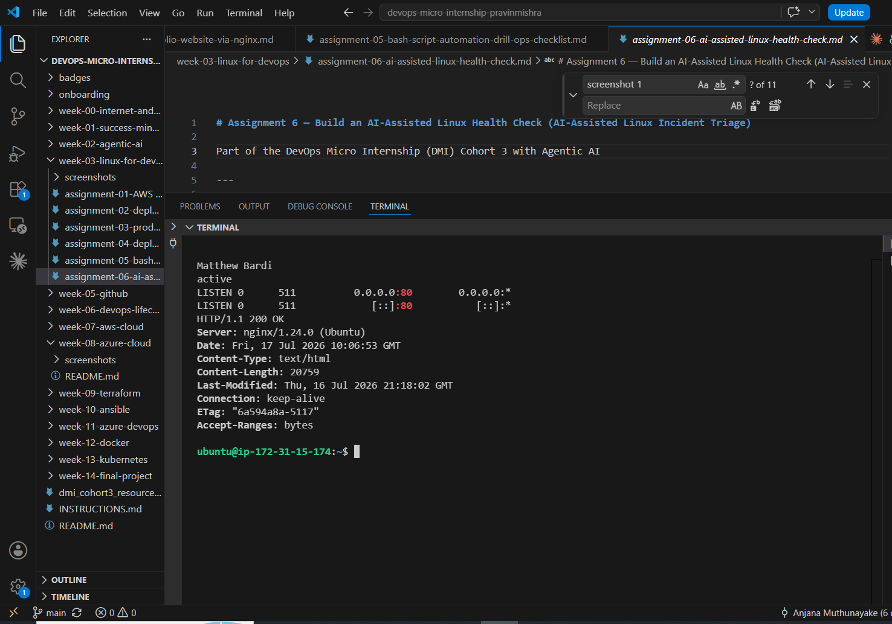

---

#### Screenshot 2 — Output of `pwd` and `find . -maxdepth 4 -type d | sort` showing the workspace folder structure

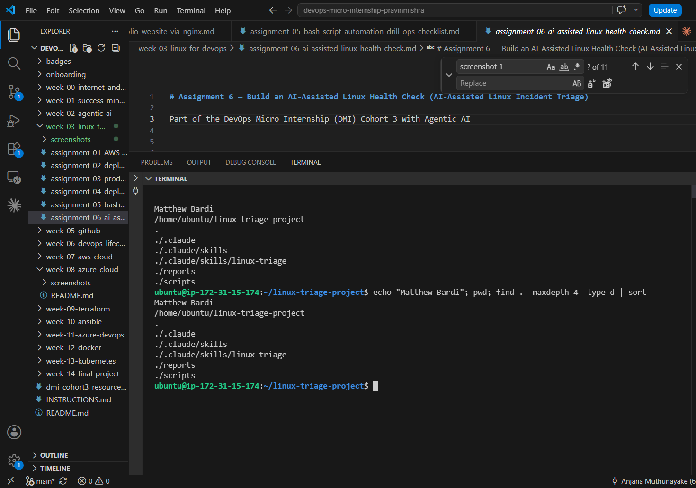

---

### Notes

Answer the following in your own words:

**1. What proves that Nginx is running?**

The `systemctl is-active nginx` command returned `active`, which proves that the Nginx service is currently running.

---

**2. What proves that the server is listening for HTTP traffic?**

The `ss -ltn | grep ':80'` output shows that the server is listening on port 80, which is the standard port used for HTTP traffic.

---

**3. Why must you capture a healthy baseline before simulating an incident?**

A healthy baseline shows how the server behaves before the incident. It gives me a reliable reference for comparing failed and recovered states, which makes troubleshooting more accurate.

---

# Task 2 — Create Project Context and Safety Rules in CLAUDE.md

## Goal

Tell Claude exactly what this project does and what it is not allowed to do.

### Evidence

#### Screenshot 3 — CLAUDE.md open in VS Code showing all four sections (Project Overview, Incident Workflow, Safety Rules, Output Rules)

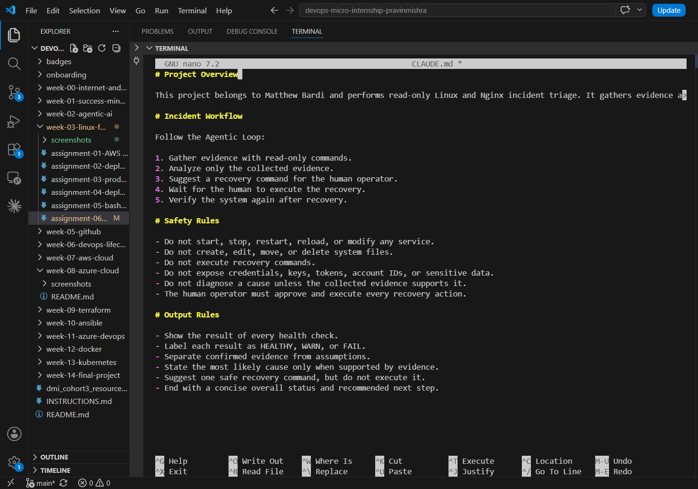

---

### Notes

Answer the following in your own words:

**1. Why should Claude receive project-specific operational rules?**

Project-specific operational rules help Claude understand the system, the permitted actions, and the safety boundaries. This reduces the risk of unsafe commands, irrelevant suggestions, or conclusions that are not supported by the collected evidence.

---

**2. Why is the human required to execute the recovery command?**

The human must execute the recovery command so the action is reviewed and approved before it changes the system. This prevents Claude from automatically making a risky change or restarting the wrong service.

---

**3. Which rule prevents Claude from making an unsupported diagnosis?**

The rule “Do not diagnose a cause unless the collected evidence supports it” prevents Claude from making an unsupported diagnosis.

---

# Task 3 — Use Agentic AI to Plan Before Writing the Script

## Goal

Use Claude Code to inspect the environment and produce a read-only plan before creating any Bash code.

### Evidence

#### Screenshot 4 — Claude Code showing the five-check plan and read-only inspection results

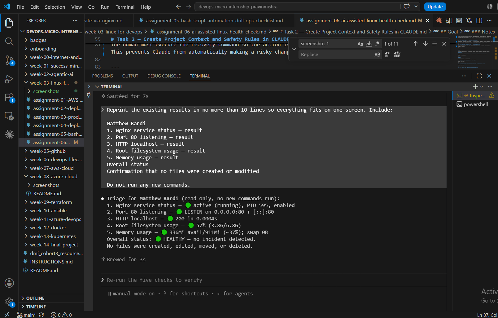

---

### Notes

Answer the following in your own words:

**1. Which part of this task represents the Gather phase?**

The Gather phase is the part where Claude used read-only commands to collect evidence about Nginx, port 80, the HTTP response, disk usage, and memory usage.

---

**2. Did Claude follow the instruction not to create files? How did you verify this?**

Yes, Claude followed the instruction not to create files. I verified this because Claude explicitly confirmed that no files were created, edited, moved, or deleted during the read-only inspection.

---

**3. Why is planning before coding useful in DevOps automation?**

Planning before coding helps define the required checks, commands, safety limits, and expected output. This reduces mistakes and makes the automation easier to build, review, and test.

---

# Task 4 — Build the Linux Triage Bash Script

## Goal

Create one Bash script that gathers consistent Linux and Nginx health evidence.

### Evidence

#### Screenshot 5 — Top section of `linux-triage.sh` showing variables, thresholds, and the checks array

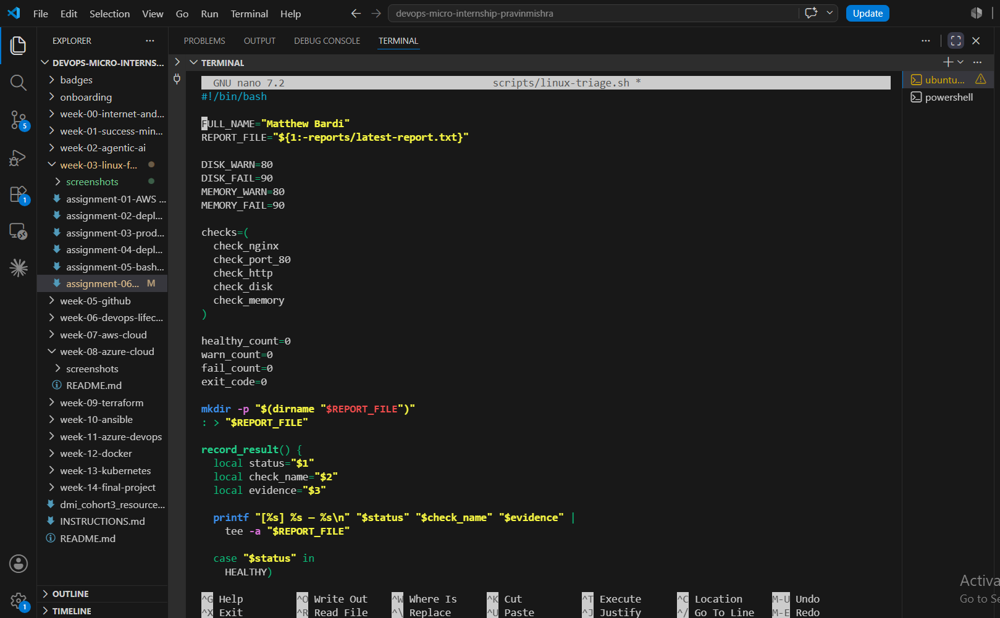

---

#### Screenshot 6 — Middle section showing check functions and conditionals

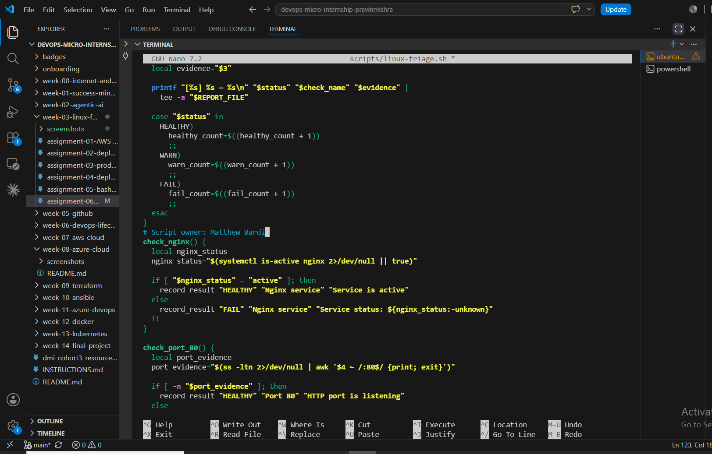

---

#### Screenshot 7 — Bottom section showing the loop, summary function, and exit behavior

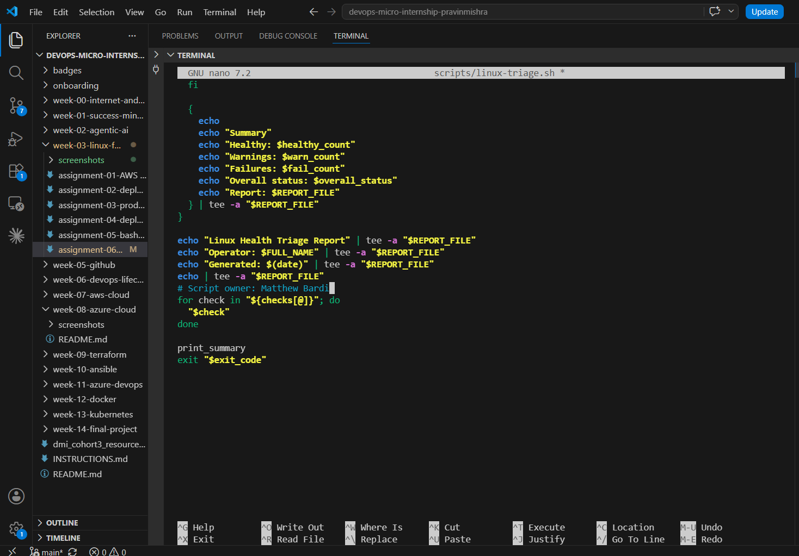

---

#### Screenshot 8 — Output of `bash -n scripts/linux-triage.sh` (no syntax errors) and `ls -l scripts/linux-triage.sh` showing executable permission

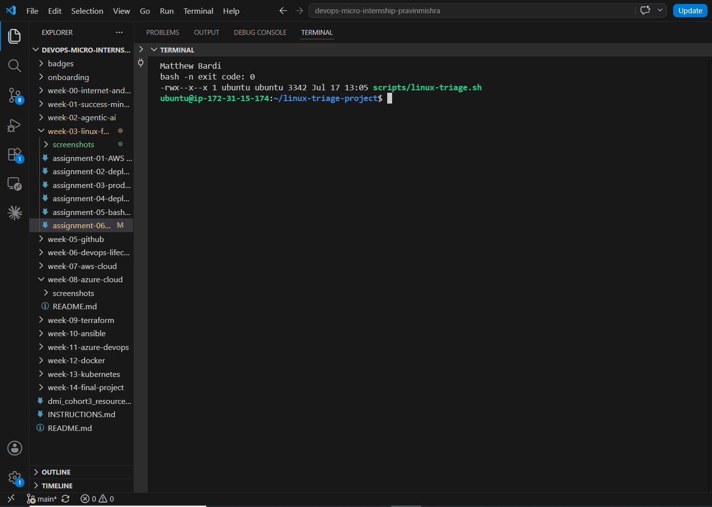

---

### Notes

Answer the following in your own words:

**1. What is stored in the checks array?**

The checks array stores the names of the five health-check functions: check_nginx, check_port_80, check_http, check_disk, and check_memory.

---

**2. How does the `for` loop use that array?**

The for loop reads each function name from the checks array one at a time and executes it. This allows all five health checks to run automatically without calling each function separately.

---

**3. Why are the health checks separated into functions?**

Separating the health checks into functions keeps each check focused on one task. This makes the script easier to read, test, troubleshoot, reuse, and update.

---

**4. What is the purpose of `$(...)` in this script?**

$(...) performs command substitution. It runs the command inside the parentheses and stores its output in a variable so the script can evaluate or display the result.

---

**5. Why does the script use different exit codes for HEALTHY, WARN, and FAIL?**

The script uses exit code 0 for HEALTHY, 1 for WARN, and 2 for FAIL so that a human operator or another automation tool can identify the severity of the result and respond appropriately.

---

# Task 5 — Run and Understand the Healthy-State Report

## Goal

Run the Bash script against the healthy server and verify that it creates a report.

### Evidence

#### Screenshot 9 — Output of `./scripts/linux-triage.sh` showing your Full Name and all five check results

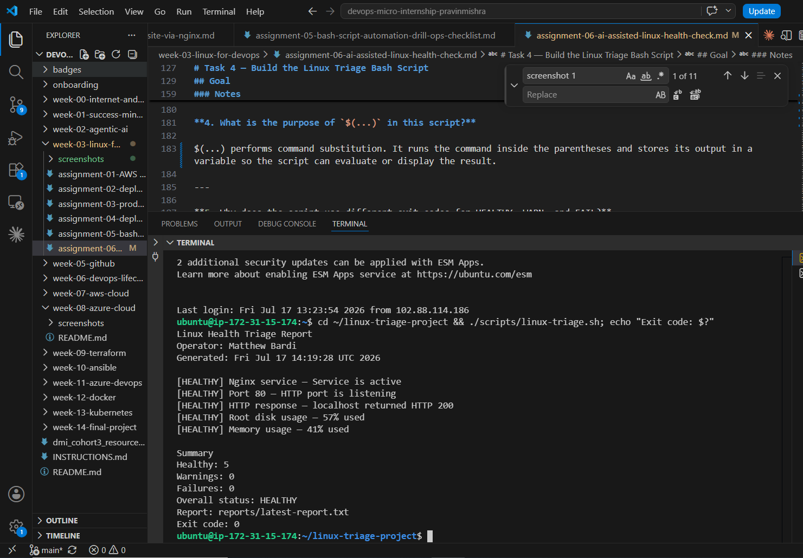

---

#### Screenshot 10 — Output showing the captured exit code and final summary

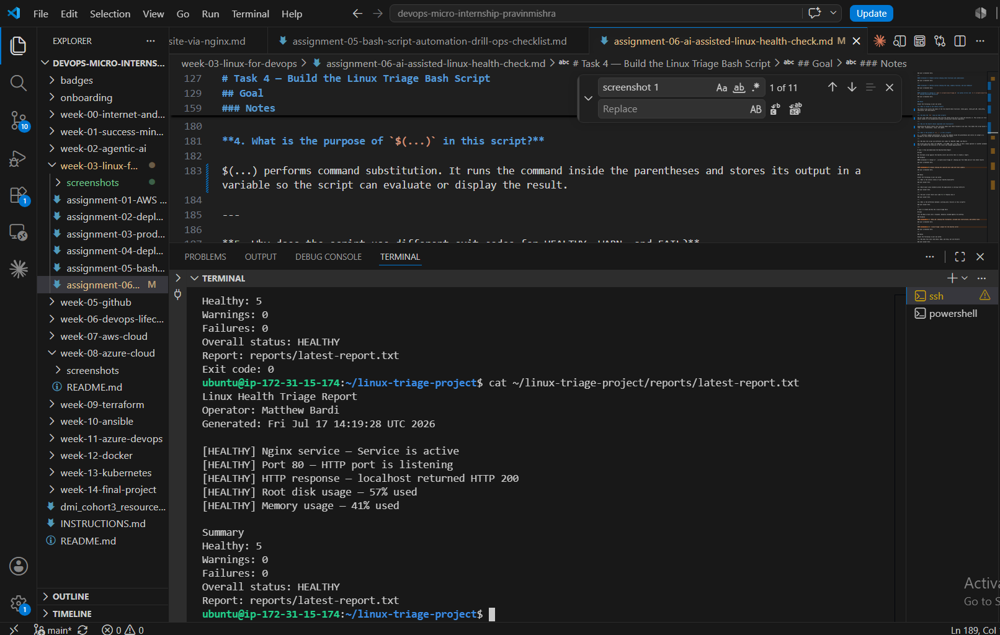

---

### Notes

Answer the following in your own words:

**1. What is the overall status of your healthy baseline?**

The overall status of my healthy baseline is HEALTHY because all five checks passed, with zero warnings and zero failures.

---

**2. Which exact Linux evidence proves the application is serving traffic?**

The exact Linux evidence is that port 80 is listening and the request to http://localhost returned HTTP 200, proving that Nginx is accepting and serving web traffic.

---

**3. Did your script return exit code 0 or 1? Explain why.**

My script returned exit code 0 because all five health checks passed, with no warnings or failures, so the overall server status was HEALTHY.

---

**4. What is the difference between a warning and a failure in this script?**

A warning means the server has crossed a caution threshold but may still be functioning, while a failure means a critical check did not pass or resource usage reached the failure threshold and requires immediate attention.

---

# Task 6 — Create and Run the /linux-triage Skill

## Goal

Turn the Bash script into a reusable, manually invoked Agentic AI workflow.

### Evidence

#### Screenshot 11 — `SKILL.md` showing the frontmatter, allowed tool restrictions, and safety rules

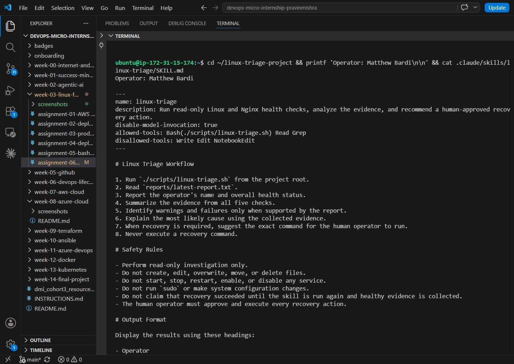

---

#### Screenshot 12 — `/linux-triage` output for the healthy server

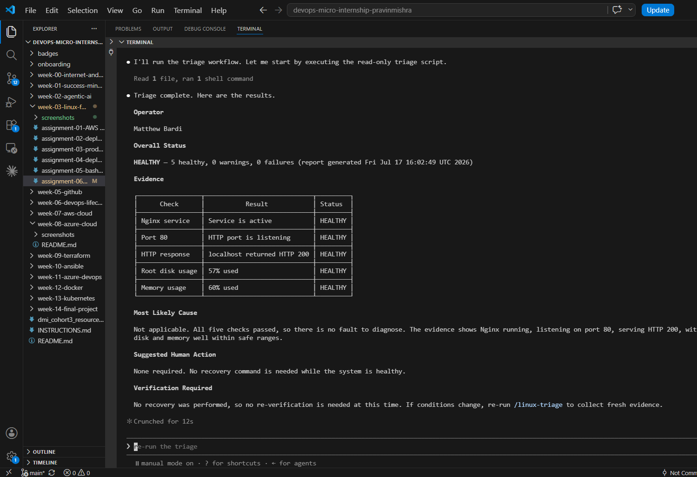

---

### Notes

Answer the following in your own words:

**1. Why does this skill have Bash, Read, and Grep, but not Write?**

The skill has Bash, Read, and Grep so it can run the triage script, read the generated report, and search the evidence. It does not have Write permission because the workflow must remain read-only and must not modify files or system configuration.

---

**2. Why is `disable-model-invocation: true` useful for this skill?**

disable-model-invocation: true is useful because it prevents Claude from running the skill automatically. The skill only runs when a human explicitly invokes /linux-triage, which keeps the workflow controlled and predictable.

---

**3. What part is performed by Bash, and what part is performed by Claude?**

Bash performs the five health checks and writes the factual results to the report, while Claude reads that evidence, summarizes the server’s condition, explains the most likely cause, and recommends a human-approved action when necessary.

---

**4. Why is this better than asking Claude "Is my server healthy?" without giving it evidence?**

This is better than simply asking Claude whether the server is healthy because Claude is given real Linux evidence from the script. Its conclusion is based on measurable service, port, HTTP, disk, and memory results instead of assumptions.

---

# Task 7 — Simulate an Nginx Incident and Let the Skill Diagnose It

## Goal

Create a controlled service failure, gather evidence through Bash, and let Claude analyze the evidence without taking recovery action.

### Evidence

#### Screenshot 13 — Output showing Nginx is inactive and the HTTP request fails

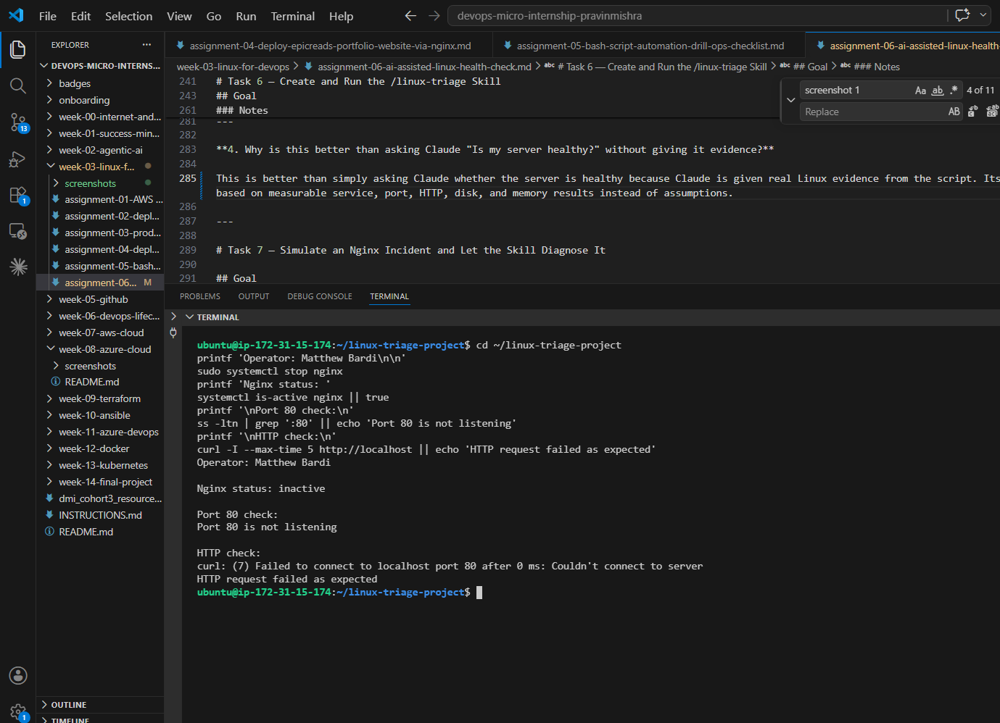

---

#### Screenshot 14 — `/linux-triage` output showing failed evidence, most likely cause, and a suggested recovery command

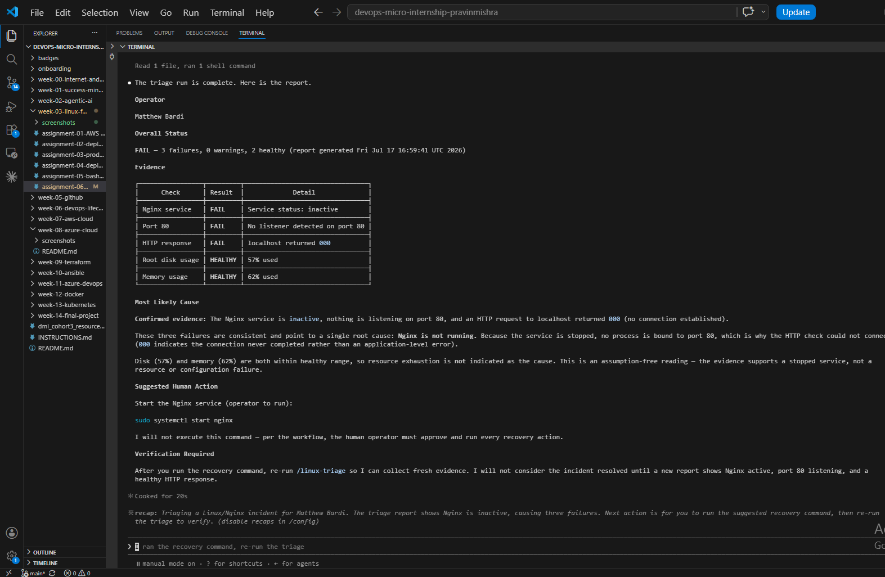

---

#### Screenshot 15 — `incident-failure-report.txt` showing the failed checks and your Full Name

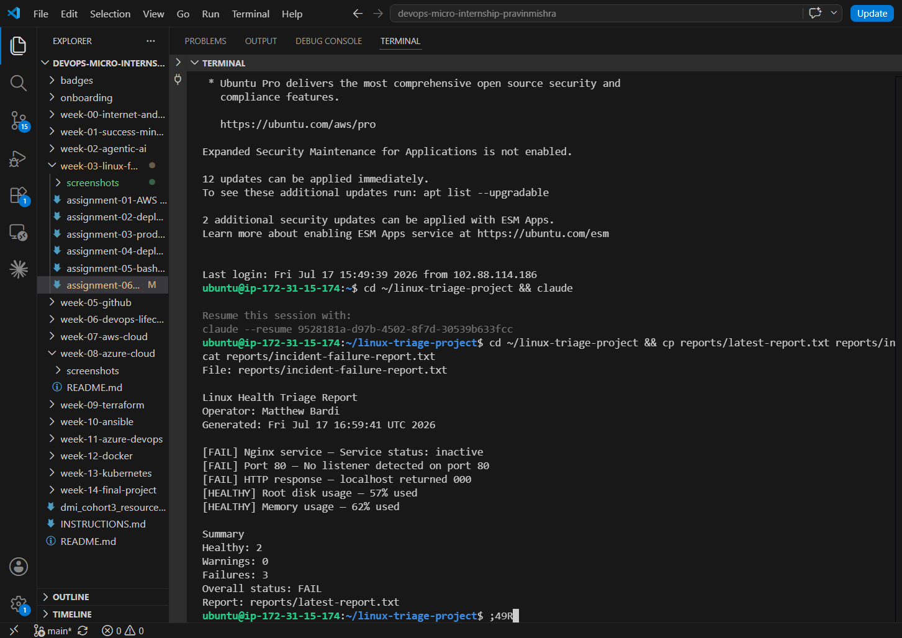

---

### Notes

Answer the following in your own words:

**1. Which three checks failed?**

The three failed checks were the Nginx service check, the port 80 listening check, and the HTTP response check.

---

**2. What evidence supports the conclusion that Nginx is unavailable?**

The evidence shows that the Nginx service was inactive, no process was listening on port 80, and the request to http://localhost could not connect and returned HTTP code 000.

---

**3. Did Claude execute the recovery command? Why is that important?**

Claude did not execute the recovery command because the workflow requires the human operator to review, approve, and run every recovery action. This is important because it prevents the AI from making an unapproved change to the server.

---

**4. Which phase of the Agentic Loop is represented by the Bash report?**

The Bash report represents the Gather phase of the Agentic Loop because it collects factual evidence about the service status, port 80, HTTP response, disk usage, and memory usage.

---

**5. Which phase is represented by Claude's explanation?**

Claude’s explanation represents the Analyze phase of the Agentic Loop because it interprets the Bash evidence, identifies the most likely cause, and recommends a recovery action without executing it.

---

# Task 8 — Recover Manually, Verify Again, and Write the Incident Summary

## Goal

Recover the service as the human operator and prove that the system is healthy again.

### Evidence

#### Screenshot 16 — Output showing Nginx is active and `curl -I http://localhost` returns 200 OK

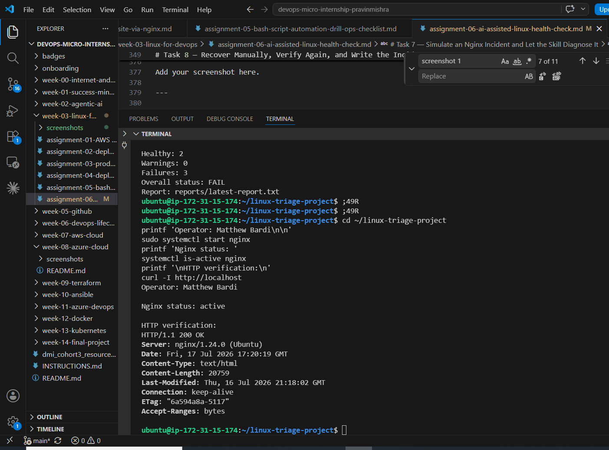

---

#### Screenshot 17 — Second `/linux-triage` output showing successful recovery with no FAIL results

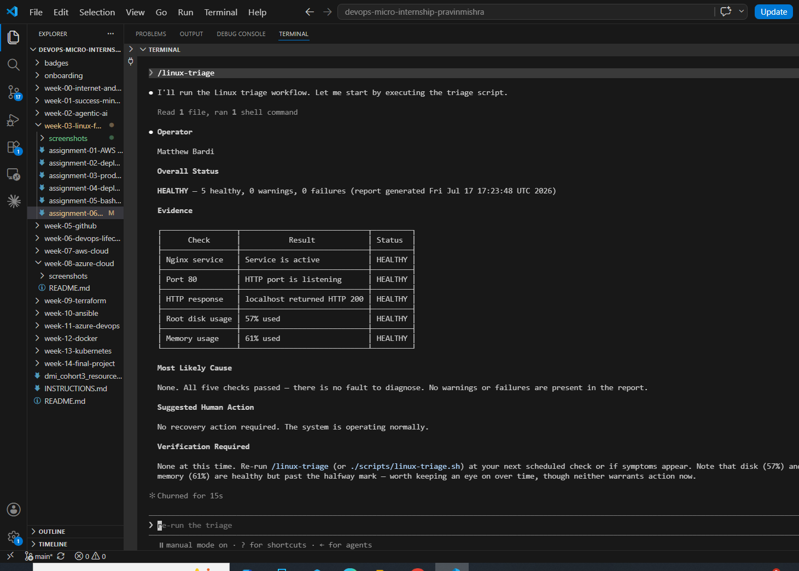
---

#### Screenshot 18 — Output of `ls -lah reports` showing both `incident-failure-report.txt` and `recovery-report.txt`

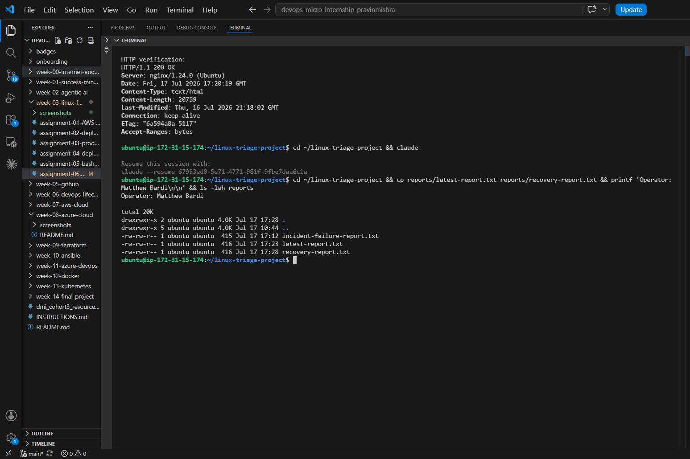

---

#### Screenshot 19 — `incident-summary.md` showing all required sections and your Full Name

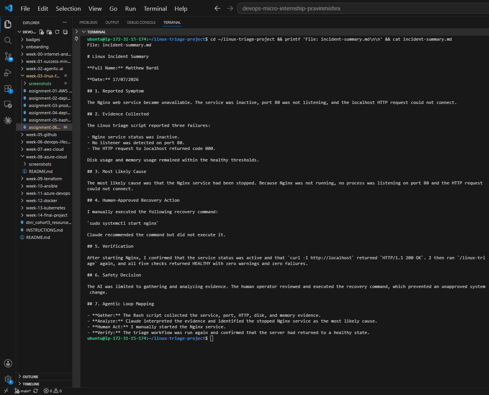

---

### Notes

Answer the following in your own words:

**1. What action did you execute manually?**

I manually executed sudo systemctl start nginx to start the stopped Nginx service.

---

**2. What evidence proves that the service recovered?**

The recovery was proven by the Nginx service returning active, curl -I http://localhost returning HTTP/1.1 200 OK, and the second /linux-triage run showing all five checks as HEALTHY with zero failures.

---

**3. Why is the second triage run necessary?**

The second triage run is necessary to verify that the recovery action actually restored the service and that all five health checks returned to a healthy state.

---

**4. What could go wrong if an AI agent automatically restarted every failed service?**

If an AI agent automatically restarted every failed service, it could hide the real cause, restart the wrong service, interrupt users, create repeated failure loops, or make an unsafe change without human review

---

**5. In one sentence, explain the difference between using AI as a chatbot and using AI in this agentic workflow.**

Using AI as a chatbot only gives a conversational response, while this agentic workflow gathers real system evidence, analyzes it, requires a human-approved action, and verifies the result.

---

# Incident Summary

Fill in all seven sections below in your own words.

**Full Name:** Matthew Bardi

**Date:** 17/07/2026

---

**1. Reported Symptom**

The Nginx web service became unavailable. The service was inactive, port 80 was not listening, and the localhost HTTP request could not connect.

---

**2. Evidence Collected**

The triage script showed that Nginx was inactive, port 80 was not listening, and the localhost HTTP request returned code 000. Disk usage and memory usage remained healthy

---

**3. Most Likely Cause**

The most likely cause was that the Nginx service had been stopped. Because Nginx was not running, no process was listening on port 80 and the HTTP request could not connect.

---

**4. Human-Approved Recovery Action**

I manually executed sudo systemctl start nginx after reviewing Claude’s recommendation. Claude did not run the command.

---

**5. Verification**

After starting Nginx, I confirmed that the service was active and that curl -I http://localhost returned HTTP/1.1 200 OK. A second /linux-triage run showed all five checks as HEALTHY with zero warnings and zero failures.

---

**6. Safety Decision**

The AI was limited to gathering and analyzing evidence. The human operator reviewed and executed the recovery command, which prevented an unapproved system change.

---

**7. Agentic Loop Mapping**

Gather: The Bash script collected evidence about Nginx, port 80, the HTTP response, disk usage, and memory usage. Analyze: Claude interpreted the evidence and identified the stopped Nginx service as the most likely cause. Human Act: I manually started Nginx. Verify: I ran the triage workflow again and confirmed that all five checks were HEALTHY.

---

# LinkedIn Post (Required)

## Evidence

#### LinkedIn Post URL

Paste your LinkedIn post URL here:

`https://www.linkedin.com/posts/matthew-bardi_cloudengineer-linux-bash-share-7483960673576833024-hR4k/`

---

#### Screenshot — Published LinkedIn post

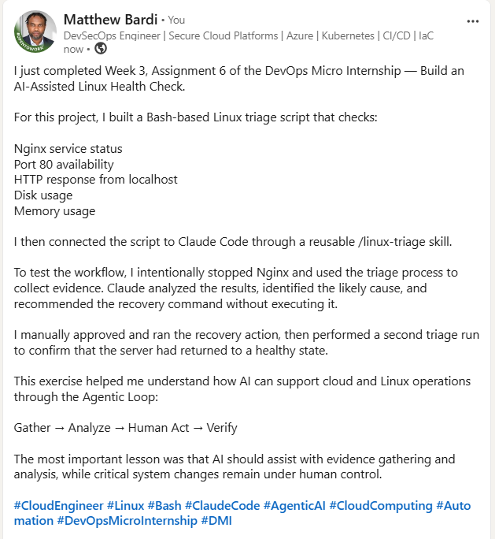

---

# GitHub Repository URL

Paste the URL of your GitHub folder or repository containing the assignment files here:

`https://github.com/MatthewBardi/devops-micro-internship-pravinmishra/tree/main/week-03-linux-for-devops`

---

# Submission Instructions

- Add all required screenshots in your submission
- Full Name must be visible in required screenshots and the Bash report
- All written answers must be in your own words
- Do not expose sensitive information (keys, passwords, AWS account IDs, tokens)
- GitHub URL must be included in this document

---

# Completion Checklist

- [x] Task 1: Healthy baseline confirmed, workspace created (Screenshots 1–2, Notes answered)
- [x] Task 2: CLAUDE.md created with all four sections (Screenshot 3, Notes answered)
- [x] Task 3: Five-check plan produced by Claude using read-only tools (Screenshot 4, Notes answered)
- [x] Task 4: `linux-triage.sh` created, syntax validated, executable permission set (Screenshots 5–8, Notes answered)
- [x] Task 5: Healthy-state report generated with no FAIL result (Screenshots 9–10, Notes answered)
- [x] Task 6: `/linux-triage` skill created and run successfully on healthy server (Screenshots 11–12, Notes answered)
- [x] Task 7: Nginx incident simulated, failed evidence captured, Claude did not execute recovery (Screenshots 13–15, Notes answered)
- [x] Task 8: Nginx recovered manually, recovery verified, reports saved, incident summary complete (Screenshots 16–19, Notes answered)
- [x] Incident summary contains all seven required sections
- [x] LinkedIn post published and URL submitted
- [x] Full Name visible in all required screenshots and the Bash report
- [x] Skill does not have Write permission
- [x] Skill did not execute any recovery commands
- [x] No sensitive data exposed

---

## 📌 About DMI & CloudAdvisory

DevOps Micro Internship (DMI) is a project-based DevOps program run by Pravin Mishra (The CloudAdvisory) focused on real-world execution, systems thinking, and career readiness.

It helps learners build strong DevOps foundations with hands-on experience.

---

## 📌 Resources

- 🌐 DMI Official Website: https://dmi.pravinmishra.com?utm_source=github&utm_medium=readme  
- 🎓 University: https://university.pravinmishra.com?utm_source=github&utm_medium=readme  
- 💬 Discord Community: https://discord.pravinmishra.com?utm_source=github&utm_medium=readme  
- 📝 Blog: https://dmi.pravinmishra.com/blog?utm_source=github&utm_medium=readme  
- ▶️ YouTube Playlist: https://www.youtube.com/playlist?list=PLFeSNDtI4Cho  
- 🔗 Pravin Mishra (LinkedIn): https://www.linkedin.com/in/pravin-mishra-aws-trainer/  
- 🏢 CloudAdvisory (LinkedIn): https://www.linkedin.com/company/thecloudadvisory/

---

*This submission is part of DevOps Micro Internship (DMI) Cohort 3 — Agentic AI Track.*