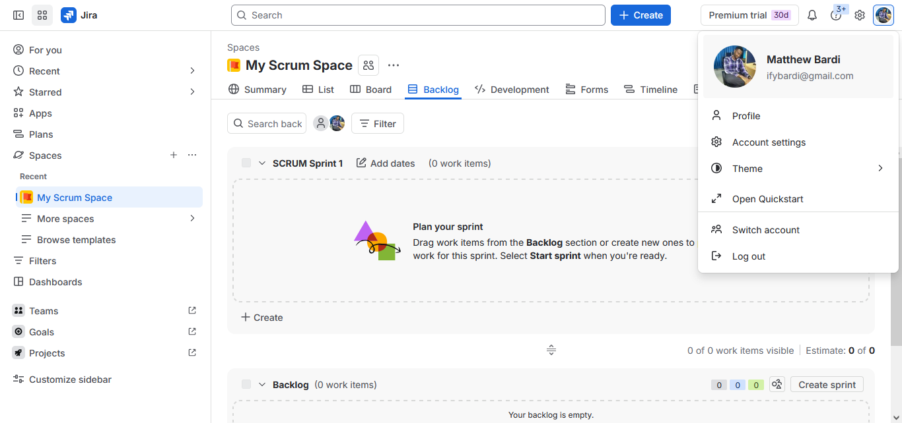
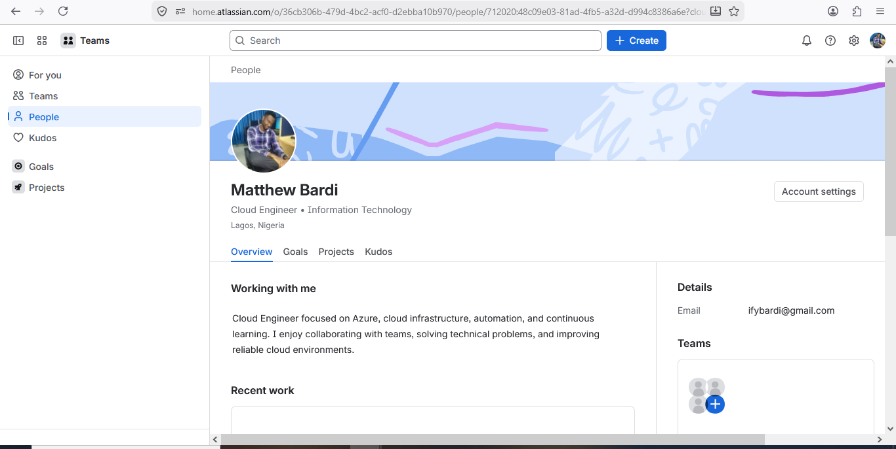
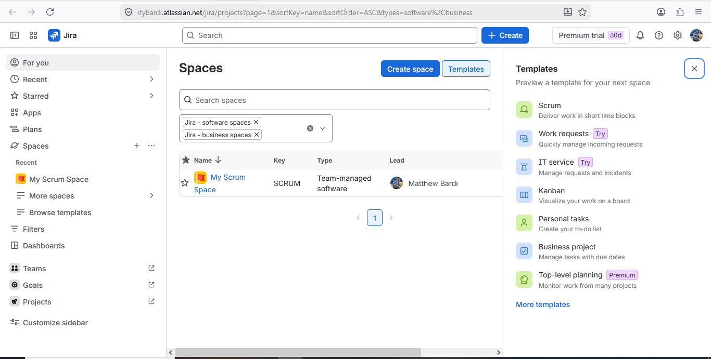
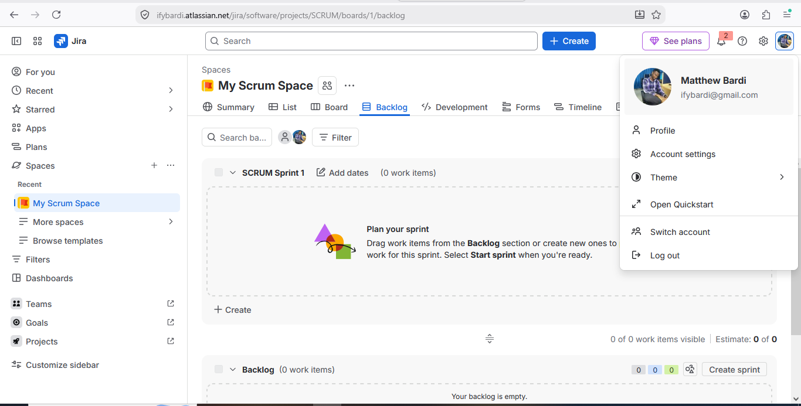

# Assignment 1 — Create Your Jira Account & Setup Profile

Part of the DevOps Micro Internship (DMI) Cohort 3 with Agentic AI

---

## Purpose

In this assignment, you will create or access a Jira Software Cloud account, verify your Atlassian identity when required, set up a professional profile, and explore the Jira dashboard and project areas. This prepares you for real-world Agile and DevOps collaboration, where Jira is commonly used to plan work, assign tickets, and track progress. You will explore the workspace only — you will not create any issues in this assignment.

---

# Task 1 — Sign Up for Jira Software Cloud

## Goal

Create or access your Jira Cloud account and reach the Jira Software workspace successfully.

### Evidence

#### Screenshot 1 — Jira welcome page, dashboard, or main workspace after successful login, with your name or avatar visible

---

# Task 2 — Verify Your Atlassian Account

## Goal

Confirm your email address if Atlassian requests verification.

### Evidence

#### Screenshot 2 (if applicable) — Confirmation screen after email verification, or the inbox showing the Atlassian verification email subject

*Not applicable — I signed in with my Google account, so Atlassian did not require separate email verification.*

---

### Notes

If you signed up with Google and no separate email verification was required, state that here instead of a screenshot.

I signed in with my Google account, so Atlassian did not require separate email verification.

---

# Task 3 — Set Up Your Professional Jira Profile

## Goal

Update your Jira profile with your full name, a job title or role (e.g. "Aspiring DevOps Engineer"), and a short professional bio.

### Evidence

#### Screenshot 3 — Updated profile page showing your full name, role/title, and bio

---

# Task 4 — Explore the Jira Dashboard and Projects

## Goal

Locate the project list and open a project's Board or Backlog, and view Project settings, without creating, editing, or deleting any issues.

### Evidence

#### Screenshot 4 — "View all projects" page showing at least one project

---

#### Screenshot 5 — Opened project showing either the Board or Backlog screen

---

# Submission Instructions

- Add all required screenshots in your submission
- Full name must be visible in required screenshots
- Do not expose sensitive information (passwords, verification codes, account recovery details)

---

# Completion Checklist

- [x] Task 1: Jira Software Cloud account created or existing account accessed (Screenshot 1)
- [x] Task 2: Email verification completed, or a Google sign-in note included (Screenshot 2 or Notes)
- [x] Task 3: Professional profile updated with full name, role/title, and bio (Screenshot 3)
- [x] Task 4: Projects page and a Board or Backlog explored (Screenshots 4 & 5)
- [x] No Jira issues created
- [x] Full Name visible in required screenshots
- [x] No sensitive data exposed

---

## 📌 About DMI & CloudAdvisory

DevOps Micro Internship (DMI) is a project-based DevOps program run by Pravin Mishra (The CloudAdvisory) focused on real-world execution, systems thinking, and career readiness.

It helps learners build strong DevOps foundations with hands-on experience.

---

## 📌 Resources

- 🌐 DMI Official Website: https://dmi.pravinmishra.com?utm_source=github&utm_medium=readme
- 🎓 University: https://university.pravinmishra.com?utm_source=github&utm_medium=readme
- 💬 Discord Community: https://discord.pravinmishra.com?utm_source=github&utm_medium=readme
- 📝 Blog: https://dmi.pravinmishra.com/blog?utm_source=github&utm_medium=readme
- ▶️ YouTube Playlist: https://www.youtube.com/playlist?list=PLFeSNDtI4Cho
- 🔗 Pravin Mishra (LinkedIn): https://www.linkedin.com/in/pravin-mishra-aws-trainer/
- 🏢 CloudAdvisory (LinkedIn): https://www.linkedin.com/company/thecloudadvisory/

---

*This submission is part of DevOps Micro Internship (DMI) Cohort 3 — Agentic AI Track.*
