# Assignment 4 — Gotto Job: Backlog Refinement & Sprint 1 in Jira

Part of the DevOps Micro Internship (DMI) Cohort 3 with Agentic AI

**Student:** Matthew Bardi
**Working Mode:** Solo Mode

---

## Purpose

In this 90-minute, time-boxed exercise, you will act as a Scrum team — or run in Solo Mode, playing every role yourself — to turn the Gotto Job template into a value-ordered backlog, estimate the work in story points, plan Sprint 1, open the burndown chart, and ship one small UI-only increment (text, color, spacing, a label, or a CTA — no backend changes).

---

# Task 1 — Roles & Mode Setup (Team vs Solo)

## Goal

Choose Team Mode or Solo Mode, and document how each Scrum role (Product Owner, Scrum Master, Dev Lead, DevOps Lead) was handled.

### Evidence

#### Screenshot 1 — Jira "Create project" screen, or the project sidebar after creation

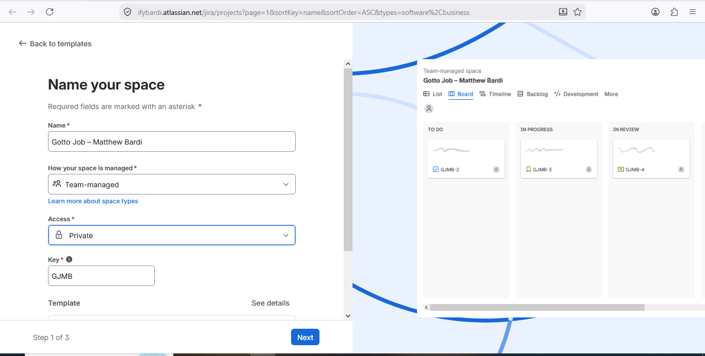

---

### Notes

Write one line for each role: PO (what you prioritized), SM (how you ensured process), Dev Lead (what you built), DevOps Lead (how you shipped).

**PO:** I prioritized the UI improvement stories and selected the hero headline as the first increment to deliver.

**SM:** I defined the Sprint Goal, planned the Sprint scope, and tracked the work through To Do, In Progress, and Done.

**Dev Lead:** I updated the homepage hero headline and verified that it met the acceptance criteria on desktop and mobile.

**DevOps Lead:** I committed the change to Git, deployed the site to AWS EC2 with Nginx, and verified the live URL.

---

# Task 2 — Create the Jira Project (Team-managed → Scrum)

## Goal

Create a Team-managed Scrum project named `Gotto Job – Team <#>` (Team Mode) or `Gotto Job – <YourName>` (Solo Mode).

### Notes

I created a Team-managed Scrum project in Jira named **Gotto Job – Matthew Bardi** with project key **GJMB**.

### Evidence

#### Screenshot 2 — Project created page showing the project name and key

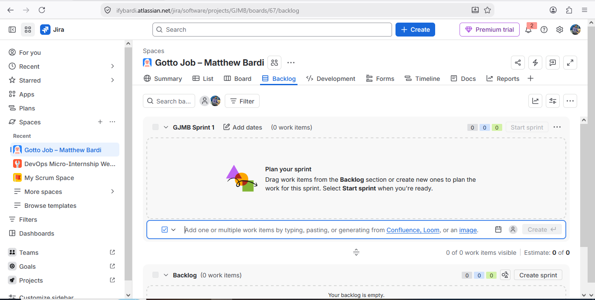

---

# Task 3 — Create the Epic

## Goal

Create the Epic `Improve Gotto Job UI discoverability & trust` to group the UI improvement initiative.

### Notes

I created Epic **GJMB-1 — Improve Gotto Job UI discoverability & trust** to group the related UI improvement stories under one product objective.

### Evidence

#### Screenshot 3 — Backlog showing the Epic panel with the Epic visible

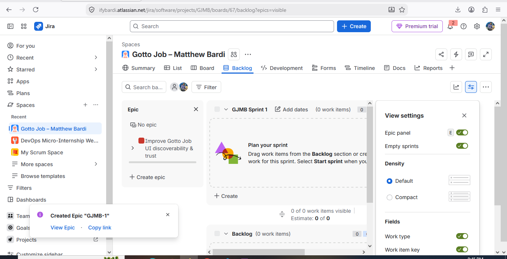

---

# Task 4 — Seed the Product Backlog (6–8 Stories + Fibonacci Points + Ranking)

## Goal

Create at least six Stories under the Epic, estimate each with 1, 2, or 3 story points, and rank them by value.

### Notes

I created and ranked six UI improvement stories under Epic GJMB-1:

- **GJMB-2** — Show headline “Find your next role, fast.” — 1 point
- **GJMB-3** — Change the primary menu/button to a high-contrast color — 1 point
- **GJMB-4** — Make job titles larger and bolder — 2 points
- **GJMB-5** — Show a “REMOTE” pill on cards flagged REMOTE — 2 points
- **GJMB-6** — Add a human-readable posted date to cards — 1 point
- **GJMB-7** — Clarify advanced search labels — 2 points

### Evidence

#### Screenshot 4 — Backlog showing the Epic and at least six Stories under it

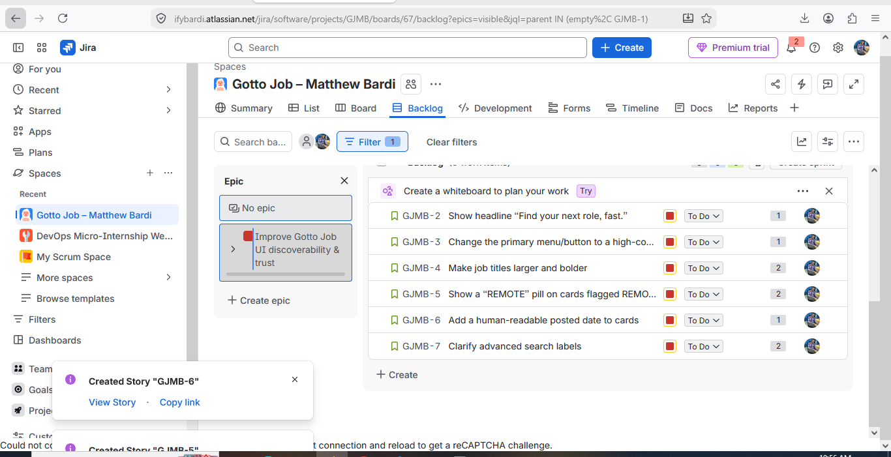

---

#### Screenshot 5 — One Story opened showing its Story Points and acceptance criteria filled in

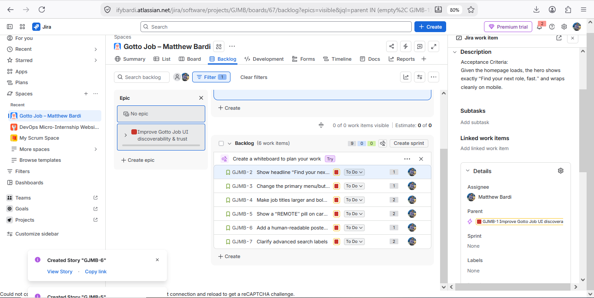

---

# Task 5 — Planning Poker (Estimate + Debate Notes)

## Goal

Confirm the Story Points (1, 2, or 3) for each Story and record brief reasoning for each estimate.

### Evidence

#### Screenshot 6 — Backlog showing Story Points visible, or two or three Stories opened showing their points

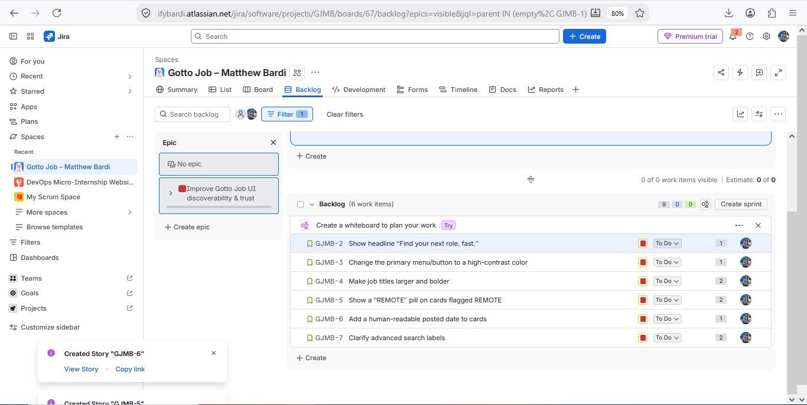

---

### Notes

For each story, explain in one or two lines why it is a 1, 2, or 3 (mention any debate, even in Solo Mode).

- **GJMB-2 — 1 point:** Simple text-only hero headline change with low implementation risk.
- **GJMB-3 — 1 point:** Small visual color change with limited implementation effort.
- **GJMB-4 — 2 points:** Typography changes require styling and visual verification across job cards.
- **GJMB-5 — 2 points:** Adding the REMOTE pill requires identifying the relevant cards and validating consistent presentation.
- **GJMB-6 — 1 point:** Static human-readable posted-date text is a small UI-only change.
- **GJMB-7 — 2 points:** Multiple search labels require coordinated UI updates and alignment checks.

In Solo Mode, I reviewed each estimate myself. The main consideration was whether the change was a simple text/style update or required additional UI logic and testing.

---

# Task 6 — Sprint Planning: Create Sprint 1 + Sprint Goal + Scope

## Goal

Create Sprint 1, move three or four Stories into it (approximately 3–6 points), set the Sprint Goal, and break each selected Story into Build, Verify, Deploy, and Screenshot Sub-tasks.

### Notes

I created **GJMB Sprint 1** with the Sprint Goal:

> Ship 2–3 visible UI improvements to Gotto Job and show them live.

I selected GJMB-2 (1 point), GJMB-3 (1 point), and GJMB-4 (2 points), for a total Sprint scope of **4 story points**.

Each selected Story was broken into four Sub-tasks: **Build, Verify, Deploy, and Screenshot**.

### Evidence

#### Screenshot 7 — Sprint 1 with the selected Stories inside it

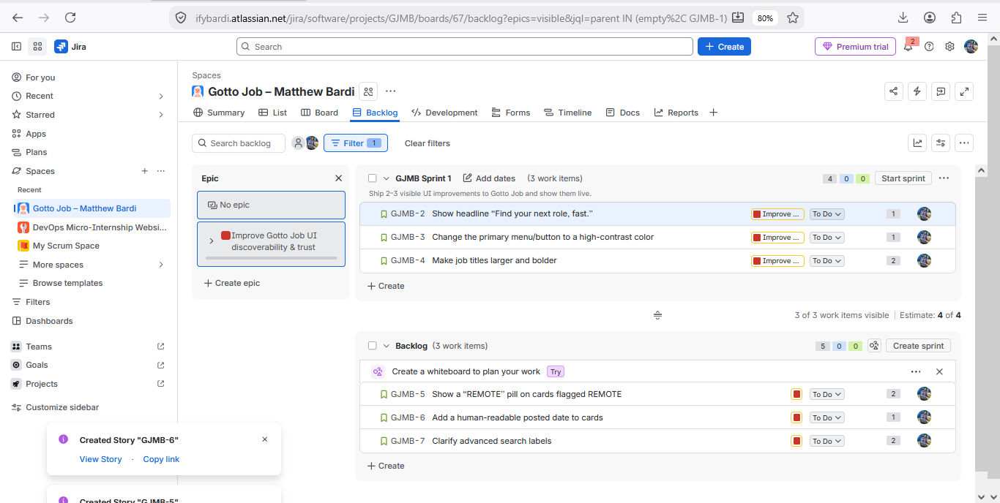

---

#### Screenshot 8 — One Story showing the Sub-tasks created

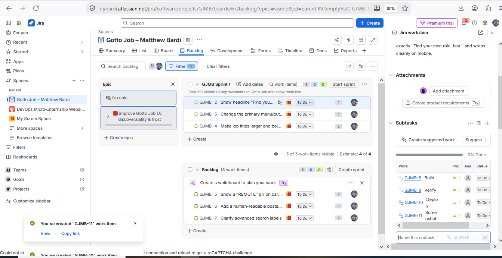

---

# Task 7 — Reports: Open Burndown Chart

## Goal

Open the Burndown Chart and confirm it exists for Sprint 1. It is acceptable if the chart is not yet populated.

### Notes

I opened the Sprint Burndown Chart for GJMB Sprint 1 to inspect progress against the planned Story Points.

### Evidence

#### Screenshot 9 — Burndown Chart page opened, even if empty

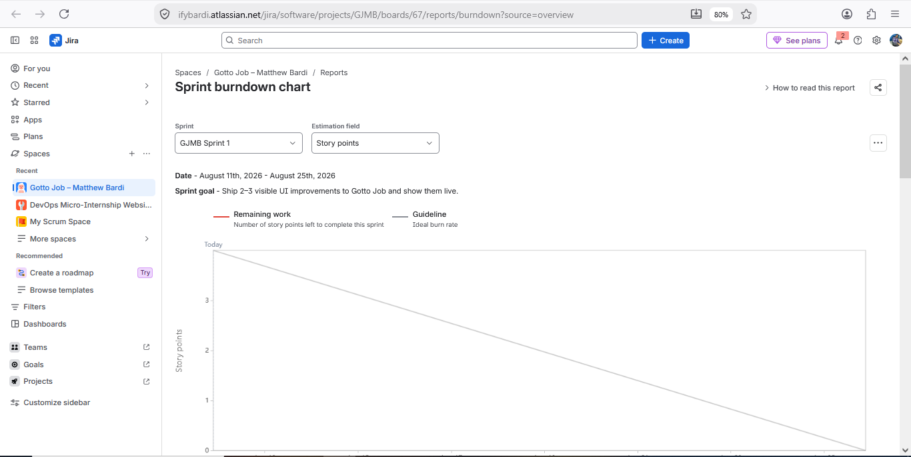

---

# Task 8 — Ship One Small Increment (Build + Deploy + Proof)

## Goal

Implement one small UI-only Story from Sprint 1, commit it, deploy it live, and move the Story and its Sub-tasks to Done in Jira.

### Notes

I selected **GJMB-2** and changed the homepage hero headline to **“Find your next role, fast.”**

I committed the UI change with:

`feat(ui): update homepage hero headline`

I deployed the site to AWS EC2 using Nginx, verified it on desktop and mobile, and moved the Story and all four Sub-tasks to Done.

**Live URL:** http://32.196.113.97/gotto-job/

### Evidence

#### Screenshot 10 — Jira board showing the Story moved to Done

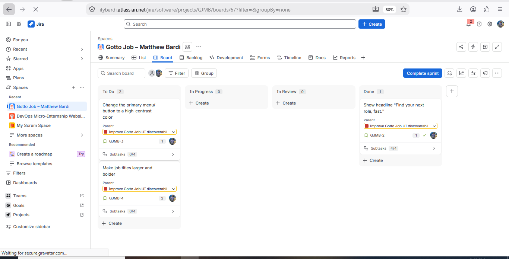

---

#### Screenshot 11 — Git commit output

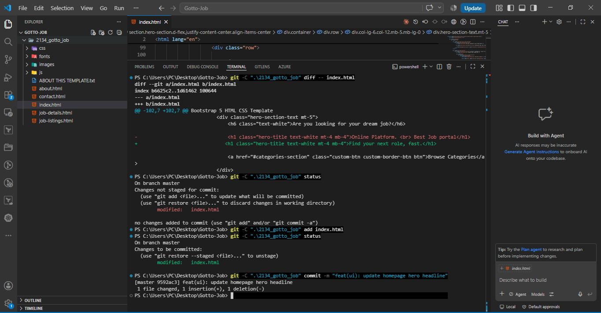

---

#### Screenshot 12 — Live URL in the browser showing the UI change, with the URL visible

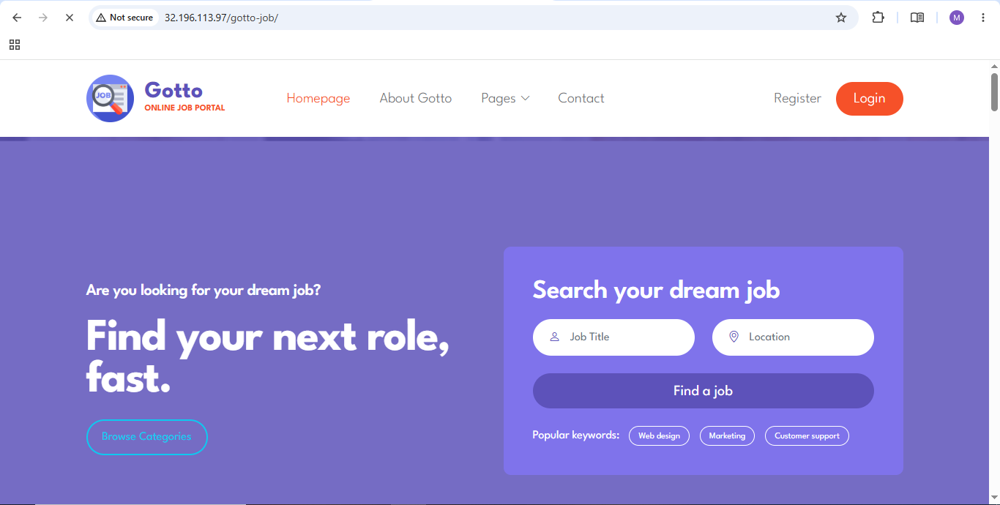

---

# Task 9 — Retro Notes (Scrum Pillar + Value)

## Goal

Add a retro comment covering what went well, what to improve, one Scrum pillar observed (Transparency, Inspection, or Adaptation), and one Scrum value (Openness, Focus, Commitment, Courage, or Respect).

### Notes

**What went well:** I refined the backlog, planned Sprint 1, implemented and deployed the hero headline change successfully.

**What to improve:** I would validate deployment permissions and static asset access earlier to reduce troubleshooting time.

**Scrum pillar — Inspection:** I verified the live deployment and mobile layout before marking the Story Done.

**Scrum value — Commitment:** I completed the selected Story including Build, Verify, Deploy, and evidence.

### Evidence

#### Screenshot 13 — Jira retro comment visible

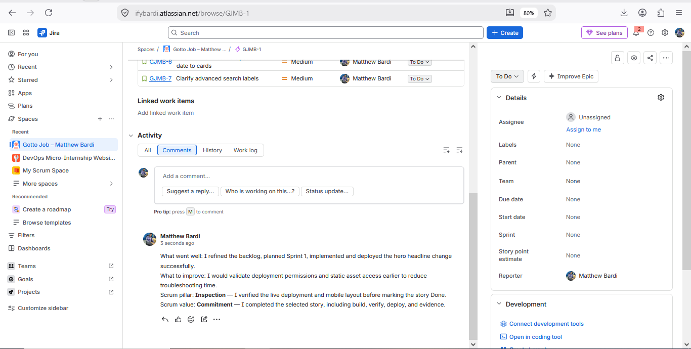

---

# Task 10 — LinkedIn Post (Mandatory)

## Goal

Publish a LinkedIn post about what you delivered, including your live URL, three to five lines on what you did and learned, and one screenshot (Burndown Chart, Sprint board, or the live UI change).

## Evidence

#### LinkedIn Post URL

Paste your LinkedIn post URL here:

https://www.linkedin.com/posts/activity-7493377298847485954-Ght1

---

#### Screenshot 14 — Published LinkedIn post

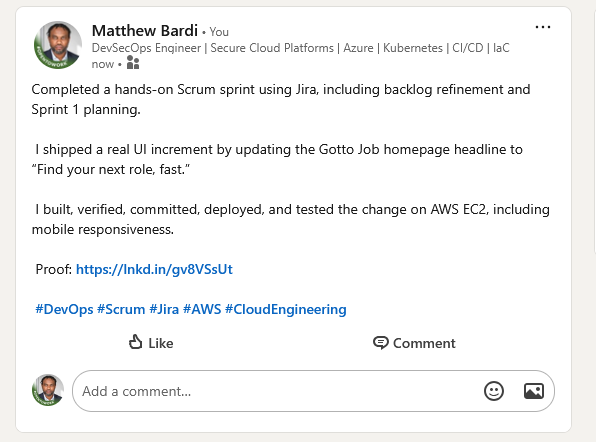

---

# Submission Instructions

- Add all 14 required screenshots
- Full name must be visible in required screenshots
- Do not expose sensitive information (keys, passwords, account IDs)

---

# Completion Checklist

- [x] Task 1: Team Mode or Solo Mode selected and all four roles documented (Screenshot 1 & Notes)
- [x] Task 2: Team-managed Scrum project created with the required name (Screenshot 2)
- [x] Task 3: UI improvement Epic created (Screenshot 3)
- [x] Task 4: 6–8 Stories added under the Epic and ranked by value (Screenshots 4 & 5)
- [x] Task 5: Story Points set (1, 2, or 3) with reasoning recorded (Screenshot 6 & Notes)
- [x] Task 6: Sprint 1 created with Sprint Goal, 3–4 Stories, and Sub-tasks (Screenshots 7 & 8)
- [x] Task 7: Burndown Chart opened (Screenshot 9)
- [x] Task 8: One UI-only increment implemented, committed, deployed, and verified (Screenshots 10–12)
- [x] Task 9: Retro comment with one Scrum pillar and one Scrum value (Screenshot 13)
- [x] Task 10: Mandatory LinkedIn post published with the live URL, backlog refinement, Sprint planning, one shipped increment, proof, and Screenshot 14
- [x] Full Name visible in required screenshots
- [x] No sensitive data exposed

---

## 📌 About DMI & CloudAdvisory

DevOps Micro Internship (DMI) is a project-based DevOps program run by Pravin Mishra (The CloudAdvisory) focused on real-world execution, systems thinking, and career readiness.

It helps learners build strong DevOps foundations with hands-on experience.

---

## 📌 Resources

- 🌐 DMI Official Website: https://dmi.pravinmishra.com?utm_source=github&utm_medium=readme  
- 🎓 University: https://university.pravinmishra.com?utm_source=github&utm_medium=readme  
- 💬 Discord Community: https://discord.pravinmishra.com?utm_source=github&utm_medium=readme  
- 📝 Blog: https://dmi.pravinmishra.com/blog?utm_source=github&utm_medium=readme  
- ▶️ YouTube Playlist: https://www.youtube.com/playlist?list=PLFeSNDtI4Cho  
- 🔗 Pravin Mishra (LinkedIn): https://www.linkedin.com/in/pravin-mishra-aws-trainer/  
- 🏢 CloudAdvisory (LinkedIn): https://www.linkedin.com/company/thecloudadvisory/

---

*This submission is part of DevOps Micro Internship (DMI) Cohort 3 — Agentic AI Track.*
