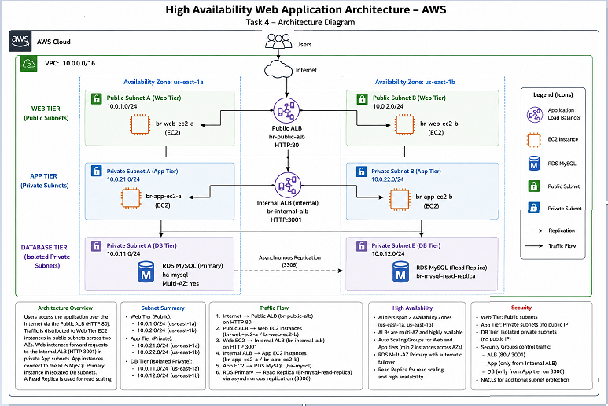
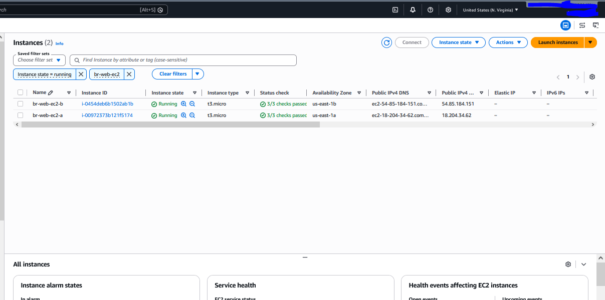
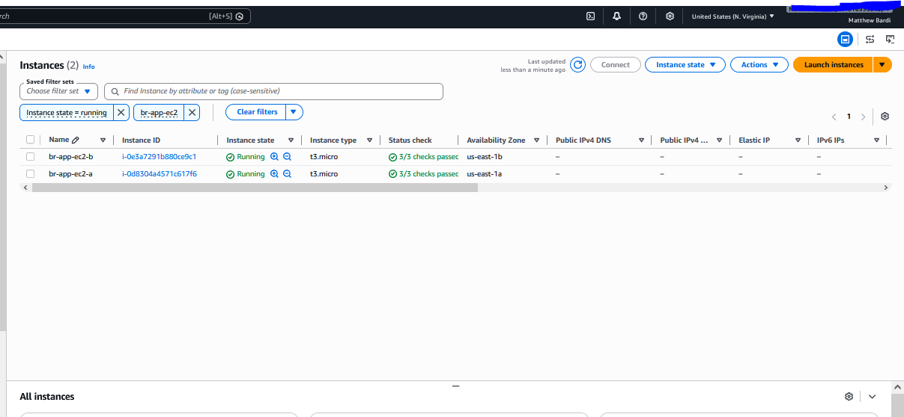
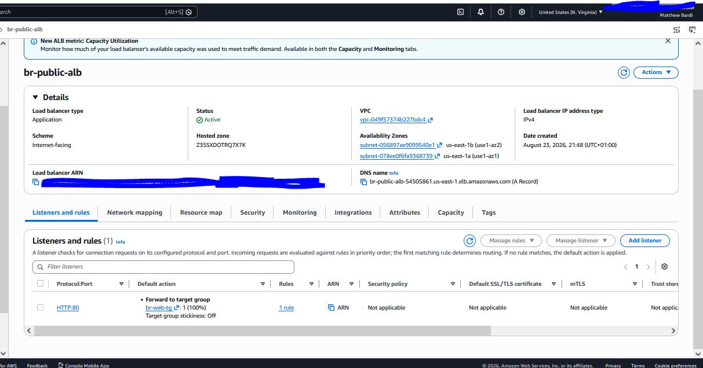
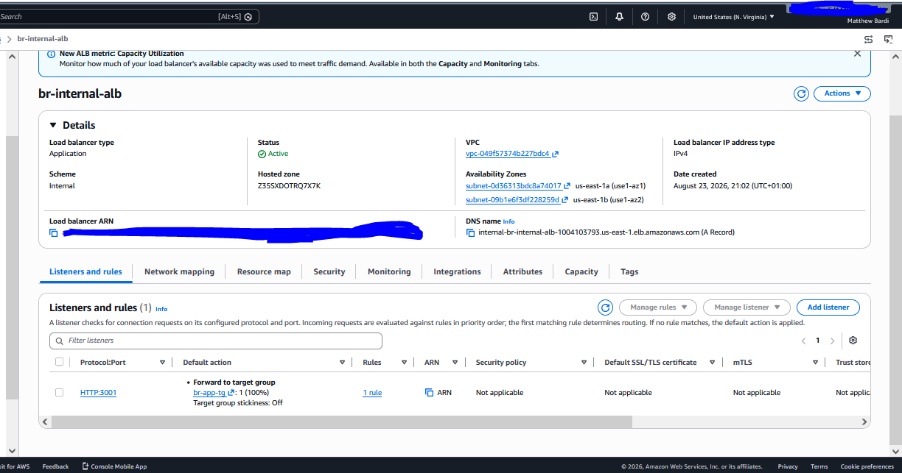
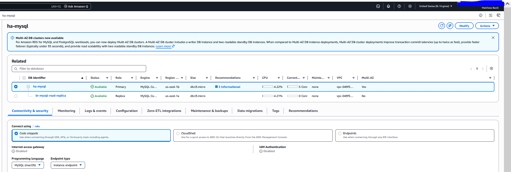
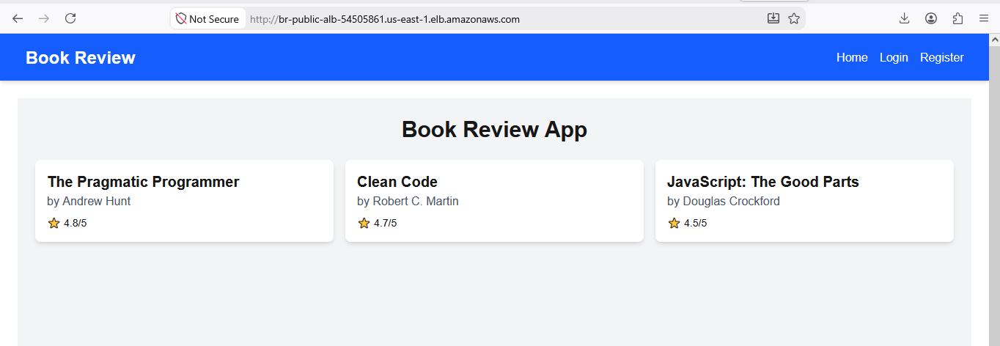
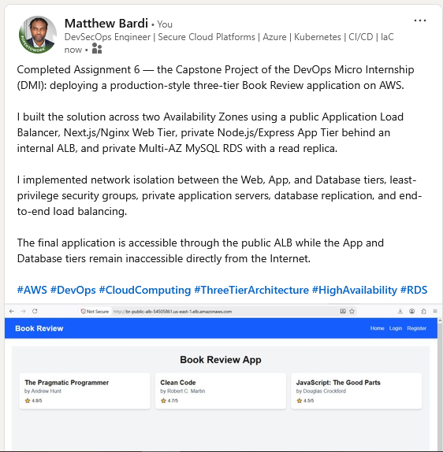

# Assignment 6 — Capstone Assignment — Deploy Book Review App (Three-Tier Architecture) on AWS

Part of the DevOps Micro Internship (DMI) Cohort 3 with Agentic AI

---

## Purpose

This is the most important assignment of the course. You will deploy the Book Review App in a fully production-style three-tier architecture on AWS: a Next.js Web Tier behind Nginx and a public ALB, a private Node.js/Express App Tier behind an internal ALB, and a private Multi-AZ MySQL RDS database with a read replica. You are expected to design, deploy, isolate, debug, and document the result independently.

---

# Task 1 — Architecture Diagram

## Goal

Create an architecture diagram showing the custom VPC (10.0.0.0/16), the six subnets across two Availability Zones (two public Web Tier, two private App Tier, two private Database Tier), the public ALB, Web Tier EC2/Nginx, internal ALB, private App Tier EC2, private Multi-AZ RDS with its read replica, and the permitted traffic flow.

### Evidence

#### Diagram image or link

---

# Task 2 — AWS Region & Services Used

## Goal

Record the AWS Region used and list every AWS service used across networking, compute, load balancing, security, and the database.

### Notes

**Region:**

US East (N. Virginia) - us-east-1

---

**Services:**

Amazon VPC, EC2, Application Load Balancer (Elastic Load Balancing), Amazon RDS for MySQL, Security Groups, Internet Gateway, NAT Gateway, Route Tables, AWS IAM, AWS Systems Manager, and Systems Manager Parameter Store.

---

# Task 3 — Public Entry Point

## Goal

Confirm the Book Review App loads through the public ALB DNS name.

### Evidence

#### Public ALB DNS

Paste your public ALB DNS name here:

`br-public-alb-54505861.us-east-1.elb.amazonaws.com`

---

# Task 4 — Evidence Screenshots

## Goal

Capture visual proof of every tier and load balancer.

### Evidence

#### Web EC2

---

#### App EC2

---

#### Public ALB

---

#### Internal ALB

---

#### RDS + Replica

---

#### App UI proof

---

# Task 5 — Summary

## Goal

Summarize what worked in the final deployment, the issues encountered and how each was fixed, and the tools or sources used to research and debug.

### Notes

**What worked:**

The Book Review App was successfully deployed as a three-tier architecture across two Availability Zones. The public Application Load Balancer distributes traffic to two Next.js/Nginx Web Tier EC2 instances. The Web Tier communicates with two private Node.js/Express App Tier instances through an internal Application Load Balancer on port 3001. The App Tier connects to a private Multi-AZ MySQL RDS primary with a read replica. The application successfully loads book data through the public ALB while the App and Database tiers remain inaccessible directly from the Internet.

---

**Issues + fixes:**

Several issues were resolved during deployment. The AWS account reached its RDS instance quota, so the older EpicBook database was snapshotted and removed to free capacity. The existing Multi-AZ ha-mysql database was preserved with a safety snapshot and reused for the capstone. Because AWS would not move the existing RDS instance between subnet groups inside the same VPC, the private subnet roles were reorganized so the existing 10.0.11.0/24 and 10.0.12.0/24 subnets became the isolated Database Tier, while 10.0.21.0/24 and 10.0.22.0/24 became the private App Tier using NAT for outbound access. The frontend initially displayed 'No books available' because of an API path mismatch; Nginx was updated on both Web Tier instances to correctly route the frontend API request to the backend.

---

**Tools/sources used:**

AWS Management Console and AWS CloudShell/AWS CLI were used to build and verify the infrastructure. AWS Systems Manager Run Command was used to configure and troubleshoot private EC2 instances without exposing them publicly, and Parameter Store was used to securely hold database and application secrets. The official Book Review App GitHub repository, AWS documentation, Linux command-line tools, curl, systemd, Nginx, Node.js, MySQL utilities, and ChatGPT were used for deployment, validation, and troubleshooting.

---

# LinkedIn Post (Required)

## Goal

Publish a LinkedIn post sharing the capstone deployment, including the public ALB DNS (or a redacted screenshot), three to five lines on what you built and why it is production-style, and one proof screenshot.

## Evidence

#### LinkedIn Post URL

Paste your LinkedIn post URL here:

`https://www.linkedin.com/feed/update/urn:li:share:7497414863644962816/`

---

#### Screenshot of LinkedIn post

---

# Submission Instructions

- Add all required screenshots and links in your submission
- Do not expose passwords, RDS credentials, connection strings, private keys, or account IDs

---

# Completion Checklist

- [x] Task 1: Architecture diagram completed
- [x] Task 2: AWS Region and services documented
- [x] Task 3: Public ALB DNS confirmed working
- [x] Task 4: All six evidence screenshots captured (Web Tier, App Tier, both ALBs, RDS + replica, app UI)
- [x] Task 5: Deployment summary completed (what worked, issues/fixes, tools/sources)
- [x] LinkedIn post published and URL submitted
- [x] App Tier and Database Tier confirmed not publicly accessible
- [x] No sensitive data exposed

---

## 📌 About DMI & CloudAdvisory

DevOps Micro Internship (DMI) is a project-based DevOps program run by Pravin Mishra (The CloudAdvisory) focused on real-world execution, systems thinking, and career readiness.

It helps learners build strong DevOps foundations with hands-on experience.

---

## 📌 Resources

- 🌐 DMI Official Website: https://dmi.pravinmishra.com?utm_source=github&utm_medium=readme  
- 🎓 University: https://university.pravinmishra.com?utm_source=github&utm_medium=readme  
- 💬 Discord Community: https://discord.pravinmishra.com?utm_source=github&utm_medium=readme  
- 📝 Blog: https://dmi.pravinmishra.com/blog?utm_source=github&utm_medium=readme  
- ▶️ YouTube Playlist: https://www.youtube.com/playlist?list=PLFeSNDtI4Cho  
- 🔗 Pravin Mishra (LinkedIn): https://www.linkedin.com/in/pravin-mishra-aws-trainer/  
- 🏢 CloudAdvisory (LinkedIn): https://www.linkedin.com/company/thecloudadvisory/

---

*This submission is part of DevOps Micro Internship (DMI) Cohort 3 — Agentic AI Track.*