# Assignment 6 — Capstone: Deploy Book Review App (Three-Tier Architecture) on Azure

Part of the DevOps Micro Internship (DMI) Cohort 3 with Agentic AI

---

## Purpose

This is the most important assignment of the course. You will deploy the Book Review App in a production-ready, best-practice-compliant three-tier architecture on Azure: separated presentation, application, and database tiers, least-privilege network access, a controlled public entry point, protected secrets, and availability/monitoring evidence.

---

# Task 1 — Design the Azure Three-Tier Architecture

## Goal

Create an architecture diagram and implementation plan identifying the presentation, application, and database components, the chosen Azure services, the public entry point, and the internal traffic paths.

### Evidence

#### Screenshot 1 — Architecture diagram showing the public entry point, three tiers, network boundaries, and traffic flow

---

#### Screenshot 2 — Written architecture assumptions and selected Azure services

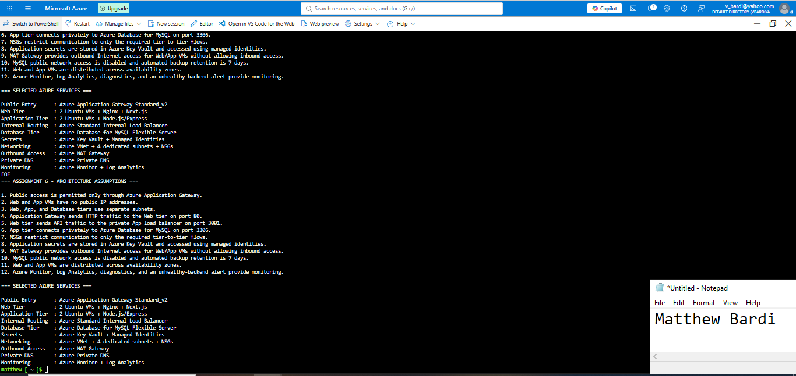

---

# Task 2 — Create the Azure Network Foundation

## Goal

Create a dedicated Resource Group and VNet with separate subnets for the web, application, and database tiers, keeping the application and database tiers without direct public access.

### Evidence

#### Screenshot 3 — Resource Group overview showing the assignment resources

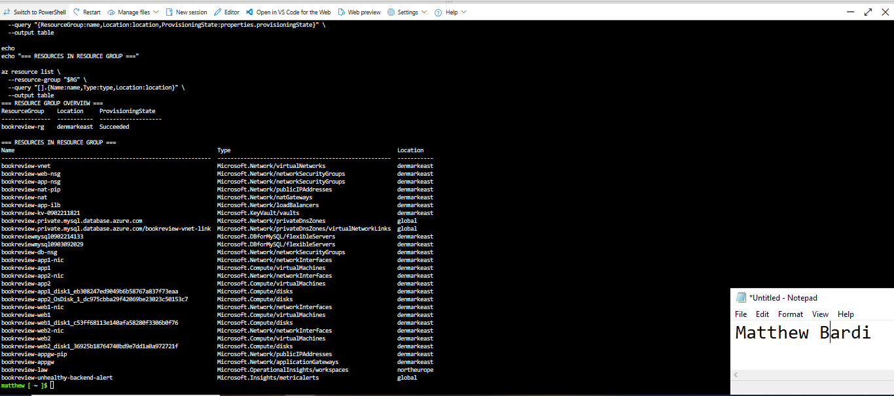

---

#### Screenshot 4 — VNet overview showing the address space and all required subnets

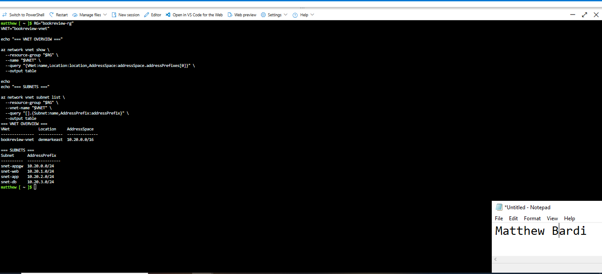

---

#### Screenshot 5 — Route-table or Private DNS evidence where applicable

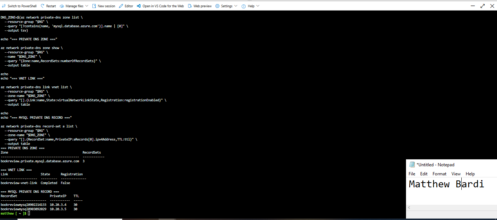

---

# Task 3 — Configure Security and Secret Management

## Goal

Apply least-privilege NSG rules so traffic flows Internet → public entry point → web tier → application tier → database tier, and store credentials in Azure Key Vault or another approved secure mechanism.

### Evidence

#### Screenshot 6 — NSG rules proving least-privilege access between the tiers

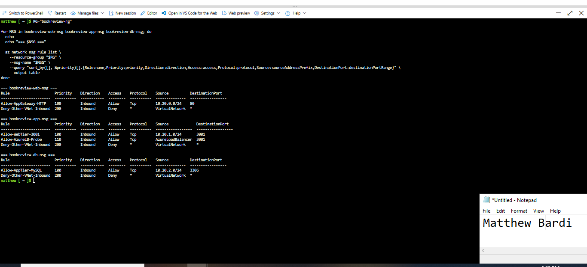

---

#### Screenshot 7 — Key Vault or approved secret-management configuration (without displaying secret values)

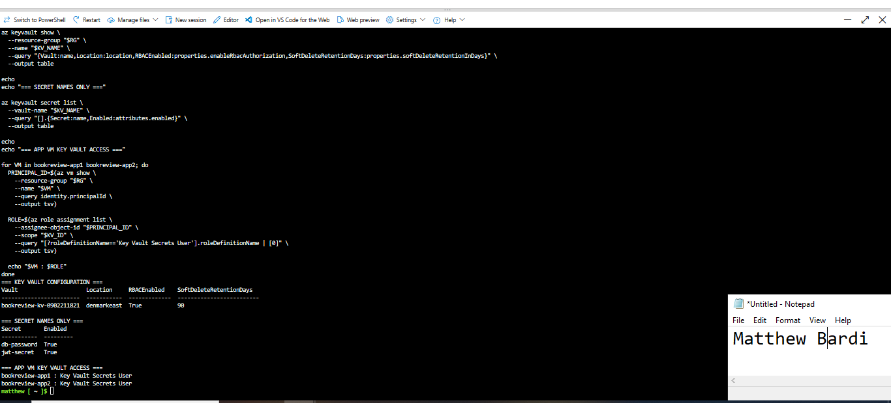

---

# Task 4 — Deploy the Presentation (Web) Tier

## Goal

Deploy the Book Review App presentation layer on the approved web-tier compute service, configured to route requests to the internal application-tier endpoint, and not directly exposed except through the public entry service.

### Evidence

#### Screenshot 8 — Web-tier compute overview showing subnet and availability configuration

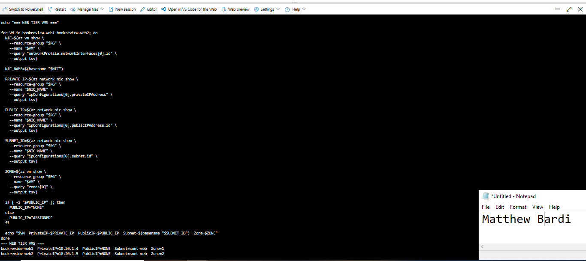

---

#### Screenshot 9 — Terminal or service output proving the presentation layer is running

---

# Task 5 — Deploy the Business (Application) Tier

## Goal

Deploy the Book Review App backend privately in the application subnet, configured to use the private database endpoint and secured environment values, reachable only through its internal endpoint.

### Evidence

#### Screenshot 10 — Application-tier compute overview showing private subnet placement

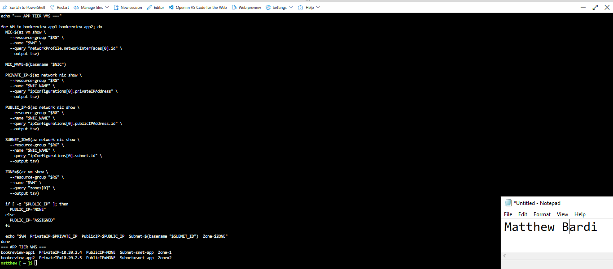

---

#### Screenshot 11 — Backend process, service, or listening-port evidence

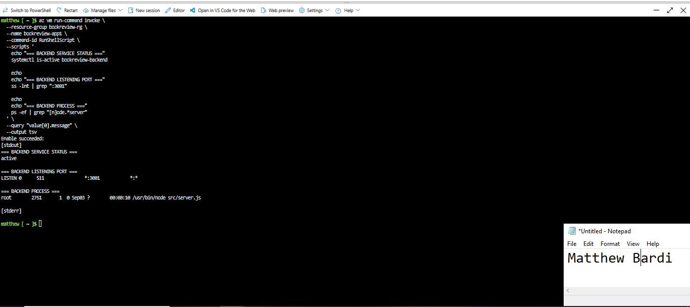

---

#### Screenshot 12 — Internal health-check or API response (without exposing secrets)

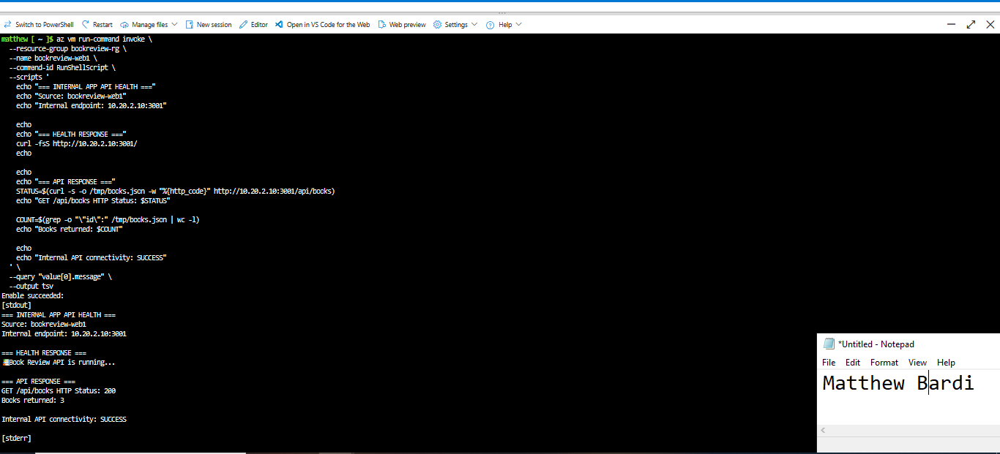

---

# Task 6 — Deploy the Managed Database Tier

## Goal

Create a private Azure managed database (public access disabled), with availability/backup/retention settings, the Book Review App schema imported, and access restricted to the application tier only.

### Evidence

#### Screenshot 13 — Database overview showing private connectivity and public access disabled

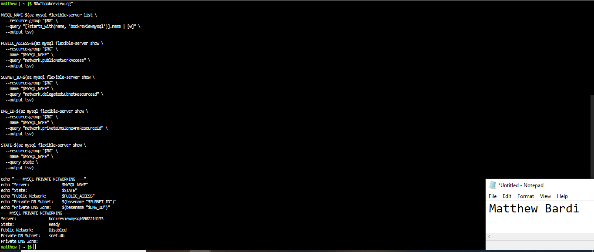

---

#### Screenshot 14 — Availability, backup, and retention configuration

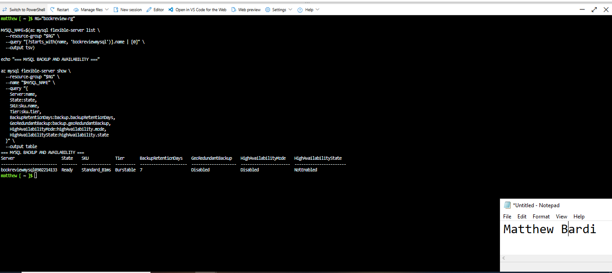

---

#### Screenshot 15 — Successful schema or connectivity verification (without exposing credentials)

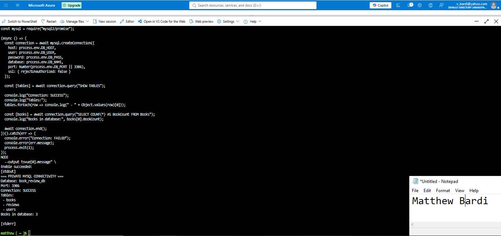

---

# Task 7 — Configure Traffic Management, Availability, and Monitoring

## Goal

Configure the approved public entry service with health probes and backend pools, internal routing for the application tier where required, and enable Azure Monitor/diagnostics/logs/alerts for the key resources.

### Evidence

#### Screenshot 16 — Public entry service showing listener, frontend endpoint, and healthy web targets

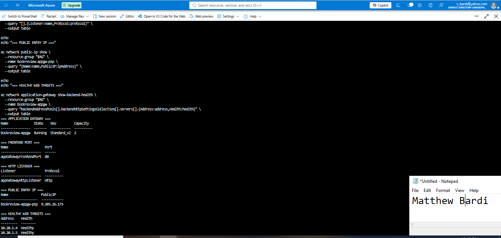

---

#### Screenshot 17 — Internal application-tier load-balancing or routing configuration where applicable

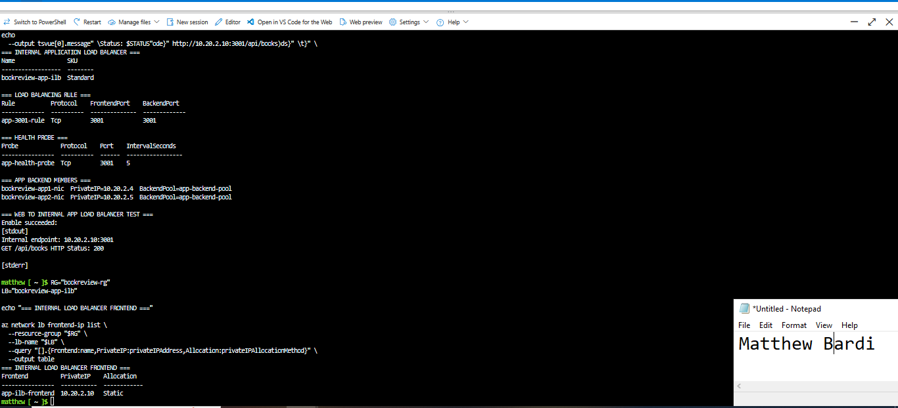

---

#### Screenshot 18 — Azure Monitor, diagnostic settings, logs, metrics, or alert evidence

---

# Task 8 — Validate the Production-Style Deployment

## Goal

Confirm the Book Review App works end to end through the public endpoint, with at least one database read and one write, confirm private tiers are not internet-reachable, and complete a safe availability test.

### Evidence

#### Screenshot 19 — Browser showing the Book Review App through the public endpoint

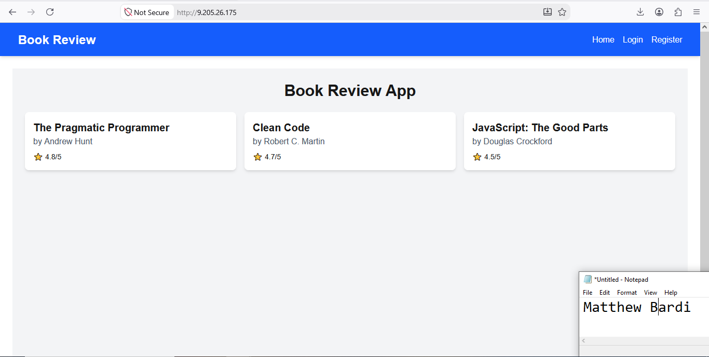

---

#### Screenshot 20 — Proof of successful database-backed read and write operations

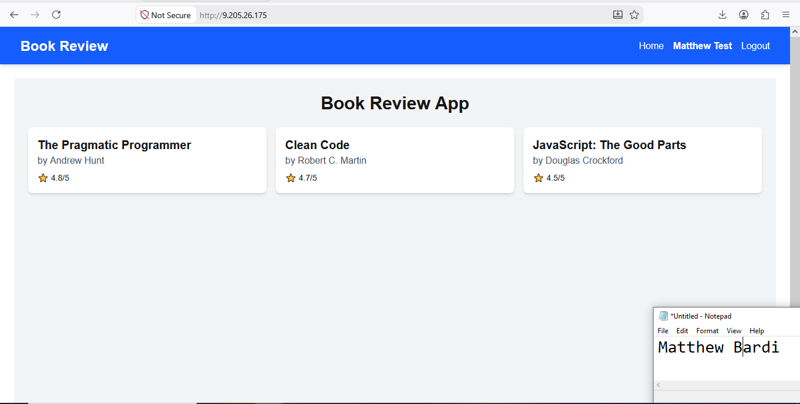

---

#### Screenshot 21 — Evidence that private tiers are not publicly accessible

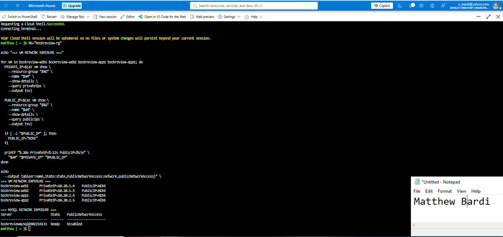

---

#### Screenshot 22 — Availability-test and healthy-target evidence

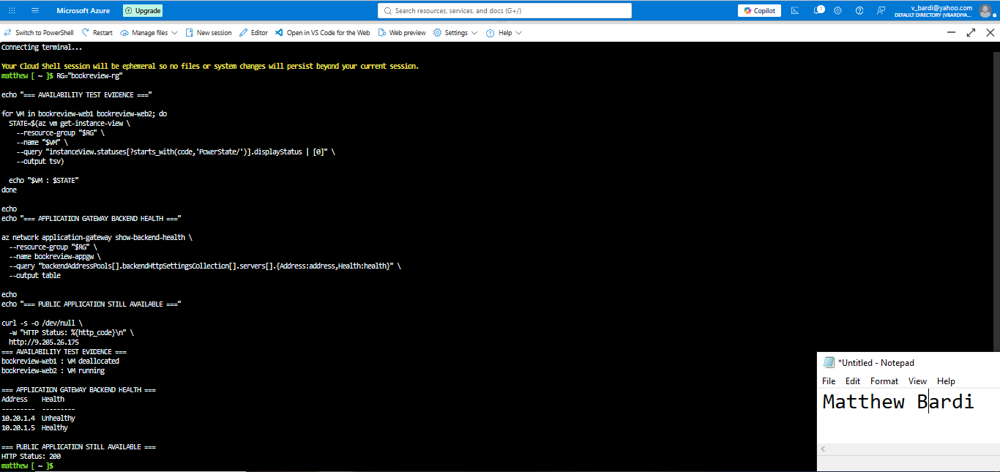

---

#### Public Endpoint

Paste your public endpoint URL here:

`http://9.205.26.175`

---

### Notes

Summarize what worked, issues encountered and how they were fixed, and the availability/security/secrets/monitoring/backup choices made.

The Book Review App was deployed as a three-tier Azure architecture in the `bookreview-rg` resource group. The network uses `bookreview-vnet` (`10.20.0.0/16`) with separate subnets for Application Gateway, Web, Application, and Database tiers.

The public entry point is Azure Application Gateway Standard_v2. The two Web VMs run Nginx and Next.js in separate availability zones and have no public IP addresses. Application Gateway forwards HTTP traffic on port 80 to the Web tier.

The Web tier forwards `/api` requests to an Azure Standard Internal Load Balancer at `10.20.2.10:3001`. Two private Application VMs run the Node.js/Express backend on port 3001 in separate availability zones. Both Application VMs are members of the internal load balancer backend pool.

Azure Database for MySQL Flexible Server is deployed with private VNet integration in the database subnet. Public network access is disabled. The application schema contains the `books`, `reviews`, and `users` tables, and private Application-to-Database connectivity on port 3306 was successfully validated. Automated backup retention is configured for 7 days. Geo-redundant backup and MySQL High Availability were not enabled for this lab deployment.

Least-privilege NSG rules restrict the intended traffic flow to Application Gateway → Web on port 80, Web → Application on port 3001, and Application → MySQL on port 3306. The Web and Application VMs have no public IP addresses, and the database has public network access disabled.

Application secrets, including the database password and JWT secret, are stored in Azure Key Vault. Azure RBAC is enabled on the vault, and the Application VMs use managed identities with the `Key Vault Secrets User` role to retrieve the required secrets without embedding secret values in the submission.

A NAT Gateway provides outbound Internet connectivity for the private Web and Application tiers without providing inbound access.

Azure Monitor and Log Analytics were configured for the Application Gateway. Application Gateway access logs, performance logs, and metrics are sent to the `bookreview-law` Log Analytics workspace. An Azure Monitor metric alert named `bookreview-unhealthy-backend-alert` monitors `UnhealthyHostCount`.

End-to-end validation succeeded through `http://9.205.26.175`. The application displayed database-backed book records, a test user was successfully registered and then authenticated, proving database write and read functionality.

During validation, a temporary browser `localStorage` value caused a client-side JSON parsing error after login. The stored invalid session value was cleared, the backend and public login responses were verified, and subsequent login succeeded normally.

Availability was tested by deallocating `bookreview-web1`. Application Gateway marked `10.20.1.4` unhealthy while `10.20.1.5` remained healthy, and the public endpoint continued to return HTTP 200. `bookreview-web1` was then restarted and both Application Gateway backend targets returned to Healthy.

One deployment issue was Azure regional vCPU quota. An older completed lab VM was removed to release the required Denmark East vCPU capacity for the second Web VM. Log Analytics was deployed in North Europe because Microsoft.OperationalInsights workspaces were not available in Denmark East.

---

# Submission Instructions

- Add all required screenshots and links in your submission
- Do not expose passwords, keys, connection strings, or subscription IDs

---

# Completion Checklist

- [x] Task 1: Architecture diagram and assumptions documented (Screenshots 1–2)
- [x] Task 2: Network foundation created with isolated tiers (Screenshots 3–5)
- [x] Task 3: Least-privilege security and secret management configured (Screenshots 6–7)
- [x] Task 4: Presentation tier deployed (Screenshots 8–9)
- [x] Task 5: Application tier deployed privately (Screenshots 10–12)
- [x] Task 6: Managed database tier deployed privately (Screenshots 13–15)
- [x] Task 7: Public entry, internal routing, and monitoring configured (Screenshots 16–18)
- [x] Task 8: End-to-end validation and availability test completed (Screenshots 19–22, Public Endpoint, Notes)
- [x] No sensitive data exposed

---

## 📌 About DMI & CloudAdvisory

DevOps Micro Internship (DMI) is a project-based DevOps program run by Pravin Mishra (The CloudAdvisory) focused on real-world execution, systems thinking, and career readiness.

It helps learners build strong DevOps foundations with hands-on experience.

---

## 📌 Resources

- 🌐 DMI Official Website: https://dmi.pravinmishra.com?utm_source=github&utm_medium=readme  
- 🎓 University: https://university.pravinmishra.com?utm_source=github&utm_medium=readme  
- 💬 Discord Community: https://discord.pravinmishra.com?utm_source=github&utm_medium=readme  
- 📝 Blog: https://dmi.pravinmishra.com/blog?utm_source=github&utm_medium=readme  
- ▶️ YouTube Playlist: https://www.youtube.com/playlist?list=PLFeSNDtI4Cho  
- 🔗 Pravin Mishra (LinkedIn): https://www.linkedin.com/in/pravin-mishra-aws-trainer/  
- 🏢 CloudAdvisory (LinkedIn): https://www.linkedin.com/company/thecloudadvisory/

---

*This submission is part of DevOps Micro Internship (DMI) Cohort 3 — Agentic AI Track.*
