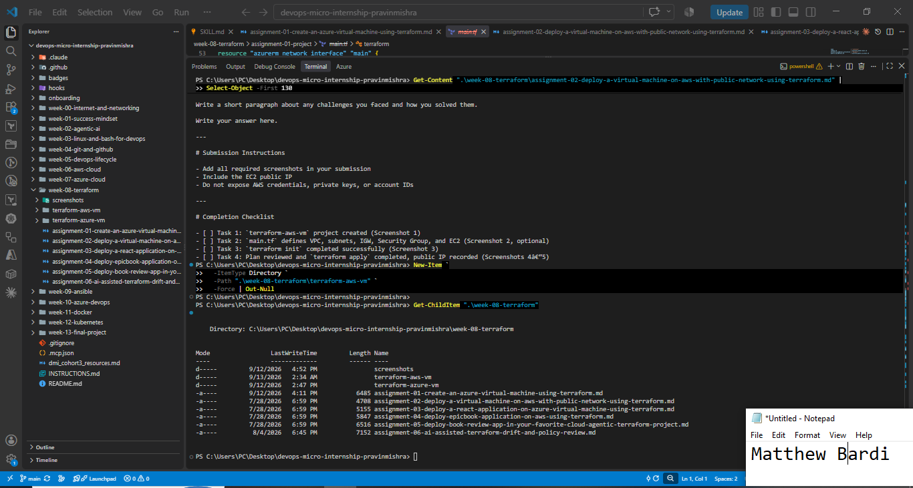
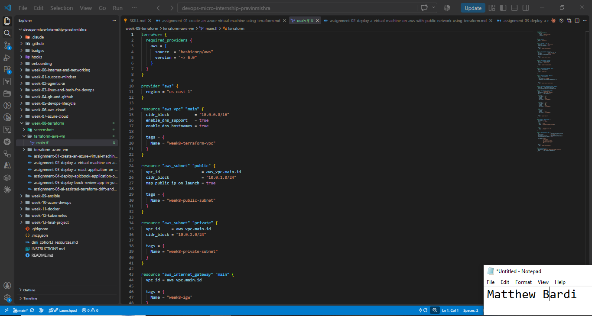
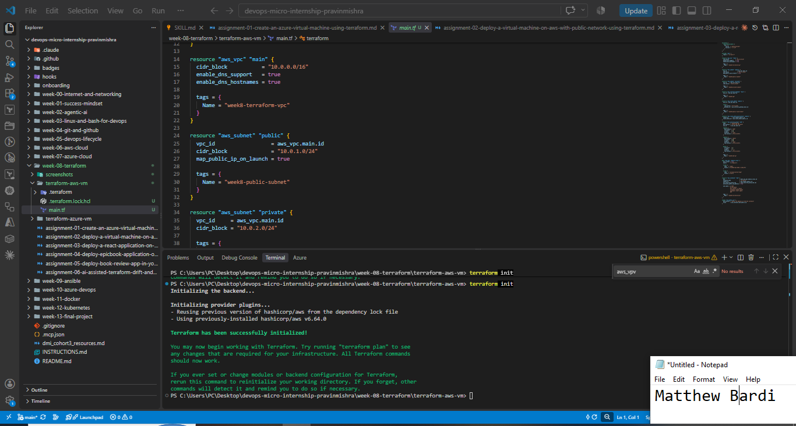
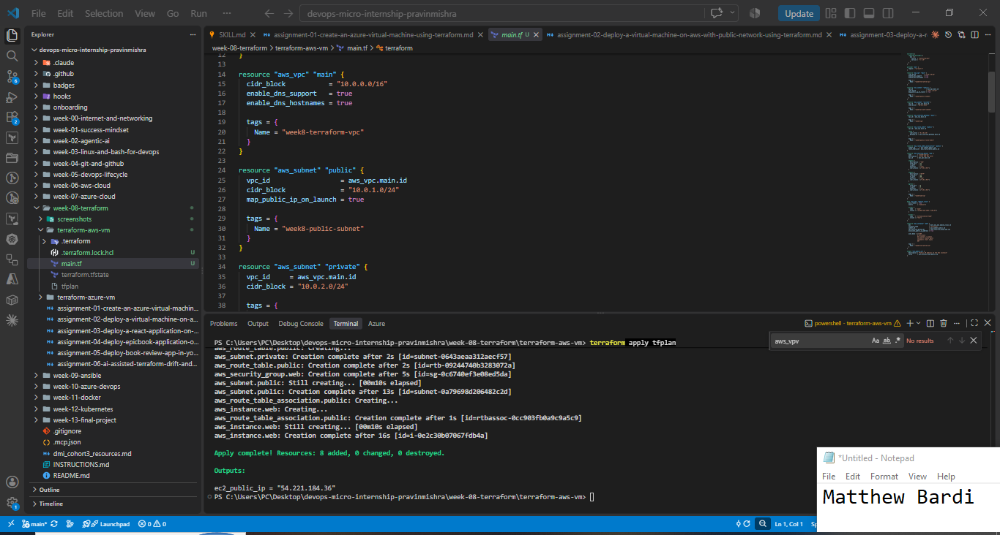
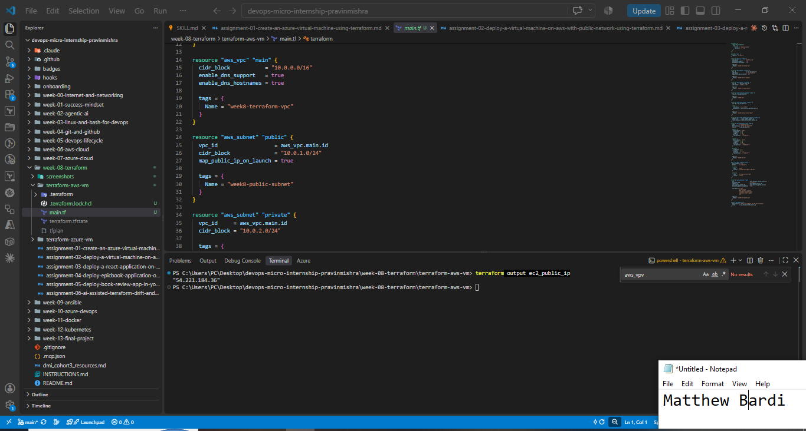
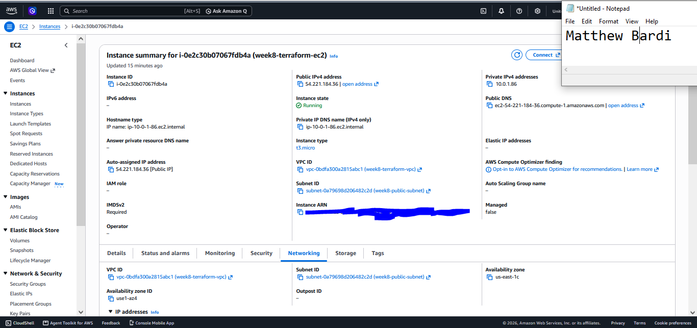
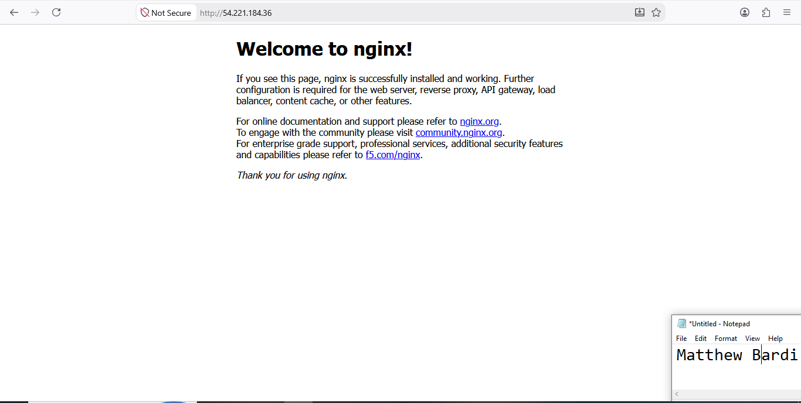
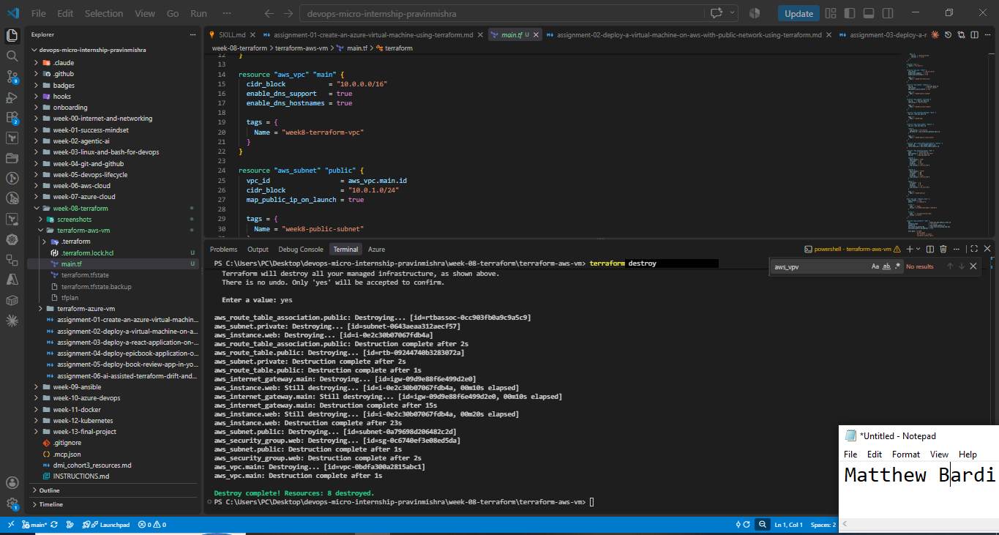

# Assignment 2 — Deploy a Virtual Machine on AWS with Public Network Using Terraform

Part of the DevOps Micro Internship (DMI) Cohort 3 with Agentic AI

---

## Purpose

In this assignment, you will use Terraform to create a custom AWS network (VPC, public and private subnets, Internet Gateway, route table) and launch an EC2 instance into the public subnet with a public IP, a Security Group allowing SSH and HTTP, and Nginx installed for validation.

---

# Task 1 — Create a New Terraform Project

## Goal

Create a `terraform-aws-vm` project directory for the AWS Terraform configuration.

### Evidence

#### Screenshot 1 — File Explorer, VS Code, or terminal showing the `terraform-aws-vm` project directory

---

# Task 2 — Create main.tf with the Required AWS Resources

## Goal

Define the AWS provider, a VPC (10.0.0.0/16) with a public subnet (10.0.1.0/24) and private subnet (10.0.2.0/24), an Internet Gateway with public routing, a Security Group (SSH 22, HTTP 80), an EC2 instance in the public subnet with a public IP, and a public IP output.

### Evidence

#### Screenshot 2 (optional) — `main.tf` showing the VPC and EC2 resource blocks

---

# Task 3 — Initialize Terraform

## Goal

Run `terraform init` and confirm the working directory initializes successfully.

### Evidence

#### Screenshot 3 — Terminal showing successful `terraform init` output

---

# Task 4 — Plan and Apply the Configuration

## Goal

Review `terraform plan`, run `terraform apply`, and record the EC2 instance's public IP from the Terraform output.

### Evidence

#### Screenshot 4 — Terraform apply output showing successful completion

---

#### Screenshot 5 — Terraform output showing the EC2 public IP

**EC2 public IP used for validation:** `54.221.184.36`

---

# Task 5 — Verify the Deployment

## Goal

Confirm the EC2 instance is running in the public subnet with a public IP, install Nginx, and confirm it is accessible by browser or SSH.

### Evidence

#### Screenshot 6 — EC2 instance running in the AWS Console, with the subnet and public IP visible

---

#### Screenshot 7 — Browser showing the Nginx page through the EC2 public IP, or terminal showing a successful SSH connection

---

# Task 6 — Destroy Resources

## Goal

Run `terraform destroy` to remove the Terraform-managed AWS resources after testing.

### Evidence

#### Screenshot 8 — Terminal showing successful `terraform destroy` completion

---

### Notes

Write a short paragraph about any challenges you faced and how you solved them.

A challenge I encountered was that my existing AWS CLI login session had expired, which initially prevented Terraform from authenticating to AWS. I reauthenticated to AWS, verified that the CLI session was working, and then continued with Terraform validation, planning, and deployment. Nginx was installed automatically on the EC2 instance using user data. I verified that the instance was running in the public subnet with a public IP and confirmed the Nginx page was reachable in a browser. After completing all validation and screenshots, I destroyed all Terraform-managed AWS resources.

---

# Submission Instructions

- Add all required screenshots in your submission
- Include the EC2 public IP
- Do not expose AWS credentials, private keys, or account IDs

---

# Completion Checklist

- [x] Task 1: `terraform-aws-vm` project created (Screenshot 1)
- [x] Task 2: `main.tf` defines VPC, subnets, IGW, Security Group, and EC2 (Screenshot 2, optional)
- [x] Task 3: `terraform init` completed successfully (Screenshot 3)
- [x] Task 4: Plan reviewed and `terraform apply` completed, public IP recorded (Screenshots 4–5)
- [x] Task 5: EC2 instance verified running and accessible (Screenshots 6–7)
- [x] Task 6: `terraform destroy` completed successfully (Screenshot 8)
- [x] Challenges/solutions paragraph written (Notes)
- [x] No sensitive information exposed

---

## 📌 About DMI & CloudAdvisory

DevOps Micro Internship (DMI) is a project-based DevOps program run by Pravin Mishra (The CloudAdvisory) focused on real-world execution, systems thinking, and career readiness.

It helps learners build strong DevOps foundations with hands-on experience.

---

## 📌 Resources

- 🌐 DMI Official Website: https://dmi.pravinmishra.com?utm_source=github&utm_medium=readme  
- 🎓 University: https://university.pravinmishra.com?utm_source=github&utm_medium=readme  
- 💬 Discord Community: https://discord.pravinmishra.com?utm_source=github&utm_medium=readme  
- 📝 Blog: https://dmi.pravinmishra.com/blog?utm_source=github&utm_medium=readme  
- ▶️ YouTube Playlist: https://www.youtube.com/playlist?list=PLFeSNDtI4Cho  
- 🔗 Pravin Mishra (LinkedIn): https://www.linkedin.com/in/pravin-mishra-aws-trainer/  
- 🏢 CloudAdvisory (LinkedIn): https://www.linkedin.com/company/thecloudadvisory/

---

*This submission is part of DevOps Micro Internship (DMI) Cohort 3 — Agentic AI Track.*
