# Assignment 3 — Deploy a React Application on Azure Using Terraform

**DevOps Micro Internship (DMI), Cohort 3**
**Name:** Matthew Bardi

## Project overview

I used Terraform to provision an Azure resource group, virtual network, subnet, network security group, public IP, network interface, and Ubuntu 20.04 virtual machine. I used `cloud-init.sh` to automate the installation of Node.js, npm, Git, and Nginx; clone and build the React application; and serve the production build through Nginx.

The application was verified at **http://9.205.159.227** while the VM was running. I subsequently destroyed the eight Terraform-managed resources as required by the assignment, so the website is no longer online.

## Infrastructure and deployment

- **Terraform configuration:** `terraform-react-azure/main.tf`
- **Automated setup script:** `terraform-react-azure/cloud-init.sh`
- **Azure resource group:** `rg-week8-react-terraform`
- **Virtual machine:** `vm-week8-react`
- **VM configuration:** Ubuntu 20.04, Standard B1s
- **Network access:** SSH (port 22) and HTTP (port 80)
- **Application:** `https://github.com/pravinmishraaws/my-react-app`
- **Web server:** Nginx

Terraform supplies the setup script to the VM using `custom_data = base64encode(file("${path.module}/cloud-init.sh"))`. On startup, cloud-init installs the required software, builds the React app, copies the production build into `/var/www/html`, and configures Nginx to serve it.

## Evidence

### Screenshot 1 — Terraform version

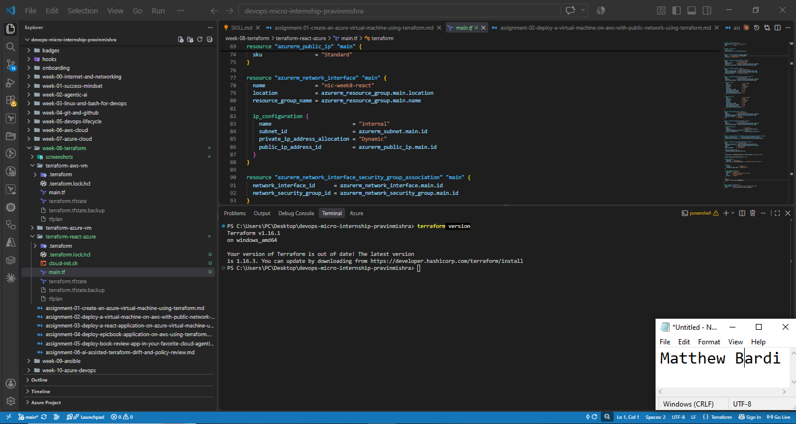

### Screenshot 2 — Azure CLI version

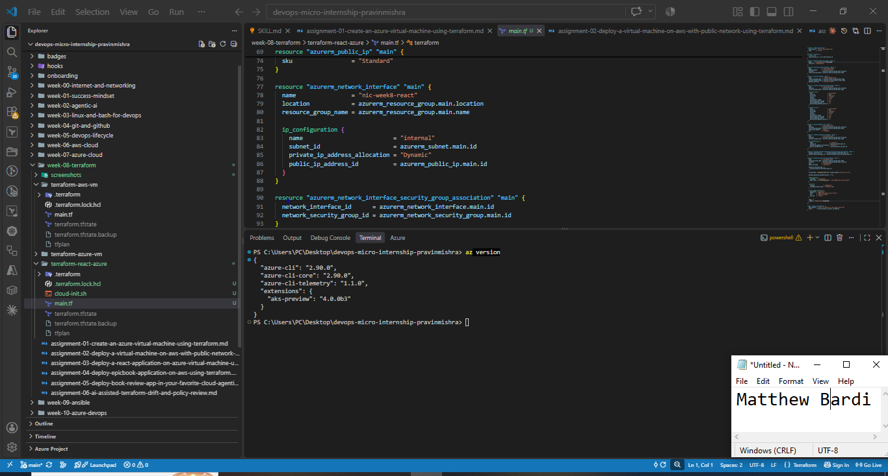

### Screenshot 3 — HashiCorp Terraform VS Code extension

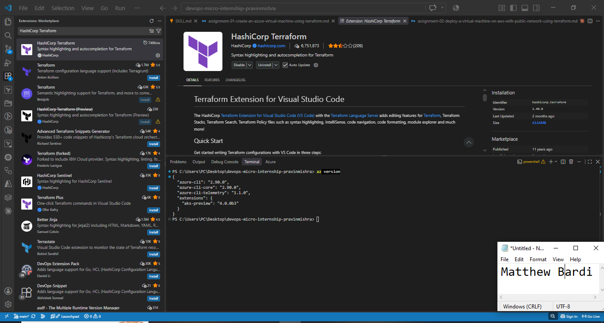

### Screenshot 4 — Terraform provider, resource group, and NSG rules

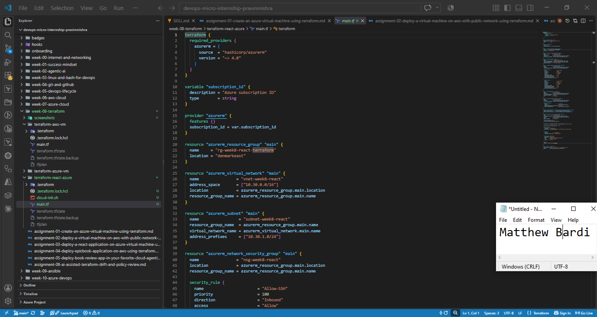

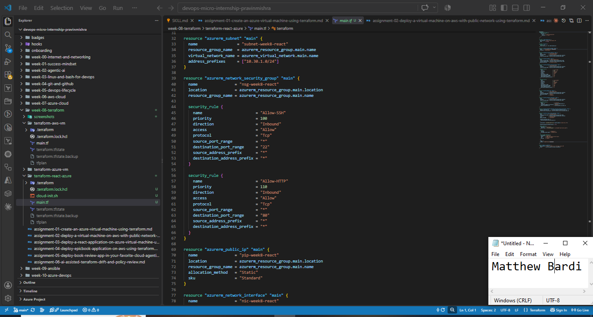

### Screenshot 5 — VM configuration with cloud-init

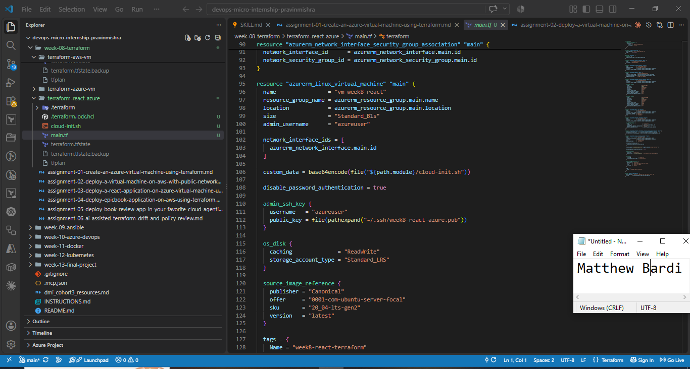

### Screenshot 6 — Completed cloud-init script

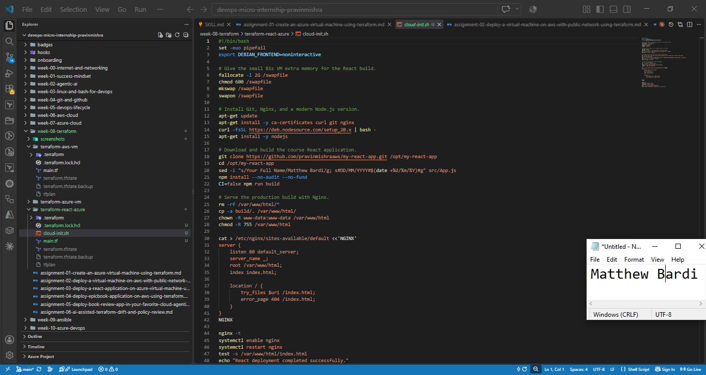

### Screenshot 7 — Public IP output block

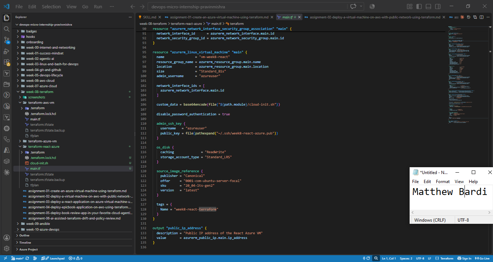

### Screenshot 8 — Successful Terraform initialization

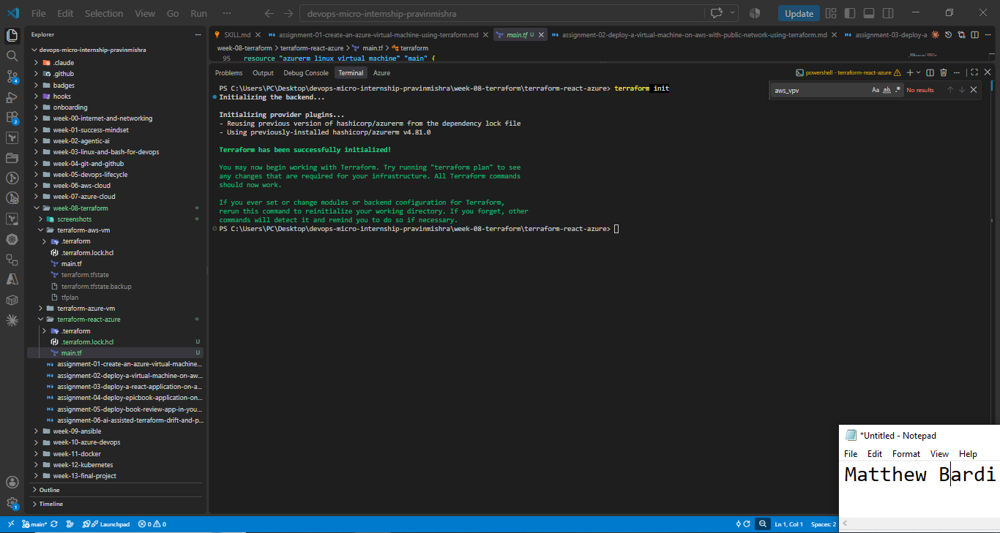

### Screenshot 9 — Original Terraform plan

The initial infrastructure plan proposed eight resources: **8 to add, 0 to change, 0 to destroy**.

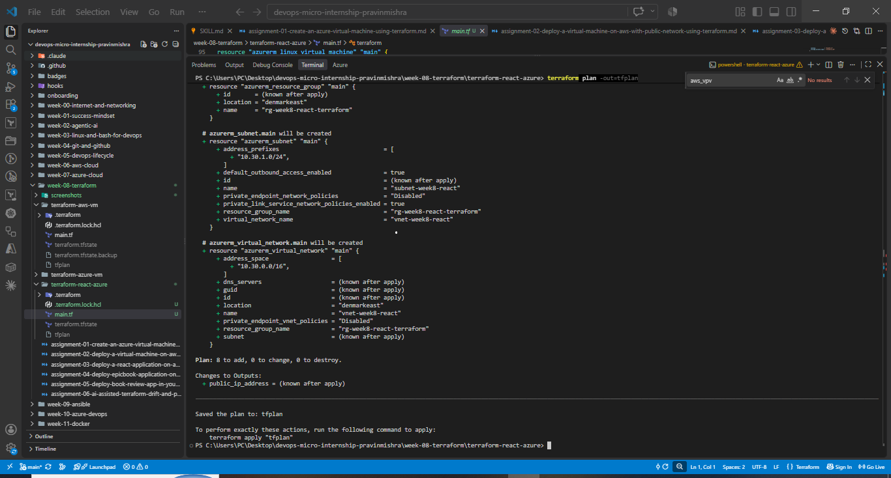

### Screenshot 10 — Successful Terraform apply

The initial apply created the eight infrastructure resources. I later replaced the VM through Terraform to attach the automated cloud-init configuration while retaining the public IP.

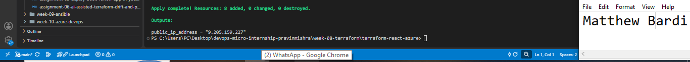

### Screenshot 11 — Terraform public IP output

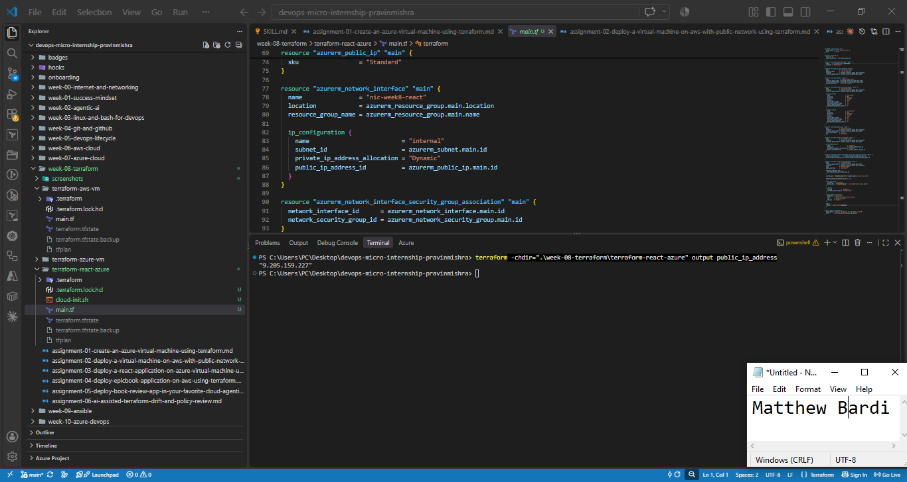

### Screenshot 12 — SSH verification of automated deployment

Cloud-init completed, and its log reported that the React deployment completed successfully.

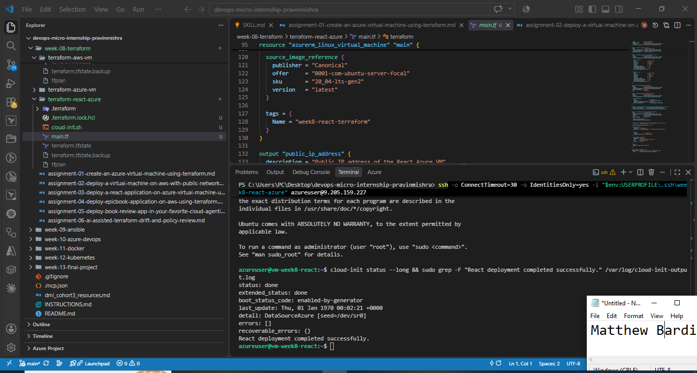

### Screenshot 13 — Nginx running

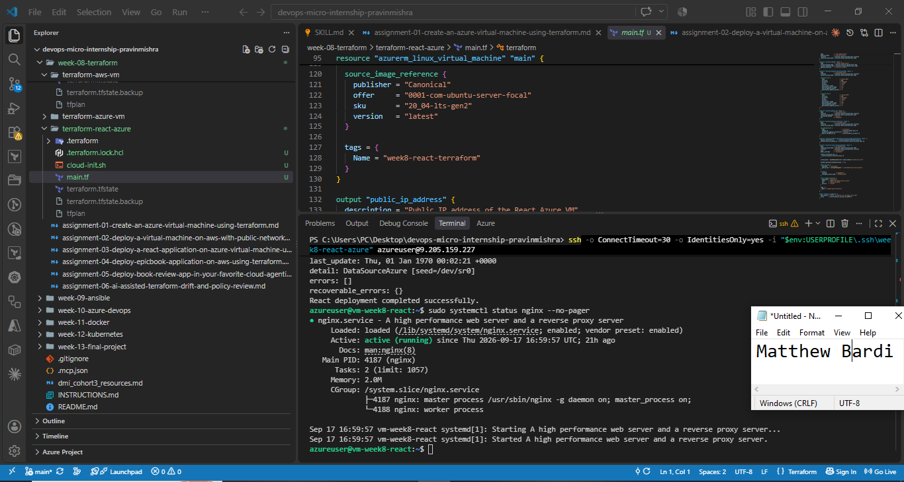

### Screenshot 14 — React application in the browser

The application loaded through the VM's public IP and displayed my name.

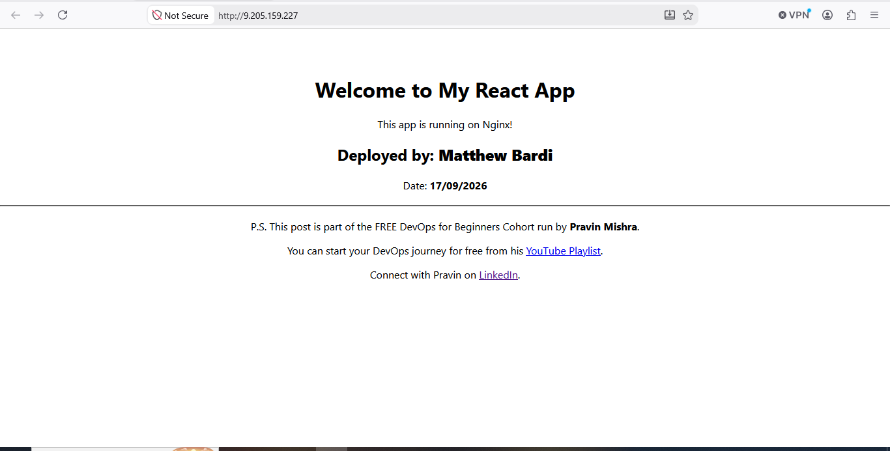

### Screenshot 15 — Successful Terraform destroy

After capturing the deployment evidence, I ran `terraform destroy`. Terraform reported **8 resources destroyed**.

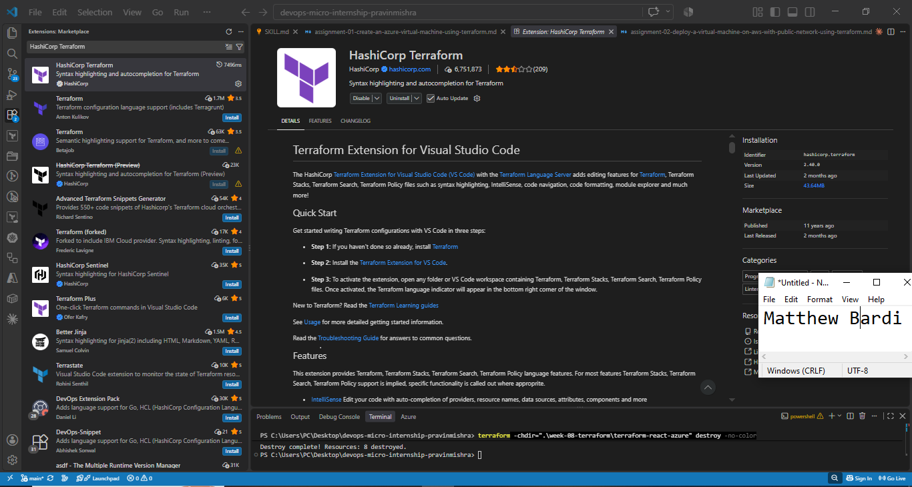

## Challenges and resolutions

The initial VM had been deployed before cloud-init was added. I updated the Terraform configuration to attach `cloud-init.sh`, reviewed the replacement plan, and applied it. I then verified the automated deployment and Nginx service.

Replacing the VM changed its SSH host key. Before reconnecting, I verified the new host-key fingerprint using Azure Run Command, removed the stale local host-key entry, and established a new SSH connection.

## Outcome

I provisioned Azure infrastructure with Terraform, automated the React deployment with cloud-init, verified the application through its public IP, and removed the assignment infrastructure with Terraform after collecting the evidence. No credentials, passwords, or private keys are included in this write-up.