# Assignment 4 — Deploy EpicBook Application on AWS Using Terraform

Part of the DevOps Micro Internship (DMI) Cohort 3 with Agentic AI

---

## Purpose

In this assignment, you will use Terraform to provision AWS network infrastructure (VPC, public/private subnets, Security Groups), launch an Ubuntu 22.04 EC2 instance, and provision a private Amazon RDS for MySQL instance. You will then deploy EpicBook, connect it to MySQL, and validate the complete user flow.

---

# Task 1 — Create Network Infrastructure with Terraform

## Goal

Define a VPC (10.0.0.0/16) with a public subnet (10.0.1.0/24) and private subnet (10.0.2.0/24), an Internet Gateway with public routing, an EC2 Security Group (SSH 22, HTTP 80), and an RDS Security Group (MySQL 3306 only from the EC2 Security Group).

### Evidence

#### Screenshot 1 — Terraform configuration showing the VPC and both subnet CIDR ranges

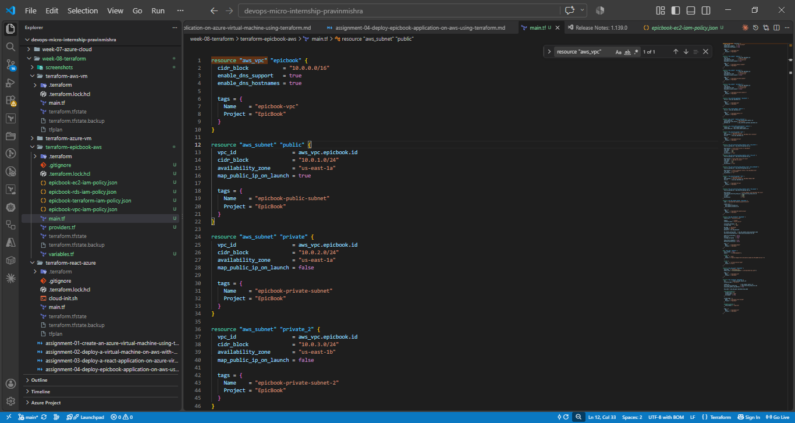

---

#### Screenshot 2 — Terraform configuration showing the Internet Gateway, public route table, and both Security Groups

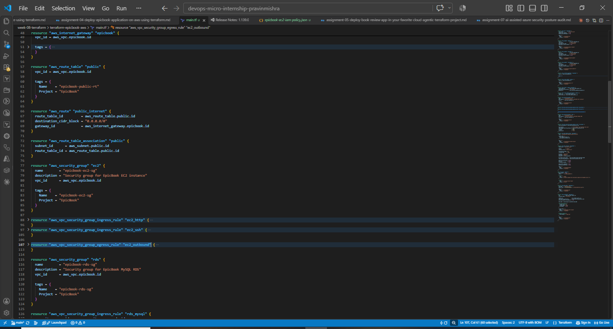

---

# Task 2 — Provision EC2 Virtual Machine (Ubuntu 22.04)

## Goal

Use Terraform to launch a t2.micro Ubuntu 22.04 EC2 instance in the public subnet with a public IP, then install Node.js, npm, Git, Nginx, and MySQL client.

### Evidence

#### Screenshot 3 — Terraform apply output showing successful EC2 provisioning

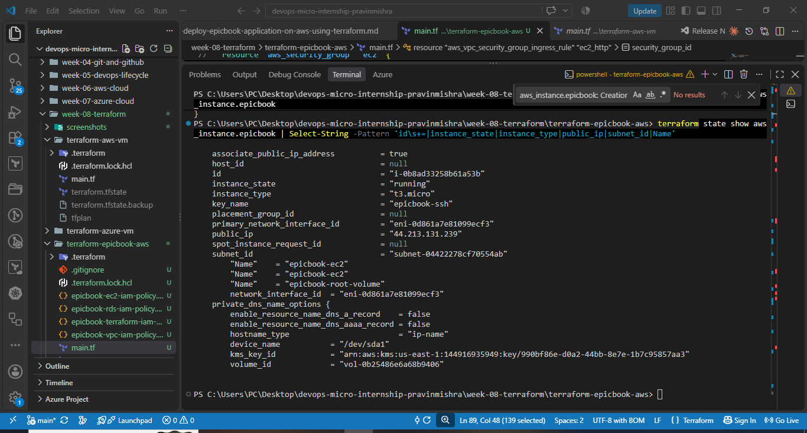

> Note: The original Terraform apply output was no longer available in the terminal history. Terraform state is shown here as evidence that the EC2 instance is managed by Terraform and is running successfully.

---

#### Screenshot 4 — EC2 instance running in the AWS Console with the public IP and subnet visible

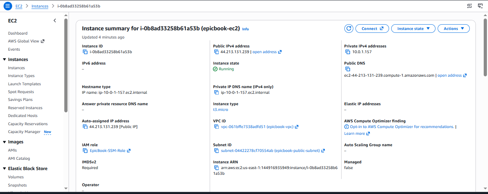

---

#### Screenshot 5 — Terminal showing successful SSH access and installed software

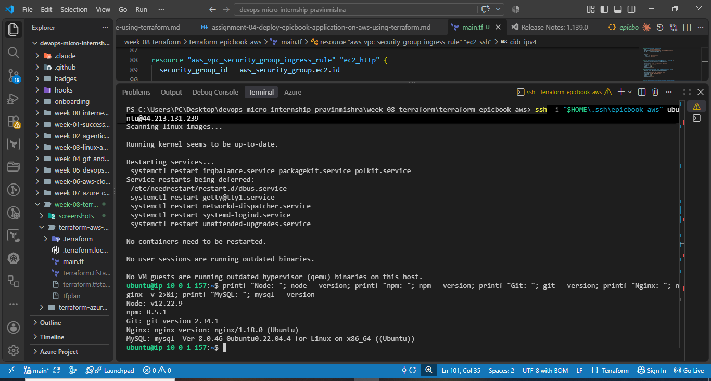

---

# Task 3 — Deploy the EpicBook Application

## Goal

Deploy the EpicBook frontend and backend on the EC2 instance and configure Nginx to serve it, following the Installation, Configuration & Troubleshooting Guide.

### Evidence

#### Screenshot 6 — Terminal showing the EpicBook application files and dependency installation

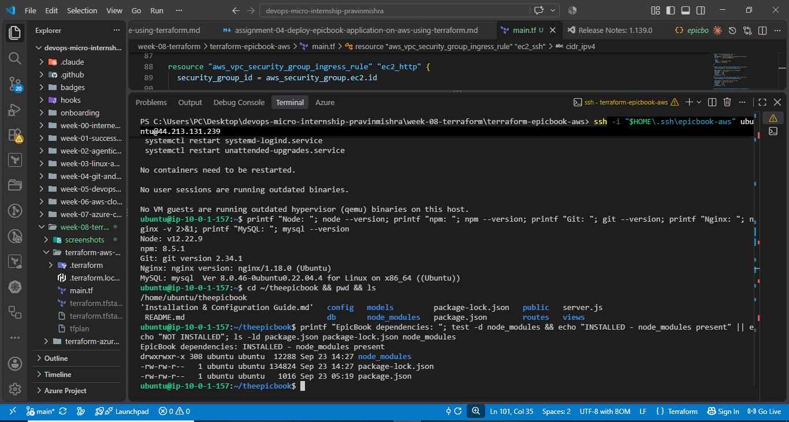

---

#### Screenshot 7 — Terminal showing the application and Nginx services running

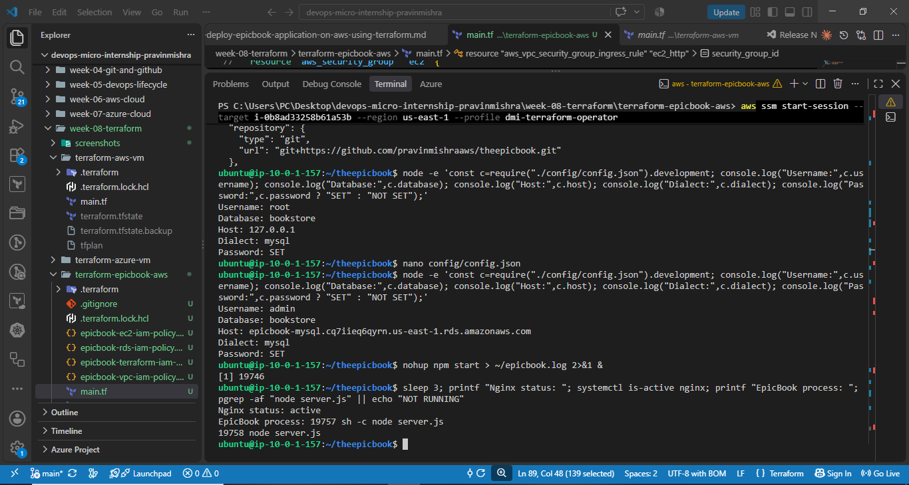

---

# Task 4 — Set Up Amazon RDS for MySQL with Terraform

## Goal

Provision a private Amazon RDS MySQL instance (db.t3.micro, Publicly accessible: false) restricted to the EC2 Security Group, then initialize the database using the provided SQL dump and connect the EpicBook backend to it.

### Evidence

#### Screenshot 8 — Terraform apply output showing successful RDS provisioning

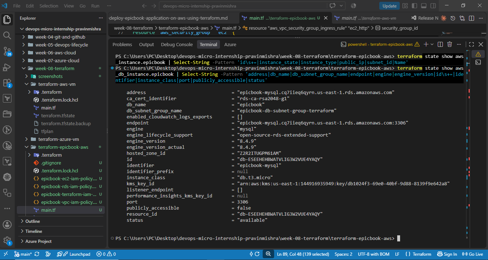

> Note: The original Terraform apply output was no longer available in the terminal history. Terraform state is shown here as evidence that the RDS instance is managed by Terraform, is available, and is configured with `publicly_accessible = false`.

---

#### Screenshot 9 — RDS instance in the AWS Console showing the private network configuration and Publicly accessible: No

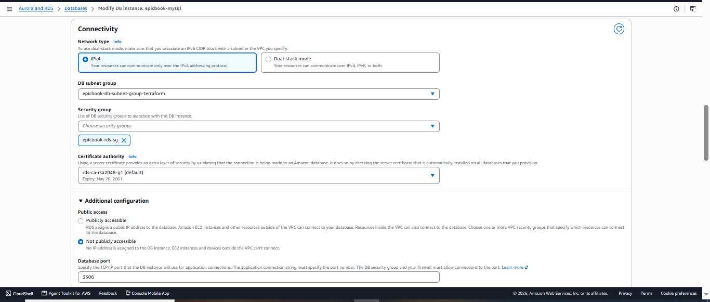

---

#### Screenshot 10 — Terminal showing successful database initialization or table verification from EC2

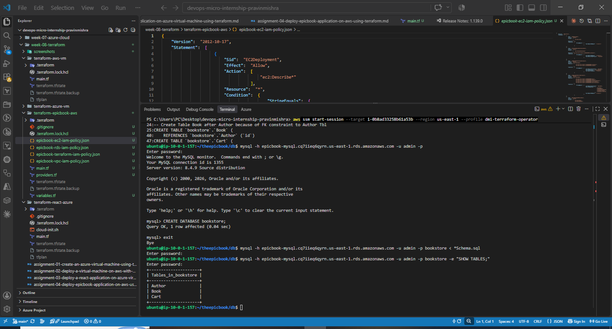

---

# Task 5 — Test End-to-End Functionality

## Goal

Confirm EpicBook is accessible through the EC2 public IP and that navigation, cart, order summary, and checkout all work against the MySQL backend.

**EC2 Public IP:** `44.213.131.239`

### Evidence

#### Screenshot 11 — Browser showing the EpicBook application through the EC2 public IP

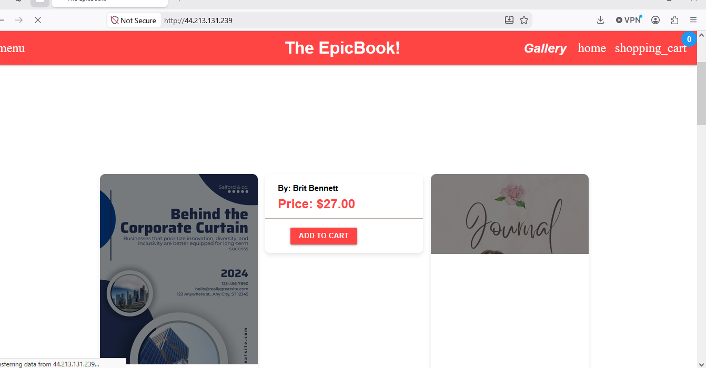

---

#### Screenshot 12 — Browser showing a working product, cart, order summary, or checkout flow

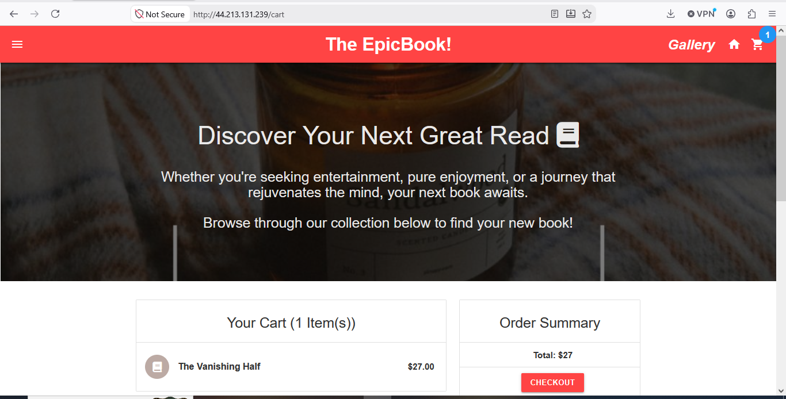

---

### Notes

Write a short note describing any issue you faced, how you fixed it, and what you learned.

During this assignment, I encountered several issues while deploying EpicBook. My public IP changed, which caused SSH access to fail because the EC2 Security Group only allowed my previous IP address. I updated the SSH ingress rule through Terraform and regained access.

The EpicBook application was initially configured to use MySQL on `127.0.0.1` instead of the private Amazon RDS instance. I updated the application configuration to use the RDS endpoint and verified that the database tables and data were available.

I also found that the Node.js application stopped when the terminal session ended. I created a `systemd` service for EpicBook so that it runs independently of the terminal and starts automatically after a reboot.

Finally, Nginx was serving its default page rather than EpicBook. I configured Nginx as a reverse proxy from port 80 to the Node.js application on port 8080 and verified the complete shopping-cart workflow.

This assignment helped me understand Terraform state management, AWS VPC networking, EC2, private RDS connectivity, Linux services, Nginx reverse proxying, and troubleshooting a full-stack application deployment.

---

# LinkedIn Post (Required)

## Goal

Publish a LinkedIn post about what you achieved in this assignment, with public or "Anyone" visibility.

## Evidence

#### LinkedIn Post URL

Paste your LinkedIn post URL here:

https://www.linkedin.com/feed/update/urn:li:activity:7509666259609849858/

---

#### Screenshot 13 — Published LinkedIn post showing the text and at least one image or proof

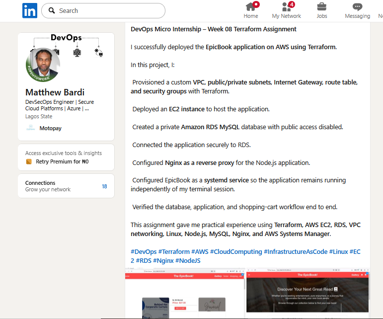

---

# Submission Instructions

- Add all required screenshots in your submission
- Include the EC2 public IP
- Do not expose database passwords, private keys, or other secrets

---

# Completion Checklist

- [x] Task 1: VPC, subnets, IGW, and Security Groups created with Terraform (Screenshots 1–2)
- [x] Task 2: EC2 provisioned and required software installed (Screenshots 3–5)
- [x] Task 3: EpicBook deployed and Nginx serving the app (Screenshots 6–7)
- [x] Task 4: Private RDS MySQL created and database initialized (Screenshots 8–10)
- [x] Task 5: End-to-end functionality validated (Screenshots 11–12)
- [x] Issue/fix/learning note written (Notes)
- [x] LinkedIn post published and URL submitted (Screenshot 13)
- [x] No sensitive data exposed

---

## 📌 About DMI & CloudAdvisory

DevOps Micro Internship (DMI) is a project-based DevOps program run by Pravin Mishra (The CloudAdvisory) focused on real-world execution, systems thinking, and career readiness.

It helps learners build strong DevOps foundations with hands-on experience.

---

## 📌 Resources

- 🌐 DMI Official Website: https://dmi.pravinmishra.com?utm_source=github&utm_medium=readme  
- 🎓 University: https://university.pravinmishra.com?utm_source=github&utm_medium=readme  
- 💬 Discord Community: https://discord.pravinmishra.com?utm_source=github&utm_medium=readme  
- 📝 Blog: https://dmi.pravinmishra.com/blog?utm_source=github&utm_medium=readme  
- ▶️ YouTube Playlist: https://www.youtube.com/playlist?list=PLFeSNDtI4Cho  
- 🔗 Pravin Mishra (LinkedIn): https://www.linkedin.com/in/pravin-mishra-aws-trainer/  
- 🏢 CloudAdvisory (LinkedIn): https://www.linkedin.com/company/thecloudadvisory/

---

*This submission is part of DevOps Micro Internship (DMI) Cohort 3 — Agentic AI Track.*
